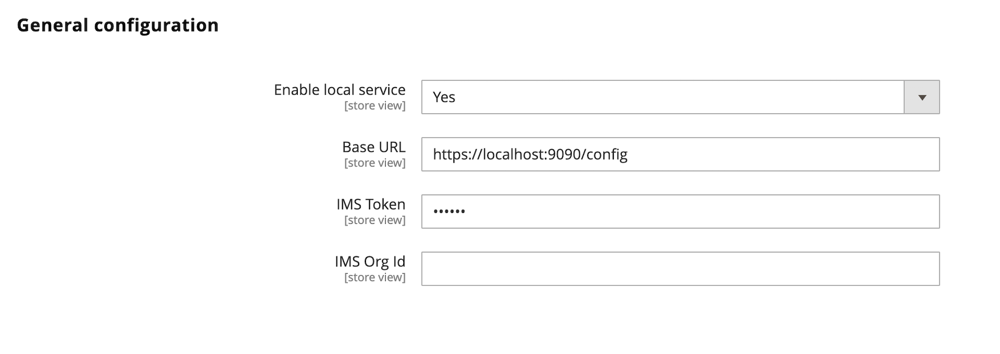

# Admin configuration and testing

The Adobe Commerce Admin UI SDK enables you to use a local server to view and test your Admin changes before you submit your app to the Adobe Marketplace.

## Create a server configuration file

Example of a `server.js` implementation

```js
const http = require('https');
const fs = require('fs');
const url = require('url');

const options = {
    key: fs.readFileSync('key.pem'),
    cert: fs.readFileSync('cert.pem')
  };
 
console.log('Server will listen at :  https://localhost ');
http.createServer(options, function (req, res) {
    res.writeHead(200, {
        'Content-Type': 'application/json',
        'Access-Control-Allow-Origin': '*',
        'Access-Control-Allow-Headers': '*'
    });
    let json_response;
    
    console.log(url.parse(req.url,true).pathname);
    if (url.parse(req.url,true).pathname == "/config") {
        json_response = {
            baseUrl: "https://localhost:9090/",
            apiKey: "apiKey",
            auth: {
                schema: "Bearer",
                imsToken: "dummyToken"
            },
            imsOrg: "imsOrg",
            version: 1,
            service: "aem"
        }
    } else {
        json_response = [{
            "name": "backend-page-content-1",
            "title": "Test extension",
            "description": "No",
            "icon": "no",
            "publisher": "aQQ6300000008LEGAY",
            "endpoints": {
              "aem/commerce-admin.page-content.add/1": {
                "view": [{
                  "href": "https://localhost:9080/"
                }]
              }
            },
            "xrInfo": {
              "supportEmail": "test@adobe.com",
              "appId": "4a4c7cf8-bd64-4649-b8ed-662cd0d9c918"
            },
            "status": "PUBLISHED" }]
    }
 
    res.end( JSON.stringify(json_response) );
}).listen(9090);
```

## Configure the Admin

Navigate to **Stores** > Settings > **Configuration** > **Adobe Services** > **Admin UI SDK** and edit the **General Configuration** screen.



1. Select **Yes** from the **Enable local service** menu.

1. Set the **Base URL** that points to your localhost. The default

1. Set the **IMS Token**. You can use dummyToken for example as a token and set it in your `server.js` file.

1. Set the **IMS Org Id**. You can use `imsOrg` for example as a token and set it in your `server.js` file.
Make sure that the configuration matches your local server input. If this is enabled, all calls will be automatically redirected to the local server instead of connecting to Adobe's App Registry.
