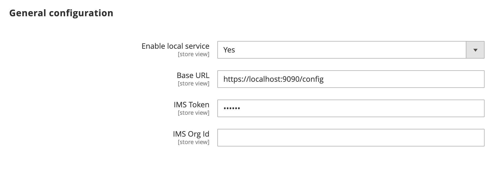

# Admin configuration and testing

The Adobe Commerce Admin UI SDK allows you to use a local server to view and test your Admin customizations before you submit your app to the Adobe Marketplace.

## Configure the Admin

Navigate to **Stores** > Settings > **Configuration** > **Adobe Services** > **Admin UI SDK** and edit the **Local testing** screen. When you enable the local service, all calls are automatically redirected to the local server, instead of connecting to Adobe's App Registry. The values you specify must match the contents of your local `server.js` file.

[Test with a sample app](#test-with-a-sample-app) provides a sample `server.js` file.



1. Select **Yes** from the **Enable Admin UI SDK** menu.

1. Select **Yes** from the **Enable local service** menu.

1. Set the **Base URL** that points to your localhost, including the port.

1. Set the **IMS Token**. In the sample `server.js` file, this value is set to `dummyToken`.

1. Set the **IMS Org Id**. In the sample `server.js` file, this value is set to `imsOrg`.

1. Save your configuration.

1. Clear the cache.

   ```bash
   bin/magento cache:flush
   ```

## Test with a sample app

You can download a sample app from the [Commerce UI test extension repository](https://github.com/magento/app-builder-samples) to gain insight on how the Admin SDK injects menus and pages into the Admin.

1. Run the following command to clone and sync the repository:

   ```bash
   git clone git@github.com:magento/app-builder-samples.git
   ```

1. Change directories to the cloned repository's root directory.

1. Create a `server.js` file to define a local server:

   ```js
   const http = require('https');
   const fs = require('fs');
   const url = require('url');
   
   const options = {
    key: fs.readFileSync('key.pem'),
    cert: fs.readFileSync('cert.pem')
    };
    
    console.log('Server will listen at :  https://localhost ');
    http.createServer(options, function (req, res) {
      res.writeHead(200, {
        'Content-Type': 'application/json',
        'Access-Control-Allow-Origin': '*',
        'Access-Control-Allow-Headers': '*'
      });
      let json_response;
      
      console.log(url.parse(req.url,true).pathname);
      if (url.parse(req.url,true).pathname == "/config") {
        json_response = {
          baseUrl: "https://localhost.adobe.io:9090/",
          apiKey: "apiKey",
          auth: {
            schema: "Bearer",
            imsToken: "dummyToken"
          },
          imsOrg: "imsOrg",
          version: 1,
          service: "commerce",
          extensionPoint: "backend-ui"
        }
      } else {
        json_response = [{
          "name": "test-extension",
          "title": "Test extension",
          "description": "No",
          "icon": "no",
          "publisher": "aQQ6300000008LEGAY",
          "endpoints": {
            "commerce/backend-ui/1": {
              "view": [{
                "href": "https://localhost:9080/index.html"
              }]
            }
          },
          "xrInfo": {
            "supportEmail": "test@adobe.com",
            "appId": "4a4c7cf8-bd64-4649-b8ed-662cd0d9c918"
          },
          "status": "PUBLISHED" }]
        }
        //console.log(json_response);
      res.end( JSON.stringify(json_response) );
    }).listen(9090);
    ```

1.  Run the local server:

    ```bash
    node server.js
    ```

1. Make sure you have access to the localhost server configuration by entering the following URL in your browser:

   `https://localhost:9090/config`

   The browser displays a JSON file similar to the following:

   ```json
   {
    "baseUrl":"https://localhost:9090/",
    "apiKey":"apiKey",
    "auth":{
      "schema":"Bearer",
      "imsToken":"dummyToken"
    },
    "imsOrg":"imsOrg",
    "version":1,
    "service":"commerce",
    "extensionPoint":"backend-ui"
    }
   ```

1. Run your extension locally.

   ```bash
   aio app run
   ```

1. Check that the **First App on App Builder** option has been added to the **Marketing** menu in the Admin and that selecting the option takes you to the **Fetched orders from Adobe Commerce** page.

   

   
