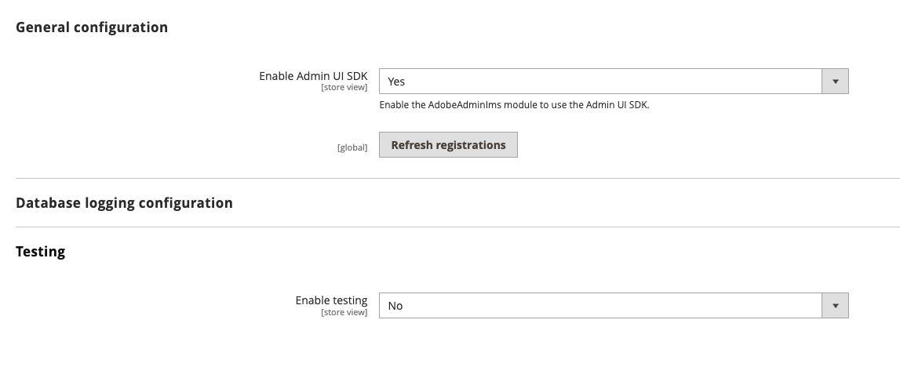
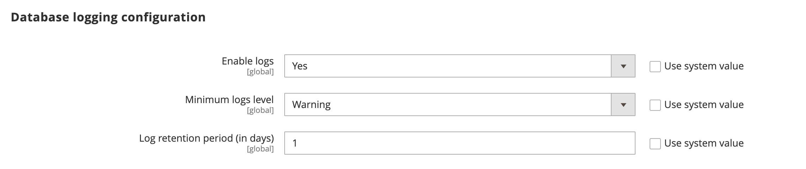
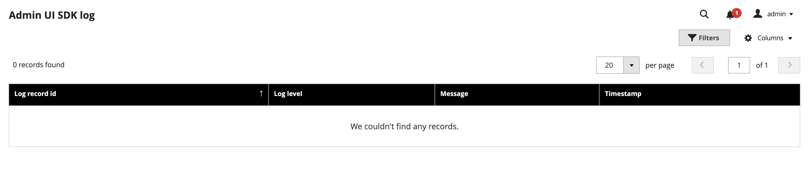
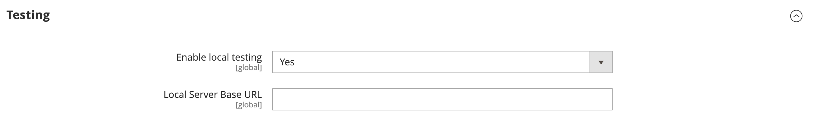
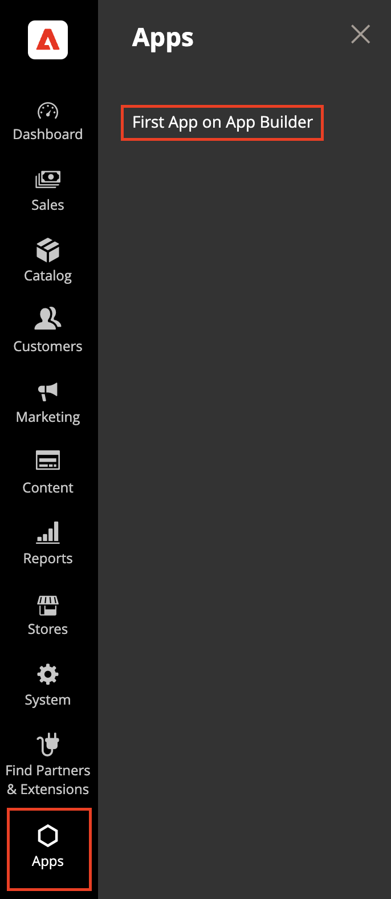
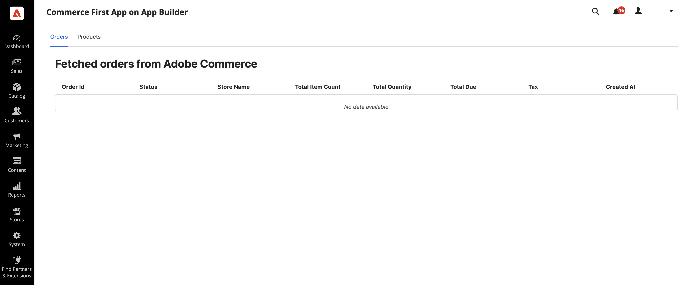

# Admin configuration and testing

The Adobe Commerce Admin UI SDK allows you to use a local server to view and test your Admin customizations before you submit your app to the Adobe Marketplace.

Navigate to **Stores** > Settings > **Configuration** > **Adobe Services** > **Admin UI SDK** screen.

## General configuration

The **General configuration** section enables the Admin UI SDK and refreshes registrations when changes are made.



The Admin UI SDK is disabled by default. To enable it, set the **Enable Admin UI SDK** field to **Yes**.

The [**Configure extensions**](./eligible-extensions-config.md) button allows you to select the workspace and eligible extensions for the Commerce instance.

The **Refresh registrations** button reloads all registrations from the App Builder registry. It is typically used when changes are made to the registration on the App Builder application side or when a new app is added and published, to reflect these changes in the Admin.

By default, registrations are not refreshed. You can optionally set the **Refresh registrations on schedule** menu to refresh registrations daily, weekly, or monthly.  Weekly refreshes are performed on Sundays, while monthly refreshes are performed on the first day of the month.

## Database logging configuration

The **Database logging configuration** section allows you to save Admin UI SDK log entries for the specified retention period.



To save logs, set the **Enable Logs** field to **Yes**. By default, this field is set to **No**.

Set the minimum log level to save. Any logs at this level or higher will be stored. By default, the minimum level is set to **Warning**.

Set the retention period for logs to be cleaned from the database. This field specifies the number of days. By default, the retention period is set to 1 day.

Navigate to **System** > Admin UI SDK > **Admin UI SDK Logs** to check the saved logs.



## Local testing

When you enable the local service, all calls are automatically redirected to the local server, instead of connecting to Adobe's App Registry. The values you specify must match the contents of your local `server.js` file.



1. Select **Yes** from the **Enable local testing** menu.

1. Set the **Local Server Base URL** that points to your localhost, including the port.

1. Save your configuration.

### Configuration

You can download a sample app from the [Adobe Commerce Samples repository](https://github.com/adobe/adobe-commerce-samples/tree/main/admin-ui-sdk/menu/custom-menu) to gain insight on how the Admin SDK injects menus and pages into the Admin.

1. Run the following command to clone and sync the repository:

   ```bash
   git clone git@github.com:adobe/adobe-commerce-samples.git
   ```

1. Change directories to the cloned repository's root directory.

1. Create a `server.js` file in `<repoRootDir>/admin-ui-sdk` to define a local server:

   ```js
   const http = require('https');
   const fs = require('fs');
   const url = require('url');
   
   const options = {
    key: fs.readFileSync('key.pem'),
    cert: fs.readFileSync('cert.pem')
    };
    
    console.log('Server will listen at :  https://localhost ');
    http.createServer(options, function (req, res) {
      res.writeHead(200, {
        'Content-Type': 'application/json',
        'Access-Control-Allow-Origin': '*',
        'Access-Control-Allow-Headers': '*'
      });
      
      console.log(url.parse(req.url,true).pathname);
      
      const json_response = [
        {
          "name": "test-extension",
          "title": "Test extension",
          "description": "No",
          "icon": "no",
          "publisher": "aQQ6300000008LEGAY",
          "endpoints": {
            "commerce/backend-ui/1": {
              "view": [{
                "href": "https://localhost:9080/index.html"
              }]
            }
          },
          "xrInfo": {
            "supportEmail": "test@adobe.com",
            "appId": "4a4c7cf8-bd64-4649-b8ed-662cd0d9c918"
          },
          "status": "PUBLISHED" 
        }
      ]
      
      res.end( JSON.stringify(json_response) );
    }).listen(9090);
    ```

1. Generate the `key.pem` certificate in the same directory.

    ```bash
    openssl genpkey -algorithm RSA -out key.pem -pkeyopt rsa_keygen_bits:2048
    ```

1. Generate the `cert.pem` certificate in the same directory.

    ```bash
    openssl req -new -x509 -key key.pem -out cert.pem -days 365
    ```

1. Run the local server:

    ```bash
    node server.js
    ```

1. Make sure you have access to the localhost server configuration by entering the following URL in your browser:

   `https://localhost:9090`

   The browser displays a JSON file similar to the following:

   ```json
    [
      {
        "name": "test-extension",
        "title": "Test extension",
        "description": "No",
        "icon": "no",
        "publisher": "aQQ6300000008LEGAY",
        "endpoints": {
          "commerce/backend-ui/1": {
            "view": [{
              "href": "https://localhost:9080/index.html"
            }]
          }
        },
        "xrInfo": {
          "supportEmail": "test@adobe.com",
          "appId": "4a4c7cf8-bd64-4649-b8ed-662cd0d9c918"
        },
        "status": "PUBLISHED"
      }
    ]
   ```

### Custom menu example

1. Change directories to `<repoRootDir>/admin-ui-sdk/menu/custom-menu`.

1. Run the following command to load dependencies.

  ```bash
  npm install
  ```

1. Select your App Builder project.

  ```bash
  aio console project select
  ```

1. Select the App Builder workspace.

  ```bash
  aio console workspace select
  ```

1. Sync the App Builder project details.

  ```bash
  aio app use
  ```

1. Build your solution.

  ```bash
  aio app build
  ```

1. Run your custom menu extension locally.

   ```bash
   aio app dev
   ```

1. Confirm that the **Apps** section appears on the main menu and the **First App on App Builder** option appears in the **Apps** menu in the Admin. Click **First App on App Builder** and confirm that the **Fetched orders from Adobe Commerce** page opens.

   

   
