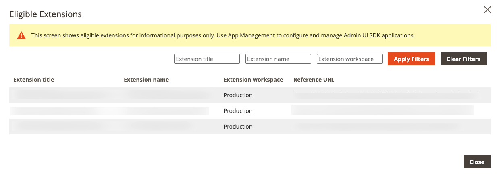

# Eligible Extensions Configuration

The eligible extensions configuration allows you to select the extensions for a specific Commerce instance. All eligible extensions will be loaded from the App Registry. An extension is considered eligible when the deployed workspace is published to the `commerce/backend-ui/1` extension point.

## Eligible Extensions Configuration Screen

Navigate to **Stores** > Settings > **Configuration** > **Adobe Services** > **Admin UI SDK** screen.

In the **General Configuration**, click on the `Configure extensions` button.

1. Select the workspace of extensions you want to map to the Commerce instance and apply to load eligible extensions.

1. Select the extensions you want to include in the Commerce instance.

1. Save the selection to have registrations correctly included in the Commerce Admin Panel.

Workspace choices are: **Stage**, **Production**, or **Custom**. If **Custom** is selected, make sure to provide the workspace name corresponding to the extension in App Builder. Only English alphanumeric and Latin alphabet characters are allowed.
