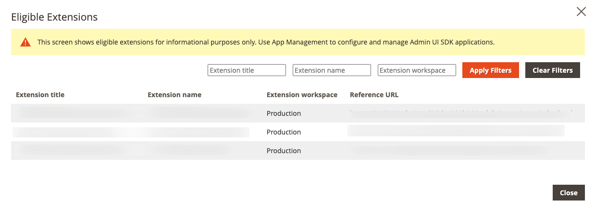

# Display extensions

<InlineAlert variant="info" slots="text" />

As of Admin UI SDK 4.0, extensions are no longer configured from the Adobe Commerce Admin. Instead, use App Manager to associate an App Builder app to a Commerce instance. See [Manage your app](https://experienceleague.adobe.com/en/docs/commerce/app-management/manage-app/manage-app) in the _App Management Guide_ for details.

The Eligible Extensions modal displays the extensions that are currently associated with the Commerce instance. To display this modal, navigate to **Stores** > Settings > **Configuration** > **Adobe Services** > **Admin UI SDK**. In the **General Configuration** section, click the **Configure extensions** button.

