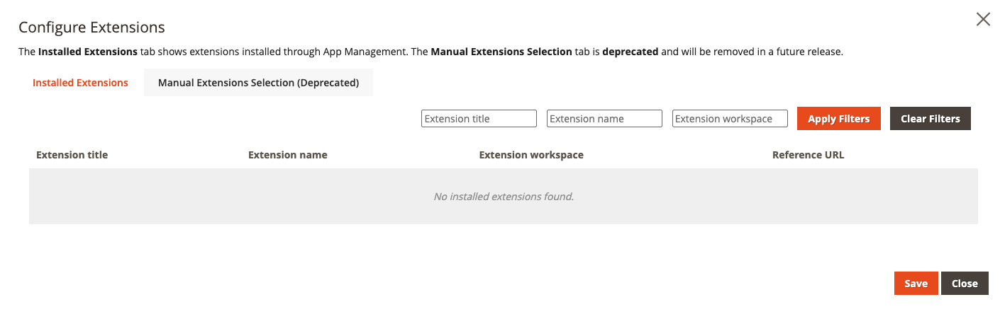

# Display extensions

<InlineAlert variant="info" slots="text" />

As of Admin UI SDK 4.1, extensions are no longer configured from the Adobe Commerce Admin. Instead, use App Manager to associate an App Builder app to a Commerce instance. See [App Management](../app-management/index.md)
[Manage your app](https://experienceleague.adobe.com/en/docs/commerce/app-management/manage-app/manage-app) in the _App Management Guide_ for details.

Navigate to **Stores** > Settings > **Configuration** > **Adobe Services** > **Admin UI SDK**. In the **General Configuration** section, click the **Configure extensions** button. The **Configure Extensions** modal dialog displays.

The **Installed Extensions** tab displays extensions that were installed with App Management. This tab is for informational purposes only. You cannot manage these apps from this dialog.

The **Manual Extensions Selection** tab allows you to select the extensions that have already been installed for a specific Commerce instance. Commerce loads all eligible extensions from the App Registry. An extension is considered eligible when the deployed workspace is published to the `commerce/backend-ui/1` extension point.

1. Select the workspace of extensions you want to map to the Commerce instance. Click **Apply** to load the eligible extensions. Workspace choices are: **Stage**, **Production**, or **Custom**. If **Custom** is selected, be sure to provide the workspace name corresponding to the extension in App Builder. Only English alphanumeric and Latin alphabet characters are allowed.

1. Select the extensions you want to include in the Commerce instance.

1. Save the selection to have registrations correctly included in the Commerce Admin.

The Eligible Extensions modal displays the extensions that are currently associated with the Commerce instance. To display this modal, navigate to **Stores** > Settings > **Configuration** > **Adobe Services** > **Admin UI SDK**. In the **General Configuration** section, click the **Configure extensions** button.

