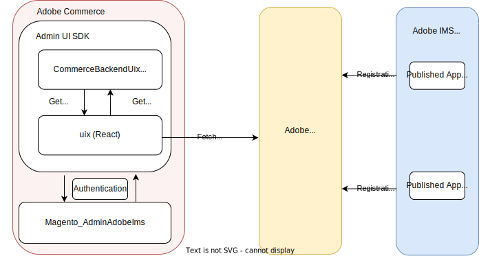
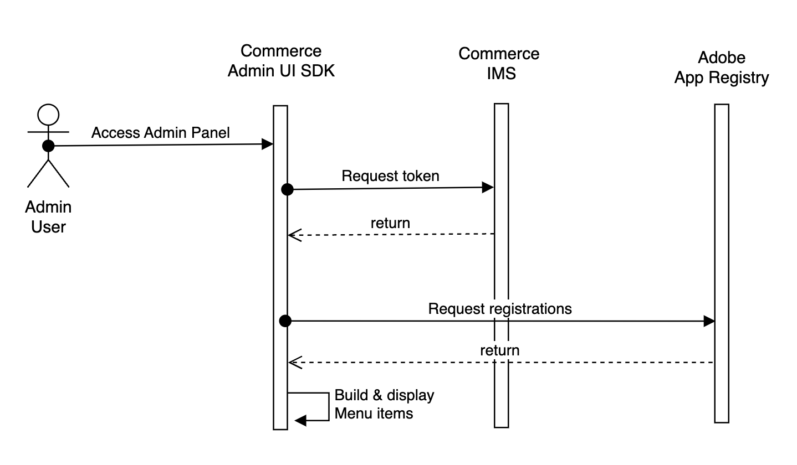

# Adobe Commerce Admin UI SDK overview

The Adobe Commerce Admin UI SDK enables an App Builder developer to extend the [Commerce Admin](https://experienceleague.adobe.com/docs/commerce-admin/start/admin/admin.html) to include custom menus and pages. These Admin customizations were traditionally defined in a PHP module. The principles of Out-of-Process development require a more modern approach. The Admin UI SDK provides the merchant with the means to use the Admin to configure and interact with an app developed in App Builder.

Many types of apps will use this SDK. It represents a one-to-many approach for supporting Out of Process UI Extensibility. Application developers, internal adopters, and merchants using Out of Process Extensibility no longer have to rely on purely headless applications. Instead, they can now build and use secure and authenticated UIs directly from the Commerce Admin panel.

## Architecture

The following diagram shows the architecture of the Admin UI SDK.

The SDK contains two main components that are necessary for development:

* The `CommerceBackendUix` module is a traditional in-process Commerce PHP module that allows Out of Process extensions to inject menus and pages into the Admin.

* `uix` defines a React app that renders the custom Admin content.

[Adobe Identity Management Service (IMS)](https://experienceleague.adobe.com/docs/commerce-admin/start/admin/ims/adobe-ims-integration-overview.html) manages authentication. The merchant adds their IMS org information into a configuration panel in Commerce. Once this information added, the merchant's App Builder app can securely communicate with the merchant's instance and render the app UI.

The following sequence diagram illustrates the authentication process.

## Code samples

The [Adobe Commerce Samples repository](https://github.com/adobe/adobe-commerce-samples/tree/main/admin-ui-sdk) contains samples for different extension points of the Adobe Commerce Admin UI SDK. Use these samples to gain insight on how the Admin SDK injects menus and pages into the Admin.

## Admin UI SDK and Adobe Extensions

Adobe App Builder supports [extensions](https://developer.adobe.com/app-builder/docs/guides/extensions/), which allow developers to integrate their applications with specific Adobe products. Extensions act as a bridge between Adobe products and the applications built using Adobe App Builder. As a result, these applications can be easily integrated and extended within Adobe's ecosystem.

The Admin UI SDK supports only the `extensions` type. An App Builder project using an `application` configuration should be [migrated](https://developer.adobe.com/app-builder/docs/guides/extensions/extension_migration_guide/) to use an `extensions` configuration linked to the `commerce/backend-ui/1` extension point ID.
