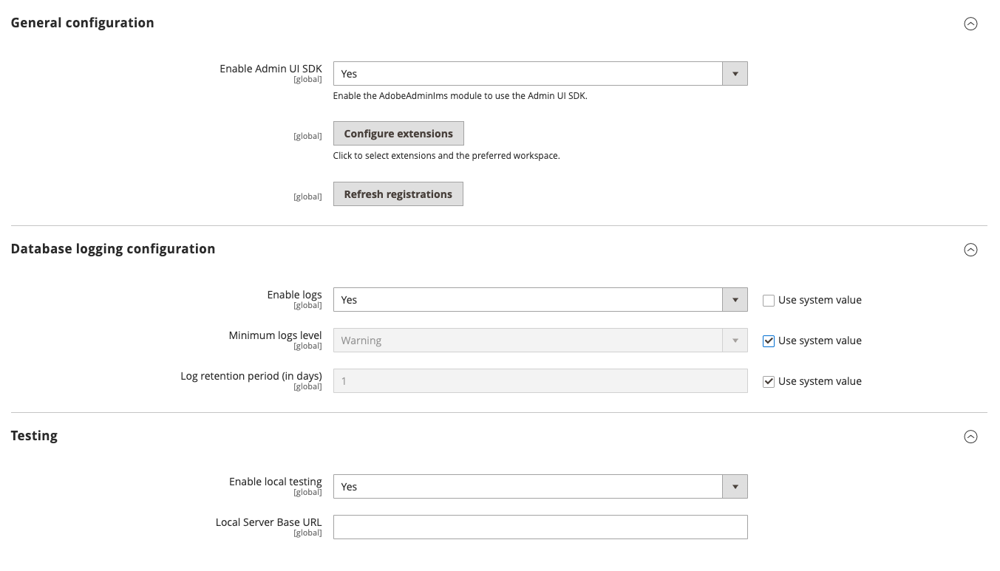

# Install or update Adobe Commerce Admin UI SDK

Adobe Commerce as a Cloud Service (SaaS) automatically includes the Adobe Commerce Admin UI SDK. All you need to do is enable it. For Adobe Commerce on Cloud and on-premises (PaaS) projects, the SDK is installed automatically on Adobe Commerce version 2.4.8 and later. You must install it manually on older versions.

<InlineAlert variant="info" slots="text1" />

Magento Open Source is not supported.

## Enable the Admin UI SDK on SaaS

<Edition name="saas" />

The Admin UI SDK is disabled by default. To enable it, login to the Adobe Commerce Admin and navigate to the  **Stores** > Settings > **Configuration** > **Adobe Services** > **Admin UI SDK** screen.



1. Set the **Enable Admin UI SDK** field to **Yes**.

1. In the **Testing** section, set the **Enable local testing** field to **No**.

1. Click **Save Config**.

## Install the Admin UI SDK on PaaS

<Edition name="paas" />

This section describes the basic steps to install the Admin UI SDK on Adobe Commerce 2.4.5 to 2.4.7. It is installed automatically on version 2.4.8 and later.

Adobe Commerce has the following software requirements:

* Adobe Commerce on cloud infrastructure or on premises: 2.4.5+
* PHP 8.1+
* [Adobe Identity Management Service (IMS) for Adobe Commerce](https://experienceleague.adobe.com/docs/commerce-admin/start/admin/ims/adobe-ims-integration-overview.html)

The [Adobe App Builder _Getting Started_ guide](https://developer.adobe.com/app-builder/docs/getting_started/) lists the latest software requirements for creating App Builder apps.

### Enable Adobe IMS for Commerce

You must implement Adobe Identity Management Service (IMS) for Adobe Commerce to use the Admin UI SDK. [Configure the Commerce Admin Integration with Adobe ID](https://experienceleague.adobe.com/docs/commerce-admin/start/admin/ims/adobe-ims-config.html?lang=en) describes this process.

### Adobe Commerce on cloud infrastructure installation

This method installs the SDK on a cloud instance.

1. On your local workstation, change to the Cloud project root directory.

1. Update your `composer.json` file:

   ```bash
   composer require "magento/commerce-backend-sdk": ">=1.0"
   ```

1. Update dependencies and install the extension:

   ```bash
   composer update
   ```

   The `composer update` command updates all dependencies. If you do not want to update all dependencies at the same time, use this command instead:

   ```bash
   composer update magento/commerce-backend-sdk
   ```

1. Commit and push your changes.

### On-premises installation

This method installs the SDK on an On-premises instance.

1. Add the SDK module to the `require` section of the `composer.json` file:

   ```bash
   composer require "magento/commerce-backend-sdk": ">=1.0"
   ```

1. Update dependencies and install the extension:

   ```bash
   composer update
   ```

   The `composer update` command updates all dependencies. If you do not want to update all dependencies at the same time, use this command instead:

   ```bash
   composer update magento/commerce-backend-sdk
   ```

1. Upgrade Adobe Commerce:

   ```bash
   bin/magento setup:upgrade
   ```

1. Refresh indexes:

   ```bash
   bin/magento indexer:reindex
   ```

1. Clear the cache:

   ```bash
   bin/magento cache:clean
   ```

1. Commit your changes.

1. Update your on-premises instance to ensure the committed code is deployed.

### Enable the Admin UI SDK

Login to the Adobe Commerce Admin and navigate to the  **Stores** > Settings > **Configuration** > **Adobe Services** > **Admin UI SDK** screen.


1. Set the **Enable Admin UI SDK** field to **Yes**.

1. (Optional) In the **Testing** section, set the **Enable local testing** field to **Yes**.

1. Click **Save Config**.

## Update the Commerce Admin UI SDK

<Edition name="paas" />

The Admin UI SDK is automatically updated for SaaS projects. For PaaS projects, follow the procedure below to update patch versions of the SDK, such as upgrading from V2.x to V3.0.0.

1. Run the following command to update the SDK:

   ```bash
   composer update magento/commerce-backend-sdk
   ```

1. Run the following commands to upgrade Adobe Commerce, reindex data, and clear the cache.

   ```bash
   bin/magento setup:upgrade && bin/magento indexer:reindex && bin/magento cache:clean
   ```

1. If you are updating from V1.x to V2.0, refer to [Migrate your extension point](./extension-points/index.md#migrate-your-extension-point-from-version-1x-to-20) for additional instructions.

1. If you are updating from V2.x to V3.0, the published extensions won't be fetched automatically. Refer to [Eligible extensions configuration](./eligible-extensions-config.md) to select the needed extensions to display.
