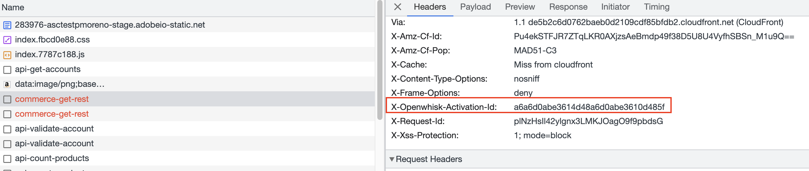

# Logging and troubleshooting

Adobe Developer App Builder offers different options to facilitate logging from code and for viewing and forwarding applications logs as needed. You can opt for the default setting, which involves retrieving logs directly from the IO Runtime, or you can forward them to other destinations like Splunk or Azure Log Analytics. Throughout the development of Amazon Sales Channel in App Builder, the default option and forwarding to Splunk were explored.

## Adobe I/O Runtime (default)

[Actions](https://developer.adobe.com/runtime/docs/guides/overview/entities/) are serverless functions that run on Adobe I/O Runtime. In general, an action is invoked in response to an event and produces some observable output. An Adobe Commerce event must work successfully for its resulting Runtime Action to be successful. Make sure to troubleshoot both of these entities when diagnosing issues with your application. The following tips and comprehensive comparison enable you to make informed decisions about your Logging approach.

When building and troubleshooting your application, it is important to understand the differences between events and runtime actions. These concepts are often interrelated, with events triggering runtime actions, but the actual functionality and logging capabilities are separate entities. Best practice is to determine whether the event delivery was successful, and then investigate any resulting runtime actions.

### Set the log level

You can configure the log level per action in your `ext.config.yml` or `app.config.yml` file, as follows:

```yaml
<action_name>:
  inputs:
    LOG_LEVEL: <error|warn|info|verbose|debug|silly>
```

### View logs

To view logs in real time, run the following command:

```bash
aio rt logs --tail
```

```terminal
283976-asctestamina-stage/amazon-app/scheduled-amazon-sync-products:e7e5281de72049d3a5281de720c9d3c7
2023-07-18T10:27:05.585Z       stdout: 2023-07-18T10:27:05.585Z [main /283976-asctestamina-stage/amazon-app/scheduled-amazon-sync-products] info: {"message":"Start retrieving Amazon product updates","params":{}}
```

Sometimes logs do not appear, like web action logs or small random hiccups. In such a case, you can use the activation ID to get specific logs for that action.

#### Get logs using the aio CLI

In this example, we are tailing our logs. We know that there is a scheduled runtime action named `sync-orders` that was executed, but its logs were never displayed. We must get its activation ID from the activation list and get the logs directly for that runtime action.

1. Run the following command to return a list of runtime entities:

   ```bash
   aio rt activation list
   ```

   ```terminal
   Datetime        Status    Kind      Version    Activation ID                    Start Wait  Init Duration Entity
   ─────────────── ───────── ───────── ──────── ─ ──────────────────────────────── ───── ───── ──── ──────── ─────────────────────────────────────────────────────
   07/18 12:09:04  success   nodejs:18 0.0.10     2491e3f886264b2891e3f88626fb2820 cold  2289  727  1885ms   amazon-app/scheduled-amazon-sync-products
   07/18 12:09:02  success   trigger   0.0.9      4373d5bf7bcd4371b3d5bf7bcd937197 --    --    --   --       everyThreeMin
   07/18 12:06:05  success   nodejs:18 0.0.9      e3eda8a94b6f4bf3ada8a94b6f3bf3f6 cold  3230  664  1829ms   amazon-app/scheduled-amazon-sync-products
   07/18 12:06:02  success   trigger   0.0.8      ae2d87a5af6045f4ad87a5af6095f463 --    --    --   --       everyThreeMin
   07/18 12:03:04  success   nodejs:18 0.0.9      b2878be443c444ed878be443c444ed4d cold  2196  751  1788ms   amazon-app/scheduled-amazon-sync-products
   07/18 12:03:02  success   trigger   0.0.8      80639009d2184c9ca39009d2182c9ce8 --    --    --   --       everyThreeMin
   07/18 12:02:07  success   nodejs:18 0.0.9      fb491c0dd31e4d97891c0dd31ecd9730 cold  2216  702  1712ms   amazon-app/scheduled-amazon-sync-listing-improvements
   07/18 12:02:07  success   nodejs:18 0.0.9      b1a8bdbee4884974a8bdbee48869745e cold  2213  956  1236ms   amazon-app/scheduled-amazon-sync-orders
   07/18 12:02:05  success   trigger   0.0.8      d88d73a273ec40fb8d73a273ece0fb2d --    --    --   --       everyTenMin
   07/18 12:00:05  success   nodejs:18 0.0.9      00479a279a234cd7879a279a233cd799 cold  3264  573  2143ms   amazon-app/scheduled-amazon-sync-products
   07/18 12:00:02  success   trigger   0.0.8      0d3466d142a64a5ab466d142a67a5a8e --    --    --   --       everyThreeMin
   07/18 11:57:05  success   nodejs:18 0.0.9      eb13ee8b00434b5f93ee8b0043fb5f61 cold  3215  589  1581ms   amazon-app/scheduled-amazon-sync-products
   07/18 11:57:02  success   trigger   0.0.8      75088e55df85453c888e55df85e53ca3 --    --    --   --       everyThreeMin
   07/18 11:54:04  success   nodejs:18 0.0.9      3eb429d46e0c45ceb429d46e0c25ce67 cold  2195  695  1693ms   amazon-app/scheduled-amazon-sync-products
   07/18 11:54:02  success   trigger   0.0.8      23c2b9e6188c404d82b9e6188c904de4 --    --    --   --       everyThreeMin
   07/18 11:52:15  success   nodejs:18 0.0.9      bf54aa75b6294fd994aa75b629dfd91d cold  10410 626  1560ms   amazon-app/scheduled-amazon-sync-listing-improvements
   07/18 11:52:07  success   nodejs:18 0.0.9      fcf0e0153d59409db0e0153d59809d36 cold  2208  1404 1738ms   amazon-app/scheduled-amazon-sync-orders
   07/18 11:52:05  success   trigger   0.0.8      cd54ae8d9b46472f94ae8d9b46e72f71 --    --    --   --       everyTenMin
   07/18 11:51:04  success   nodejs:18 0.0.9      1659c848908840bf99c8489088d0bf1b cold  2207  586  1570ms   amazon-app/scheduled-amazon-sync-products
   07/18 11:51:02  success   trigger   0.0.8      c1327a57f2734b91b27a57f2737b91c1 --    --    --   --       everyThreeMin
   07/18 11:48:04  success   nodejs:18 0.0.9      c0c5a3ceb6c4424585a3ceb6c4a24570 cold  2195  941  1927ms   amazon-app/scheduled-amazon-sync-products
   07/18 11:48:02  success   trigger   0.0.8      047760cb71314236b760cb713172362a --    --    --   --       everyThreeMin
   07/18 11:45:04  success   nodejs:18 0.0.9      86e59628804f4d15a59628804fed15e2 cold  2194  915  1936ms   amazon-app/scheduled-amazon-sync-products
   07/18 11:45:02  success   trigger   0.0.8      fe014774ee084ce2814774ee08ace245 --    --    --   --       everyThreeMin
   07/18 11:42:08  success   nodejs:18 0.0.9      5641f4fb9ae84ea281f4fb9ae8eea297 cold  3264  585  2594ms   amazon-app/scheduled-amazon-sync-listing-improvements
   07/18 11:42:08  success   nodejs:18 0.0.9      91e748ccdf5246f1a748ccdf52b6f10c cold  3238  621  939ms    amazon-app/scheduled-amazon-sync-orders
   07/18 11:42:05  success   trigger   0.0.8      e31c7d64b37a4ac49c7d64b37adac485 --    --    --   --       everyTenMin
   07/18 11:42:04  success   nodejs:18 0.0.9      ba601e7a82c741b2a01e7a82c771b2ea cold  2197  578  1574ms   amazon-app/scheduled-amazon-sync-products
   07/18 11:42:02  success   trigger   0.0.8      575a91cfd9a044169a91cfd9a0b416e4 --    --    --   --       everyThreeMin
   07/18 11:41:26  app error nodejs:18 0.0.9      1a5bc097961647cb9bc097961677cb0b cold  432   647  658ms    amazon-app/amazon-get-sales
   ```

1. Specify the activation ID to return a list of applicable log updates.

   ```bash
   aio rt logs <activation ID>
   ```

   For example, `aio rt logs b1a8bdbee4884974a8bdbee48869745e` returns the following:

   ```terminal
   === activation logs b1a8bdbee4884974a8bdbee48869745e
   2023-07-18T10:02:08.375Z       stdout: 2023-07-18T10:02:08.375Z [main /283976-asctestamina-stage/amazon-app/scheduled-amazon-sync-orders] info: {"message":"Sync orders from Amazon into Adobe Commerce","params":{}}
   2023-07-18T10:02:08.649Z       stdout: 2023-07-18T10:02:08.649Z [main /283976-asctestamina-stage/amazon-app/scheduled-amazon-sync-orders] info: {"message":"Synced account orders","params":{}}
   ```

   **Note:** If you have installed the `watch` command, you can run the `watch -n2 aio rt activation list` to refresh the activation list every two seconds.

#### Get the activation ID from a response header

You can also get the activation ID from the `X-Openwhisk-Action-Id` response header from a web action.



With this value, you can now run the `aio rt logs <activation ID>` command.

## Event logs

Event logs allow you to see details about the events received in your project.

For webhook event registrations, use [Debug Tracing](https://developer.adobe.com/events/docs/support/tracing/). This feature enables the developers to monitor attempts by I/O Events to deliver events to their webhook consumer applications. This feature helps in debugging issues with event registrations and also comes in handy while setting up an event-registration from scratch.

You can see the logs generated by a webhook event by visiting your Adobe Developer [console](https://developer.adobe.com/) and selecting your project > your workspace > the event name > **Debug Tracing**. This section displays all the events received. Each event shows the request and response. The activation ID and the logs for the specific action are also available. In the case of brand new event registrations, hitting refresh should enable this tab. Debug Tracing is only available for event registrations where the webhook option is selected.


<InlineAlert variant="info" slots="text" />

When forwarding logs is configured, it's possible that some logs cannot be displayed, or they could be displayed with a delay (observed from a few seconds to 10 minutes).

## Log forwarding to Splunk

Run the following `aio` command to configure log-forwarding to Splunk in your project/workspace. Follow the prompts to assign the host, port, index, and Splunk HEC token:

```bash
aio app config set log-forwarding --verbose
? select log forwarding destination Splunk HEC
? host <INSERT_HOST>
? port <INSERT_PORT>
? index <INSERT_INDEX>
? hec_token [hidden]
```

If you make a mistake in any of these fields, the command returns a 400 (Bad Request) response.

Upon success, your `.aio` file should be populated with the log forwarding data.

If the command is successful, but you cannot see any log in Splunk, run the following command to troubleshoot:

```bash
aio app config get log-forwarding errors
```

## Splunk logging vs IO Runtime logging

[Managing Application Logs](https://developer.adobe.com/app-builder/docs/guides/application_logging/#when-to-use-log-forwarding) can help you decide which logging works best for your use case.

### Log display time

Understand how much time the messages need to be displayed since they were logged.

| Runtime action type | Without log forwarding | With log forwarding |
| --- | --- | --- |
| Event listener | Almost instantly | Almost instantly |
| Scheduled | Almost instantly but a bit flaky | Almost instantly |
| Web | Only accessible using the activation id | Almost instantly |

### Display activation logs

The type of runtime action determines whether logs are displayed. The logs for scheduled actions are always displayed. For event listener and web actions, success and failure logs are displayed when forwarding is enabled. If forwarding is not enabled, failure logs are displayed, but not success logs.

## Troubleshooting

Debugging the React app locally poses no issues, as running the application allows for immediate visibility of any changes made. Debugging in this context can be facilitated through the use of the [console module](https://nodejs.org/api/console.html) inside your web-src components and the inspection of browser.

```text
console.log('Here your message');
```

Logs are displayed as follows:


However, when it comes to debugging actions, there are two alternatives available. The first option involves using Docker to debug by running the action on your local machine. Alternatively, you can deploy the actions to I/O Runtime and use logs for debugging purposes.

### Debugging actions locally with Docker

The [Debugging App Builder Apps](https://developer.adobe.com/app-builder/docs/resources/debugging/) codelab describes the debugging process in detail. As you work through that codelab, keep in mind that the `aio app run --local` command that allows you to run actions in the local container is not supported in NodeJS 18.

To perform [advanced debugging](https://developer.adobe.com/runtime/docs/guides/using/debugging/) for `node.js` actions, use the `wskdebug` command to forward actions from the OpenWhisk system to a local container. Based on testing conducted with various versions of both packages and two different versions of Node.js, the following information outlines the current support status:

```bash
wskdebug --inspect-brk=11932 <action_name> <path_action_name.js> -l -v
```

* `@adobe/wskdebug 1.1.3` &#9989;
* `@openwhisk/wskdebug 1.2.0` &#9989;
* `@openwhisk/wskdebug 1.3.0` &#10060;
* `@openwhisk/wskdebug 1.4.0` &#10060;

The error returned from the last two versions is:

`FetchError: request to http://0.0.0.0:53362/init failed, reason: connect ECONNREFUSED 0.0.0.0:53362`

<InlineAlert variant="info" slots="text" />

If you encounter any issues, check the `openwhisk` local log file (`openwhisk-local.log.txt`), which should be inside the `dist` folder in your project.

### Limitations and known issues

* You cannot use `wskdebug` to debug your actions if you are using `aio-lib-state` or `aio-lib-files`. See [common issues](https://developer.adobe.com/app-builder/docs/getting_started/common_troubleshooting/#debugging-errors-with-state-and-files-sdk).

* Breakpoints might not pause when debugging an action. [Troubleshoot Asset Compute extensibility](https://experienceleague.adobe.com/docs/experience-manager-learn/cloud-service/asset-compute/troubleshooting.html?lang=en#debug) provides more information.

* The `aio app run --local` command does not work with Nodejs18, Currently, only Nodejs16 is supported.

* You cannot run your application with the `--local flag` in any of the following cases:

  * The limits/timeout configured in your `app.config.yml` file are higher than 300000 ms. Setting the value too high causes the following error:
  
    ```text
    ›   Error: PUT http://localhost:3233/api/v1/namespaces/guest/actions/amazon-app/scheduled-amazon-sync-products Returned HTTP 400 (Bad Request) --> "The request content was malformed:
    ›   requirement failed: duration 400000 milliseconds exceeds allowed threshold of 300000 milliseconds"
    ```

  * You have a dependency on the `lib-state` storage library, which causes the following error:

    ```text
    "code": "ERROR_BAD_ARGUMENT",
    "message": "[TvmLib:ERROR_BAD_ARGUMENT] ow.auth" is required"
    "stacktrace": "TvmLibError: [TvmLib:ERROR_BAD_ARGUMENT] "ow.auth" is required
    ```

  * You have triggers (scheduled runtime actions) configured. This will show the following error:

    ```text
    Error: POST http://localhost:3233/api/v1/namespaces/whisk.system/actions/alarms/interval Returned HTTP 403 (Forbidden) --> "The supplied authentication is not authorized to access 'whisk.system/alarms'."
    ```

### Timeout issues

Based on the development team's experience developing Amazon Sales Channel app, a 503 error may occur when an action exceeds its allotted time. However, this error message may not always provide sufficient information, especially when the action is invoked from a React UI. In such cases, it is recommended to investigate further using the activation ID to gain more insights. If the result obtained from activation ID indicates a timeout error, it will typically display a message such as:

```json
{
  "error": "The action exceeded its time limits of 60000 milliseconds."
}
```

In such instances, investigate the root cause of the timeout error, which could potentially be due to a slow response from an external API. If so, you might consider reviewing the specific API call that is taking excessive time. Additionally, adjusting the timeout duration for your action may be a solution. Note that the maximum allowable timeout for a blocking action is set at 60 seconds.

## Additional tips

* When a new log forwarding configuration is set to an existing destination, it overwrites the previous configuration but does not remove any logs previously sent there. When the destination of the logs is changed (for example from Splunk back to Adobe I/O Runtime), logs previously sent to Splunk are not removed. And when setting forwarding back to Splunk once again, the previous logs are not reset or removed.

* Once you start forwarding logs to Splunk HEC, running the `aio rt logs` command will return the following warning:

  `Namespace is configured with custom log forwarding destination: 'splunk_hec'. Please use corresponding logging platform to view logs`

* If you receive the `Too many debug requests in the last minute` error, consider disabling the `'X-OW-EXTRA-LOGGING': 'on'` header in your runtime action. This setting activates throttling to your App Builder application, and some requests will be denied. Use log-forwarding to reduce the number of messages being logged instead.
