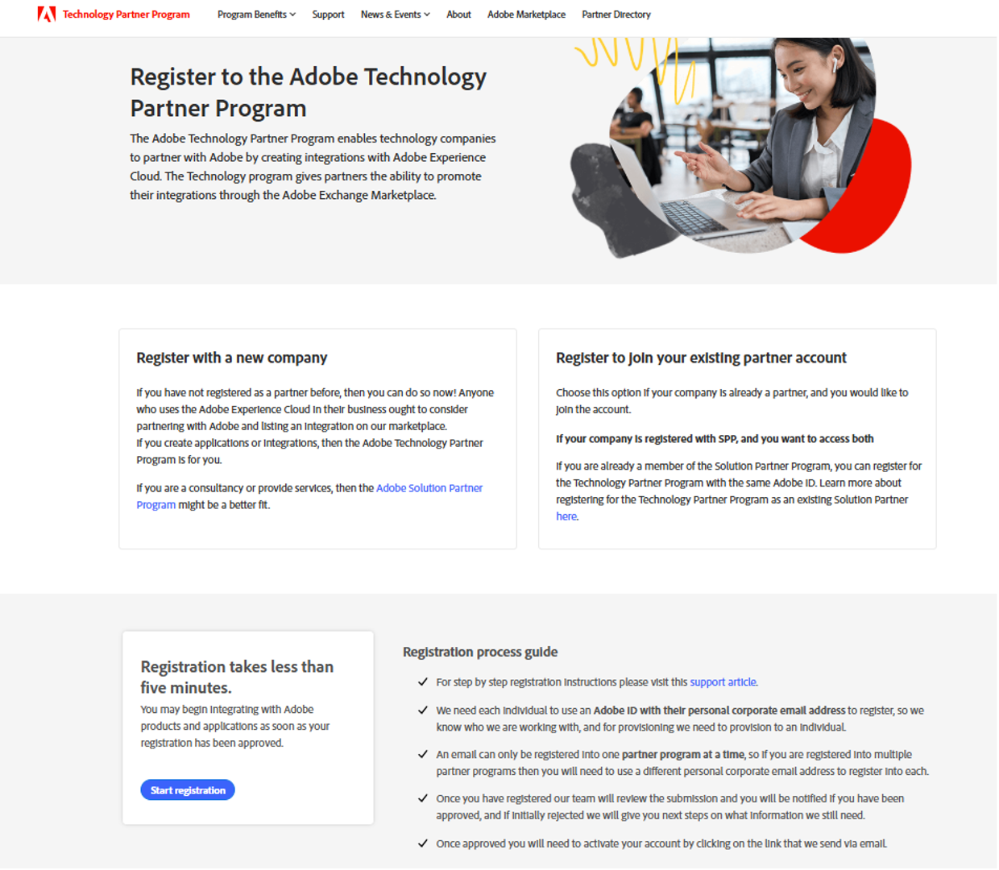

# Adobe Developer App Builder Kit for Developers

Adobe believes that strong partnerships result in powerful results. Whether you are a **Solution Implementer (SI)**, or an **Independent Software Vendor (ISV)** who wants to build App Builder apps, Adobe is committed to supporting you at every step—from onboarding and sandbox access to app development and distribution.

Through the **Technology Partner Program (TPP)**, you receive access to the tools and resources you need for application development. Adobe is committed to helping you navigate challenges and complete your apps successfully.

Together with Adobe, you can create solutions that deliver real value to you, your customers, and the broader Adobe ecosystem.

## Requirements to access App Builder

Access to App Builder requires the following conditions:

- **Membership requirements** - To build and publish an application, you must have a Silver tier membership or higher, which gives you sandbox access and the possibility to publish on the Adobe Exchange Marketplace. Start with your membership and reach out to Adobe to share your objectives on app building and start a collaboration between your team and ours. We commit to our partners and will support you if you have questions or need help during the development stage.

- **Account requirements** - A [TPP account](https://partners.adobe.com/technologyprogram/experiencecloud/registration.html) is required to access all sandboxes (App Builder, the Adobe Commerce as a Cloud Service SaaS sandbox, and the PaaS sandbox), whether you are an SI or ISV.

<InlineAlert variant="info" slots="text"/>

If you are a **Solution Partner Program (SPP)** partner, you will need to create a TPP account to access these environments.

### How to set up your account

#### Step 1: Request a TPP account

Go to the [Register to the Adobe Technology Partner Program](https://partners.adobe.com/technologyprogram/experiencecloud/registration.html) page and create a Silver-level (or higher) TPP account. You'll be asked to provide a corporate email address and company website as part of the registration process. [How to register in the Adobe Technology Partner Program](https://partners.adobe.com/technologyprogram/experiencecloud/knowledgebase/a96d596f933f8214fbe77b847aba101c.html) provides additional information about this process.

   

Adobe Support will create an IMS org for you, either proactively or after you request sandbox access in [Step 3](app-builder-partnership-essentials.md#step-3-request-sandbox-access). Each registrant must use an Adobe ID.

After you join, Adobe will assign an ISV, a TPP organization, and an App Builder sandbox associated to that organization.

   <InlineAlert variant="info" slots="text"/>

   You require a Silver membership (or higher) within a TPP account to access App Builder, or public app listing.

#### Step 2: Adobe reviews your request

**Adobe will review your application and process your membership order. Within a few days, you’ll receive an email notification confirming whether your membership has been approved or rejected because additional information is required. If further details are needed, Adobe will provide guidance on next steps.

#### Step 3: Request Sandbox access

After your Silver membership is processed, you can request sandbox access, which will be provisioned within 5 days of your request:

- **App Builder Sandbox** - automatically associated with a TPP organization (for newly provisioned TPP organizations). Older organizations without permission should request access to all three sandboxes (App Builder, PaaS and ACCS/SaaS) through [TPP Support](https://partners.adobe.com/ec/cform/sandbox) on the same ticket (if needed).

- **Commerce PaaS Sandbox** – Account Managers should request both Composer entitlements for Adobe Commerce EE/B2B Access and PaaS sandbox through [TPP Support](https://partners.adobe.com/ec/cform/sandbox).

- **Commerce SaaS Sandbox** - File a ticket to [TPP Support](https://partners.adobe.com/ec/cform/sandbox). Once received, you can add additional users that will need sandbox access in your Admin Console. See Step 6 to manually assign users as Admins or Developers (check step 6).

<InlineAlert variant="info" slots="text"/>

You can create a ticket to check the status of your organization, or sandbox enablement, specifying the name of your assigned TPP organization.

#### Step 4: Log into your IMS organization

Verify you are logged into your IMS organization by checking the top-right corner of Adobe Experience Cloud or Developer Console. If it displays your organization name, you're ready to use App Builder. If it shows an email address, you're signed into a personal account instead of your IMS organization.

#### Step 5: Create Project from template

1. Navigate to the Developer Console to access App Builder.

1. Select **Create Project from template**.

   

1. Follow steps described in the [Create your First App Builder Application](https://developer.adobe.com/app-builder/docs/get_started/app_builder_get_started/first-app) topic.

#### Step 6: Manage your team

**Admin Console** is a hub for accessing services, managing user access, product entitlements, or roles for all Adobe Experience Cloud products.

**Admin Console** allows admins to manage their team members. Any additional users who need to submit, or manage App Builder listings, need to have their Adobe ID email added to the IMS organization.

If you are an admin of your IMS organization, you can add other users, admins or developers through the **Admin Console**.

<InlineAlert variant="info" slots="text"/>

Only Developer or Admin status will allow them to manage App Builder listings; User status will not do that.

### Integrations

After partners get sandbox access, the Adobe Commerce engineering team will ask developers to extend the integration starter kit when getting started with App Builder development.

## How to build an app

1. Get started by learning more about [building an app](https://developer.adobe.com/app-builder/docs/intro_and_overview/).

1. Install the [Adobe Commerce integration starter kit](../starter-kit/integration/create-integration.md).

1. Read the [App Submission guidelines](../app-development/app-submission-guidelines.md).

1. Review the [developer guides](https://developer.adobe.com/app-builder/docs/guides/app_builder_guides/) for [out-of-process apps](index.md) and [app distribution](https://developer.adobe.com/developer-distribution/experience-cloud/docs/guides/discoverAndManage/app-builder-discover).

**Support resources:**

- [Common issues](https://developer.adobe.com/app-builder/docs/get_started/app_builder_get_started/troubleshoot).

- [Experience League forum](https://experienceleaguecommunities.adobe.com/t5/app-builder/ct-p/adobe-app-builder).

- Slack support channel in the [Magento Open Source Workspace](https://developer.adobe.com/open/magento/slack): `#app-builder-community`

## How to package your app

1. [Package and configure the app overview](https://developer.adobe.com/app-builder/docs/guides/app_builder_guides/distribution/).

1. Internal publishing: Publish within the [partner's organization](https://developer.adobe.com/app-builder/docs/get_started/app_builder_get_started/publish-app).

1. External publishing: Publish on the Adobe Exchange Marketplace. Read the following [distribution](https://developer.adobe.com/app-builder/docs/get_started/app_builder_get_started/publish-app) section.

## Distribution

Before you distribute, you must be part of the [Technology Partner Program](#step-1-request-a-tpp-account).

Here are the distribution steps with use case for Commerce SIs and ISVs:

### Step 1: Create an App Builder listing

- Sign into [Developer Distribution (DD)](https://developer.adobe.com/distribute) and confirm that your approved IMS organization appears in the upper-right organization switcher. If the organization name looks like your email address, you are not in the TPP organization, and will get an error when trying to create a listing.

- Create a public profile before submitting your first App Builder listing.

- [Create an App Builder listing](https://developer.adobe.com/developer-distribution/experience-cloud/docs/guides/submission/app-builder-submission#creating-a-listing) using the zip file you created when building your App Builder app. After creating your listing, you will be able to see it on the **Listing Overview** page.

   

### Step 2: Submit a listing for Review

- Review the [Adobe Exchange Marketplace publishing requirements](./app-submission-guidelines.md) to ensure your submission meets the requirements and to avoid delaying approval of your listing due to unmet criteria.

- Adobe brand and code reviewers will [review the App Builder listing](https://developer.adobe.com/developer-distribution/experience-cloud/docs/guides/submission/app-builder-submission#reviewing-a-submission) and provide confirmation upon approval by e-mail. If it is incomplete, Adobe will provide you with feedback. You can also see the status on your page as **Approved**, or **Published**.

## Variations

ISVs can publish the listing under their name, if they have an Adobe ID associated with a TPP organization.

SIs can:

- Publish the listing under their name, if they have joined the **Technology Partner Program** with their Adobe ID associated with a TPP organization.

- Publish on behalf of an ISV, if they are added to the TPP organization of the ISV. Provide evidence that ISV approves of SI publishing on their behalf by submitting a [TPP Support](https://partners.adobe.com/ec/cform/case) ticket, and Adobe will provide the name of the organization to the SI user to ensure they sign in to the Developer Distribution (DD) under the correct organization.

<InlineAlert variant="info" slots="text, text1"/>

Any user with an Adobe ID associated with the TPP publishing organization can submit, manage, and retract an App Builder Listing in Developer Distribution.

Users updating or revising the App Builder App itself require Commerce and App Builder sandboxes in their organization.

## Resources

- [SPP](https://solutionpartners.adobe.com/solution-partners/benefits.html) and [TPP](https://partners.adobe.com/technologyprogram/experiencecloud/benefits.html) Program Level Guide.

- [About App Builder](https://developer.adobe.com/app-builder/docs/intro_and_overview/)

- [Introduction to App Builder](https://experienceleague.adobe.com/en/docs/commerce-learn/tutorials/adobe-developer-app-builder/introduction-to-app-builder)

- [Getting started with App Builder](https://developer.adobe.com/app-builder/docs/get_started/app_builder_get_started/app-builder-intro)

- [Adobe Commerce checkout starter kit](../starter-kit/checkout/index.md) with the following Github repositories:
  
  - [Adobe Commerce checkout starter kit](https://github.com/adobe/commerce-checkout-starter-kit)
  
  - [Adobe Commerce integration starter kit](https://github.com/adobe/commerce-integration-starter-kit)

- [Set up access, environment, and tools](https://developer.adobe.com/app-builder/docs/get_started/app_builder_get_started/set-up)

- [Configuration files](https://developer.adobe.com/app-builder/docs/guides/app_builder_guides/configuration/configuration#public-distribution-configuration)

- [Adobe Developer App Builder for Adobe Experience Cloud](https://business.adobe.com/products/experience-manager/developer-app-builder.html)

- [Extend and integrate with Adobe Solutions](https://developer.adobe.com/app-builder/)

- [Adobe Commerce extensibility](../index.md)
