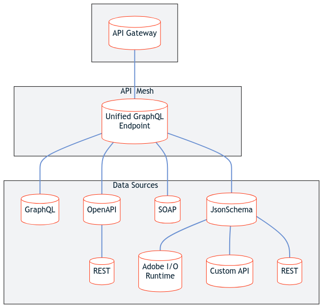

# Extensibility examples

There are many ways to extend [Adobe Commerce](../index.md) today, such as [APIs](https://developer.adobe.com/commerce/webapi/) and [extensions](https://developer.adobe.com/commerce/marketplace/guides/sellers/extension-create/). However, these options in isolation only encapsulate a small fraction of possibilities with extensibility. This article speculates on what is possible with new and emergent technologies and more elaborate integrations to explore what can be created in the future.

## Understanding extensibility components

Adobe has developed several new technologies that can further extend the Adobe Commerce platform. Each of the following services has unique features and capabilities, which are important to understand individually before considering more complex examples.

### Adobe Developer App Builder

[App Builder](https://developer.adobe.com/app-builder/docs/overview/) is a complete framework that allows you to build and deploy custom web applications to extend Adobe Commerce and other Adobe solutions while running on Adobe infrastructure.

To learn more about App Builder, follow [this step-by-step tutorial](https://developer.adobe.com/app-builder/docs/getting_started/first_app/) on creating your first app. These instructions will help you build foundational knowledge of App Builder and the tools it provides. You will learn how to create an app using the Adobe I/O CLI, and how to organize your code and projects within the developer console.

### API Mesh for Adobe Developer App Builder

[API Mesh](https://developer.adobe.com/graphql-mesh-gateway/) is an Adobe service that allows you to take multiple vendor APIs of different protocols, like GraphQL, REST, JSON schemas, and SOAP implementations, and combine them into a single unified GraphQL endpoint. By consuming a mesh's unified GraphQL endpoint, you can connect Adobe Commerce to App Builder, Adobe I/O Events for Adobe Commerce, and any other service that provides an accessible source. You can further customize your experience by using [transforms](https://developer.adobe.com/graphql-mesh-gateway/gateway/transforms/) to customize the source data to your needs.

<!-- [Link to .mmd file](../_images/api-mesh-diagram.mmd) -->

API Mesh adds extensibility at the web API layer (headless/consumer level) by providing the relevant data and behavior from different vendor APIs to the consumer (usually an experience like a storefront, web store, or kiosk) without needing to modify these sources.

Additionally, the unified GraphQL endpoint allows you to integrate with other third-party systems (like ERPs and CRMs) or synchronize data between systems.

API Mesh has several features which allow for further extensibility:

- `beforeAll` [Hooks](https://developer.adobe.com/graphql-mesh-gateway/gateway/hooks/) - Allow you to insert a function before the query takes place, which can be helpful for use cases like authenticating or checking for a header before making a request.

- [Custom Resolvers](https://developer.adobe.com/graphql-mesh-gateway/gateway/extending-unified-schema/) - Allow you to upload a resolver to your mesh that uses JavaScript to modify data, insert custom logic, and return custom computed data. In [this example](https://developer.adobe.com/graphql-mesh-gateway/gateway/extending-unified-schema/#programmatic-additionalresolvers), we show how you could use a discounts API to apply discounts to your products.

- [Transforms](https://developer.adobe.com/graphql-mesh-gateway/gateway/transforms/) - Allow you to modify the structure of an API's data without modifying the source itself.

To learn more about API Mesh, follow [this walkthrough](https://developer.adobe.com/graphql-mesh-gateway/gateway/mesh_walkthrough/) where you create, query, and transform data using a sample configuration.

### Adobe I/O Events

[Adobe I/O Events for Adobe Commerce](../events/index.md) allows you to react to an event using a runtime function when a shopper performs an action on a Commerce storefront, such as adding a product to a cart, clicking the Buy button, or creating an account. Commerce can now make transactional data available to applications created with Adobe App Builder.

In addition, [Conditional Events](../events/conditional-events.md) give you the power to define rules that execute workflows when certain thresholds are met. For example, you could create a rule that sends a special coupon code for any new customer from a specified state.

## Combining extensibility components

While App Builder, API Mesh, and Adobe I/O Events provide powerful extensibility on their own, combining them allows Adobe Commerce users to maximize their extensibility. The next few sections describe possible example implementations of this type of integration.

The Commerce storefront acts as a consumer, while API Mesh acts as an orchestration layer. The consumer sends events to the orchestration layer, which can access backend systems and vendor APIs, then compute or modify the data and return it to the storefront or pass it on to the single-page application (App Builder). The consumer or storefront can also contact the single-page application directly.

<!-- [Link to .mmd file](../_images/integrated-commerce.mmd) -->

### Example: Auditing product changes

Consider a scenario where you want to create an accessible log that keeps records of specific changes to your Adobe Commerce products. You could create a conditional event that fires when a product's price is changed beyond a specified threshold. That event is consumed by your App Builder app in a mesh that combines your Adobe Commerce REST endpoint and a third-party logging API. The App Builder app could then serve the logged data through an interactive webpage.

### Example: Tracking shipping efficiency

If you are curious about the quality and turnaround time of your shipping provider, you could trigger the process with a change of shipping status event. Then your App Builder app could use API Mesh to feed that data to a third-party shipping efficiency API, which could return the data to your single-page application for inspection.

### Example: Adding placeholder product descriptions

Imagine a scenario where you want to create placeholder products, but you do not want the page to be empty and you do not want to manually create placeholder data. You could create an event that fires when a product description contains a string like `<placeholder>`. This event is consumed by your App Builder app, which uses Adobe Commerce's REST API along with a third-party placeholder data app to populate your `stage` storefront with placeholder data.
