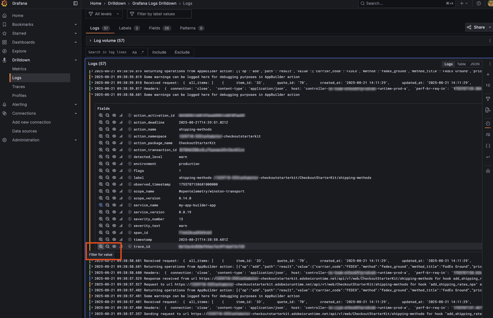
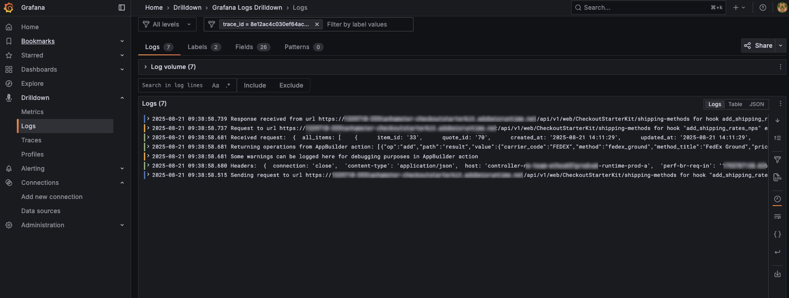

# Adobe Commerce observability with App Builder

Context propagation can align observability data from Commerce and App Builder. The context propagates automatically from Adobe Commerce to App Builder as webhooks headers or as a part of an event payload. This allows you to correlate observability data from both systems and get a complete picture of the request flow.

If your App Builder app makes requests to other services, you can also propagate the context to those services, which allows you to trace the request flow across multiple systems and get a complete picture of the request flow.

To forward logs from App Builder, use the [`@adobe/aio-lib-telemetry` package](https://github.com/adobe/aio-lib-telemetry/blob/main/docs/usage.md).

## Example

Create a file with the telemetry configuration, for example `telemetry.js` in the `application` directory of your App Builder app. Replace the `<EXPORT_URL>` with the URL of your telemetry collector. You can use a Ngrok or another tunneling service to expose your local development environment.

```javascript
const {
    defineTelemetryConfig,
    getPresetInstrumentations,
    getAioRuntimeResource
} = require("@adobe/aio-lib-telemetry")

const {
    OTLPLogExporterHttp,
    SimpleLogRecordProcessor
} = require("@adobe/aio-lib-telemetry/otel");

function localCollectorConfig(exportUrl) {
    const makeExporterConfig = (path) => ({
        url: `${exportUrl}/${path}`,
    });

    return {
        logRecordProcessors: [
            new SimpleLogRecordProcessor(
                new OTLPLogExporterHttp(makeExporterConfig("v1/logs"))
            ),
        ],
    };
}

const telemetryConfig = defineTelemetryConfig((params, isDev) => {
    // Use the tunnel URL instead of localhost
    const exportUrl = "<EXPORT_URL>"; // Replace with your actual export URL

    return {
        sdkConfig: {
            serviceName: "<YOUR_SERVICE>", // Use the name in the observability subscription to match the logs
            instrumentations: getPresetInstrumentations("simple"),
            resource: getAioRuntimeResource(),

            ...localCollectorConfig(exportUrl),
        }
    };
});

exports.telemetryConfig = telemetryConfig
```

### Context propagation from Commerce webhook headers

By using the following pattern in `index.js`, you can trace requests across Adobe Commerce and your App Builder app, making it easier to monitor, debug, and analyze your integrations. The following code example:

- Imports and uses a custom telemetry configuration (`telemetryConfig`) to send logs to your observability backend.
- Instruments the action's entrypoint with `instrumentEntrypoint` from `@adobe/aio-lib-telemetry`, which enables distributed tracing and log correlation.
- Extracts tracing headers (`traceparent` and `tracestate`) from incoming webhook requests and propagates them, so logs from both Commerce and App Builder can be correlated in your observability tool.
- Uses a logger to record structured logs at different levels (debug, info, warn, error) for better monitoring and troubleshooting.

```javascript
const { HTTP_OK } = require('../../lib/http');
const { telemetryConfig } = require('../telemetry');
const { instrumentEntrypoint, getLogger } = require('@adobe/aio-lib-telemetry');

async function main(params) {
    const logger = getLogger('my-custom-action', { level: params.LOG_LEVEL || 'info' });
    try {
        logger.debug('My custom action called with params: ', params);
        logger.info('Headers: ', params.__ow_headers);


        // Your action logic goes here

        logger.warn('Some warnings can be logged here for debugging purposes in AppBuilder action');

        const operations = [];

        operations.push({
            op: 'success',
        })

        logger.info(`Returning operations from AppBuilder action: ${JSON.stringify(operations)}`);

        return {
            statusCode: HTTP_OK,
            body: JSON.stringify(operations)
        }
    } catch (error) {
        logger.error(error);
    }
}

// The following adds requirements for passing context propagation from Commerce webhook headers
const instrumentedMain = instrumentEntrypoint(main, {
    ...telemetryConfig,
    propagation: {
        getContextCarrier: (params) => {
            if (params && params.__ow_headers && params.__ow_headers["traceparent"]) {
                return {
                    carrier: {
                        traceparent: params && params.__ow_headers && params.__ow_headers["traceparent"] || "",
                        tracestate: params && params.__ow_headers && params.__ow_headers["tracestate"] || ""
                    }
                }
            } else {
                return {
                    carrier: {}
                }
            }
        }
    }
});
exports.main = instrumentedMain
```

### Context propagation from Commerce eventing payload

By using the following example, you can trace requests using eventing. The following code example:

- Defines a function (`instrumentedMain`) that wraps the main handler with telemetry instrumentation, enabling distributed tracing and log correlation.
- Uses a custom `getContextCarrier` function to extract the `traceparent` and `tracestate` fields from the incoming event payload's `_metadata` property, ensuring that trace context is forwarded correctly for end-to-end observability across systems.
- Enables logs and traces generated by the App Builder action to be correlated with the originating Commerce event, providing full visibility into request flows.

```javascript
const {HTTP_OK} = require("../../lib/http");
const {instrumentEntrypoint, getLogger} = require("@adobe/aio-lib-telemetry");
const {telemetryConfig} = require("../telemetry");

async function main(params) {
  const logger = getLogger('commerce-events/consume', { level: params.LOG_LEVEL || 'info' });

  logger.debug(`Received Commerce event ${type}`);

  logger.warn('Event processing is not implemented yet, returning a dummy response');

  logger.debug('Consumed Commerce event.', {type});

  return {
    statusCode: HTTP_OK,
    body: JSON.stringify({
      message: `Received Commerce event ${type}`
    })
  }
}

// The following adds requirements for passing context propagation from Commerce events payload
const instrumentedMain = instrumentEntrypoint(main, {
  ...telemetryConfig,
  propagation: {
    getContextCarrier: (params) => {
      if (params.data._metadata && params.data._metadata["traceparent"]) {
        return {
          carrier: {
            traceparent: params.data._metadata["traceparent"] || "",
            tracestate: params.data._metadata["tracestate"] || ""
          }
        }
      } else {
        return {
          carrier: {}
        }
      }
    }
  }
});
exports.main = instrumentedMain
```

## Local development

You can run observability locally to test Commerce extensibility tools and their connection to App Builder. Refer to the [how to run Grafana locally](https://github.com/adobe/aio-lib-telemetry/blob/main/docs/use-cases/grafana.md#local-development) example for more information.

You can use a tunneling service to forward logs to your local development machine from the Commerce instance and deployed App Builder action. For example, you can use [Ngrok](https://ngrok.com/) to expose your local development environment to the internet. For more information, refer to [tunnel forwarding](https://github.com/adobe/aio-lib-telemetry/blob/main/docs/use-cases/support/tunnel-forwarding.md).



To filter logs for a single request you can use the `trace_id` filter. The `trace_id` is propagated from Commerce to App Builder. Use the `trace_id` to correlate logs from both systems.


