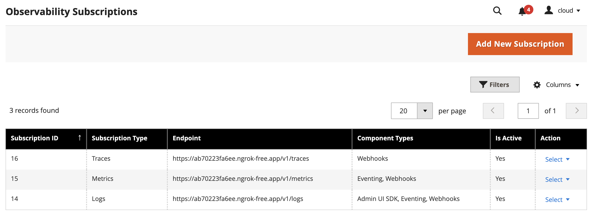

# Adobe Commerce observability overview

<InlineAlert variant="important" slots="text" />

This functionality is automatically available on [Adobe Commerce as a Cloud Service](https://experienceleague.adobe.com/en/docs/commerce/cloud-service/overview) (SaaS) projects. Adobe Commerce on-premises and Cloud infrastructure (PaaS) projects can [install separate modules](#install-observability-module) to provide this functionality.

Observability allows you to monitor and understand the behavior of extensibility tools such as [webhooks](../../webhooks/index.md), [events](../../events/index.md), and the [Admin UI SDK](../../admin-ui-sdk/index.md). This module allows you to forward logs from Adobe Commerce and connect them with App Builder logs using context propagation. This enables tracing the flow of requests and responses across different components of your application, providing a comprehensive view of your system's performance and behavior.

<Edition name="paas" />

**Note:** The message queue must be configured and running to use observability. The message queue is used to send logs asynchronously, ensuring that the main application flow is not blocked by logging operations. Consumers must be configured to run by cron jobs or as workers.

## Configure observability

To start using the observability module, you need to configure Adobe Commerce by creating a new subscription. You can create a subscription in two ways: in the Admin UI or through the Rest API. You can create multiple subscriptions, each with its own configuration. The subscription configuration includes the following parameters:

- **Type**: The type of subscription. Currently only `logs` is supported.
- **Destination**: The type of destination where the logs will be sent. Supported values are `NewRelic`, `Datadog`, `Splunk`, and `OpenTelemetry`.
- **Destination endpoint**: The endpoint of the destination where the logs will be sent.
- **Destination API key**: The API key for the destination, if required.
- **Component**: The component the subscription is created for. Supported values are `Webhooks`, `Eventing`, and `Admin UI SDK`. You can select one or more components to monitor.
- **Service name**: The name of the service that will be used to identify the logs in the destination.
- **Is active**: A flag that indicates whether the subscription is active or not.
- **Headers**: Additional headers that will be sent with the logs to the destination. This is useful for adding custom metadata or authentication information. You can specify if header has secret values to hide in the Admin UI or Rest API response.
- **Log message configuration**: Enables or disables the additional data in the log message. This includes the request headers, payload, and response payloads for webhooks.

Available log destinations:

- **OpenTelemetry**: Logs can be sent to any OpenTelemetry-compatible endpoint, allowing for flexible integration with various additional observability tools.
- **NewRelic**: Logs will be sent to NewRelic using the NewRelic Logs API.
- **Datadog**: Logs will be sent to Datadog using the Datadog Logs API.
- **Splunk**: Logs will be sent to Splunk using the Splunk HTTP Event Collector (HEC).

### Configuration (Admin UI)

To configure observability in the Admin UI, navigate to **System > Observability > Subscription List**. Here you can create, update, and delete subscriptions.



To create a new subscription, click the **Add New Subscription** button. Enter the required information and click **Save Subscription**. The new subscription is added to the list.


### Configuration (Rest API)

To manage subscriptions using the REST API, you can use the following endpoints:

| **Route URL**                             | **Method** | **Description**                                          |
|-------------------------------------------| ---------- |----------------------------------------------------------|
| `/V1/oope_observability/subscription/:id` | GET        | Retrieve an observability subscription                  |
| `/V1/oope_observability/subscription?searchCriteria[pageSize]=100`     | GET        | Retrieve a list of observability subscriptions       |
| `/V1/oope_observability/subscription`     | POST       | Create a new observability subscription                  |
| `/V1/oope_observability/subscription`     | PUT        | Update an observability subscription                   |
| `/V1/oope_observability/subscription/:id` | DELETE     | Delete observability subscription by ID                  |

#### Create a new subscription

The `POST` request to `/V1/oope_observability/subscription` requires a JSON payload. The following example shows a request body to create a new subscription:

```json
{
    "subscription": {
        "type": "logs",
        "destination": "OpenTelemetry",
        "destination_endpoint": "https://otlp.nr-data.net:4318/v1/logs",
        "component": [
            "webhooks",
            "eventing"
        ],
        "headers": [
            {
                "name": "api-key",
                "value": "abcd1234-abcdabc-afs",
                "secret": true
            }
        ],
        "log_message_settings": [
            "log_webhook_request_body"
        ],
        "is_active": "true"
    }
}
```

#### Update an existing subscription

To update an existing subscription, make a `PUT` request to the `/V1/oope_observability/subscription` endpoint. The request body should contain the updated subscription information, including the subscription `id`. The following example shows a request body to update a subscription:

```json
{
  "subscription": {
    "id": 3,
    "type": "logs",
    "destination": "NewRelic",
    "destination_endpoint": "https://log-api.newrelic.com/log/v1",
    "component": [
      "webhooks",
      "eventing",
      "admin-ui-sdk"
    ],
    "is_active": "true"
  }
}
```

#### Retrieve a list of subscriptions

To retrieve a list of all observability subscriptions, make a `GET` request to `/V1/oope_observability/subscription?searchCriteria[pageSize]=100`. This returns a paginated list of subscriptions, with a maximum of 100 subscriptions per page.

```json
{
  "items": [
    {
      "id": 1,
      "type": "logs",
      "destination": "OpenTelemetry",
      "destination_endpoint": "https:\/\/<abc>.ngrok-free.app\/v1\/logs",
      "destination_api_key": "",
      "component": [
        "webhooks",
        "eventing",
        "admin-ui-sdk"
      ],
      "headers": [],
      "service_name": "my-app-builder-app",
      "is_active": true,
      "log_message_settings": [
        "log_webhook_request_headers",
        "log_webhook_request_body",
        "log_webhook_response_body"
      ]
    },
    {
      "id": 3,
      "type": "logs",
      "destination": "NewRelic",
      "destination_endpoint": "https:\/\/log-api.newrelic.com\/log\/v1 ",
      "destination_api_key": "abcd1234-abcdabc-afs",
      "component": [
        "webhooks",
        "eventing",
        "admin-ui-sdk"
      ],
      "headers": [],
      "service_name": "",
      "is_active": false,
      "log_message_settings": [
        "log_webhook_request_headers",
        "log_webhook_request_body",
        "log_webhook_response_body"
      ]
    }
  ]
}
```

## Install observability module

<Edition name="paas" />

### Prerequisites

- Adobe Commerce on Cloud Infrastructure or on-premises: 2.4.5+
- PHP 8.1+
- Magento Open Source is not supported.

<InlineAlert variant="info" slots="text"/>

Adobe Commerce as a Cloud Service (SaaS) has the observability module pre-installed and does not require any additional installation.

### Installation

To install the observability module in Adobe Commerce:

1. Install the module:

   ```bash
   composer require magento/module-out-of-process-observability=^1.0.0 --with-dependencies
   ```

1. Enable the installed module:

   ```bash
   bin/magento module:enable Magento_OutOfProcessObservability
   ```

1. For on-premises installations, run the following command to upgrade Adobe Commerce and clear the cache.

   ```bash
   bin/magento setup:upgrade && bin/magento cache:clean
   ```
