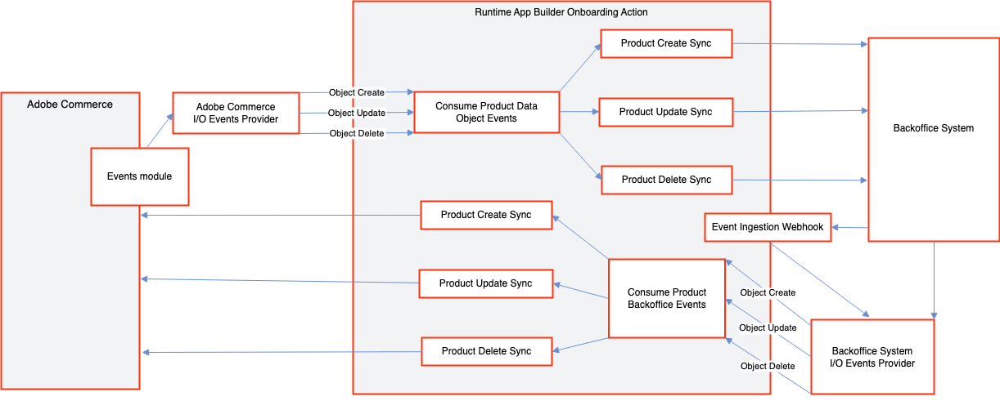

# Integrate runtime actions

The `create`, `update`, and `delete` runtime actions perform one of the following functions:

- [Notify the external application](#notify-the-external-application) - Notifies an external back-office application when an `<object>` is created, updated, or deleted in Adobe Commerce
- [Notify Commerce](#notify-adobe-commerce) - Notifies Adobe Commerce when an `<object>` is created, updated, or deleted in an external back-office application



## Notify the external application

This runtime action is responsible for notifying the external back-office application when an `<object>` is created, updated, or deleted in Adobe Commerce.

### Incoming information

The information specified during [event registration](../../events/configure-commerce.md#subscribe-and-register-events) determines the incoming information.

The `order` runtime action requires the `created_at` and `updated_at` fields.

<CodeBlock slots="heading, code" repeat="4" languages="JSON, JSON, JSON, JSON" />

#### customer

```json
{
   "id": 1,
   "created_at":"2000-12-31 16:52:40",
   "updated_at":"2000-12-31 16:48:40"
}
```

#### customer_group

```json
{
  "customer_group_id": 6,
  "customer_group_code": "Group name code",
  "tax_class_id": 4,
  "tax_class_name": "Tax class name",
  "extension_attributes": {
    "exclude_website_ids":[]
  }
}
```

#### order

```json
{
  "real_order_id": "ORDER_ID",
  "increment_id": "ORDER_INCREMENTAL_ID",
  "items": [
    {
      "item_id": "ITEM_ID"
    }
  ],
  "created_at": "2000-01-01",
  "updated_at": "2000-01-01"
}
```

#### product

```json
{
   "created_at":"2023-11-24 16:52:40",
   "name":"Test product name",
   "sku":"2_4_7_TestProduct",
   "updated_at":"2023-11-29 16:48:55"
}
```

The `params` also specify the `event_code` and `event_id`.

### Payload transformation

If necessary, make any transformation changes necessary for the external back-office application's formatting in the `transformData` function in the `transformer.js` file.

### Connect to the back-office application

Define the connection information in the `sendData` function in the `sender.js` file.  Include all the authentication and connection information in the `sender.js` file or an extracted file outside `index.js`.

Parameters from the environment can be accessed from `params`. Add the necessary parameters in the `actions/<object>/commerce/actions.config.yaml` under `commerce-created -> inputs`, `commerce-updated -> inputs`, or `commerce-deleted -> inputs` as follows:

<CodeBlock slots="heading, code" repeat="3" languages="yaml, yaml, yaml" />

#### create

```yaml
created:
  function: commerce/created/index.js
  web: 'no'
  runtime: nodejs:16
  inputs:
    LOG_LEVEL: debug
    HERE_YOUR_PARAM: $HERE_YOUR_PARAM_ENV
  annotations:
    require-adobe-auth: true
    final: true
```

#### update

```yaml
updated:
  function: commerce/updated/index.js
  web: 'no'
  runtime: nodejs:16
  inputs:
    LOG_LEVEL: debug
    HERE_YOUR_PARAM: $HERE_YOUR_PARAM_ENV
  annotations:
    require-adobe-auth: true
    final: true
```

#### delete

```yaml
deleted:
  function: commerce/deleted/index.js
  web: 'no'
  runtime: nodejs:16
  inputs:
    LOG_LEVEL: debug
    HERE_YOUR_PARAM: $HERE_YOUR_PARAM_ENV
  annotations:
    require-adobe-auth: true
    final: true
```

## Notify Adobe Commerce

This runtime action is responsible for notifying Adobe Commerce when an `<object>` is created, updated, or deleted in the external back-office application.

### Incoming information

The incoming information depends on the external API.

#### `customer`

<CodeBlock slots="heading, code" repeat="3" languages="JSON, JSON, JSON" />

#### create

```json
{
  "email": "sample@email.com",
  "name": "John",
  "lastname": "Doe"
}
```

#### update

```json
{
  "id": 1234,
  "email": "sample@email.com",
  "name": "John",
  "lastname": "Doe"
}
```

#### delete

```json
{
  "id": 1234
}
```

#### `customer_group`

<CodeBlock slots="heading, code" repeat="3" languages="JSON, JSON, JSON" />

#### create

```json
{
  "name": "A Group Name",
  "taxClassId": 25
}
```

#### update

```json
{
  "id": 8,
  "name": "A Group Name",
  "taxClassId": 25
}
```

#### delete

```json
{
  "id": 8
}
```

#### `order`

<CodeBlock slots="heading, code" repeat="1" languages="JSON" />

#### update

```json
{
  "id": 99,
  "status": "shipped",
  "notifyCustomer": false
}
```

#### `product`

<CodeBlock slots="heading, code" repeat="3" languages="JSON, JSON, JSON" />

#### create

```json
{
  "sku": "b7757d8a-3f3a-4ffd-932a-28cb07debef6",
  "name": "A Product Name",
  "description": "A product description"
}
```

#### update

```json
{
  "sku": "b7757d8a-3f3a-4ffd-932a-28cb07debef6",
  "name": "A Product Name",
  "price": 99.99,
  "description": "A product description"
}
```

#### delete

```json
{
  "sku": "b7757d8a-3f3a-4ffd-932a-28cb07debef6"
}
```

### Data validation

The incoming data is validated against a JSON schema defined in the `schema.json` file.

#### `customer`

<CodeBlock slots="heading, code" repeat="3" languages="JSON, JSON, JSON" />

#### create

```json
{
  "type": "object",
  "properties": {
    "name": { "type": "string" },
    "lastname": {"type":  "string"},
    "email": {"type":  "string"}
  },
  "required": ["name", "lastname", "email"],
  "additionalProperties": true
}
```

#### update

```json
{
  "type": "object",
  "properties": {
    "id": {"type": "number"},
    "name": { "type": "string" },
    "lastname": {"type": "string"},
    "email": {"type":  "string"}
  },
  "required": ["id", "name", "lastname", "email"],
  "additionalProperties": true
}
```

#### delete

```json
{
  "type": "object",
  "properties": {
    "id": { "type": "number" }
  },
  "required": ["id"],
  "additionalProperties": false
}
```

#### `customer_group`

<CodeBlock slots="heading, code" repeat="3" languages="JSON, JSON, JSON" />

#### create

```json
{
  "type": "object",
  "properties": {
    "name": { "type": "string" },
    "taxClassId": { "type": "number" }
  },
  "required": ["name", "taxClassId"],
  "additionalProperties": true
}
```

#### update

```json
{
  "type": "object",
  "properties": {
    "sku": { "type": "string" },
    "name": { "type": "string" },
    "price": {"type":  "number"},
    "description": {"type":  "string"}
  },
  "required": ["sku", "name", "price", "description"],
  "additionalProperties": true
}
```

#### delete

```json
{
  "customer_group_id": 6,
  "customer_group_code": "Group name code",
  "tax_class_id": 4,
  "tax_class_name": "Tax class name",
  "extension_attributes": {
    "exclude_website_ids":[]
  }
}
```

#### `order`

<CodeBlock slots="heading, code" repeat="1" languages="JSON" />

#### update

```json
{
  "type": "object",
  "properties": {
    "id": { "type": "integer" },
    "status": { "type": "string" },
    "notifyCustomer": { "type":  "boolean"}
  },
  "required": ["id", "status"],
  "additionalProperties": true
}
```

#### `product`

<CodeBlock slots="heading, code" repeat="3" languages="JSON, JSON, JSON" />

#### create

```json
{
  "type": "object",
  "properties": {
    "sku": { "type": "string" },
    "name": { "type": "string" },
    "price": {"type":  "number"},
    "description": {"type":  "string"}
  },
  "required": ["sku", "name", "description"],
  "additionalProperties": true
}
```

#### update

```json
{
  "type": "object",
  "properties": {
    "sku": { "type": "string" },
    "name": { "type": "string" },
    "price": {"type":  "number"},
    "description": {"type":  "string"}
  },
  "required": ["sku", "name", "price", "description"],
  "additionalProperties": true
}
```

#### delete

```json
{
  "type": "object",
  "properties": {
    "sku": { "type": "string" }
  },
  "required": ["sku"],
  "additionalProperties": false
}
```

### Payload transformation

If necessary, make any transformation changes necessary for the external back-office application's formatting in the `transformData` function in the `transformer.js` file.

### Preprocessing data

Any preprocessing needed before calling the Adobe Commerce API can be implemented in the `preProcess` function in the `pre.js` file.

### Interact with the Adobe Commerce API

The interaction with the Adobe Commerce API is defined in the `sendData` function in the `sender.js` file. This function delegates to the following methods and locations:

- `customer`
  - `createCustomer` - `actions/customer/commerceCustomerApiClient.js`
  - `updateCustomer` - `actions/customer/commerceCustomerApiClient.js`
  - `deleteCustomer` - `actions/customer/commerceCustomerApiClient.js`
- `customer_group`
  - `createCustomerGroup` - `actions/customer-group/commerceCustomerGroupApiClient.js`
  - `updateCustomerGroup` - `actions/customer-group/commerceCustomerGroupApiClient.js`
  - `deleteCustomerGroup` - `actions/customer-group/commerceCustomerGroupApiClient.js`
- `order`
  - `addComment` - `actions/order/commerceOrderApiClient.js`
- `product`
  - `createProduct` - `actions/product/commerceProductApiClient.js`
  - `updateProduct` - `actions/product/commerceProductApiClient.js`
  - `deleteProduct` - `actions/product/commerceProductApiClient.js`

Parameters from the environment can be accessed from `params`. Add the necessary parameters in the `actions/<object>/external/actions.config.yaml` under `created -> inputs`, `updated -> inputs`, or `deleted -> inputs` as follows:

<CodeBlock slots="heading, code" repeat="3" languages="JSON, JSON, JSON" />

#### create

```yaml
created:
  function: created/index.js
  web: 'no'
  runtime: nodejs:16
  inputs:
    LOG_LEVEL: debug
    COMMERCE_BASE_URL: $COMMERCE_BASE_URL
    COMMERCE_CONSUMER_KEY: $COMMERCE_CONSUMER_KEY
    COMMERCE_CONSUMER_SECRET: $COMMERCE_CONSUMER_SECRET
    COMMERCE_ACCESS_TOKEN: $COMMERCE_ACCESS_TOKEN
    COMMERCE_ACCESS_TOKEN_SECRET: $COMMERCE_ACCESS_TOKEN_SECRET
  annotations:
    require-adobe-auth: true
    final: true
```

#### update

```yaml
updated:
  function: updated/index.js
  web: 'no'
  runtime: nodejs:16
  inputs:
    LOG_LEVEL: debug
    COMMERCE_BASE_URL: $COMMERCE_BASE_URL
    COMMERCE_CONSUMER_KEY: $COMMERCE_CONSUMER_KEY
    COMMERCE_CONSUMER_SECRET: $COMMERCE_CONSUMER_SECRET
    COMMERCE_ACCESS_TOKEN: $COMMERCE_ACCESS_TOKEN
    COMMERCE_ACCESS_TOKEN_SECRET: $COMMERCE_ACCESS_TOKEN_SECRET
  annotations:
    require-adobe-auth: true
    final: true
```

#### delete

```yaml
deleted:
  function: deleted/index.js
  web: 'no'
  runtime: nodejs:16
  inputs:
    LOG_LEVEL: debug
    COMMERCE_BASE_URL: $COMMERCE_BASE_URL
    COMMERCE_CONSUMER_KEY: $COMMERCE_CONSUMER_KEY
    COMMERCE_CONSUMER_SECRET: $COMMERCE_CONSUMER_SECRET
    COMMERCE_ACCESS_TOKEN: $COMMERCE_ACCESS_TOKEN
    COMMERCE_ACCESS_TOKEN_SECRET: $COMMERCE_ACCESS_TOKEN_SECRET
  annotations:
    require-adobe-auth: true
    final: true
```

### Postprocess data

Any postprocessing needed after calling the Adobe Commerce API can be implemented in the `postProcess` function in the `post.js` file.

## Expected responses

If the runtime action works correctly, a `200` response indicates the event is complete.

```javascript
return {
    statusCode: 200
}
```

If the validation fails, the runtime action will respond with a `400` error, which prevents message processing from being retried by Adobe I/O.

```javascript
return {
    statusCode: 400,
    error: errors
}
```

The runtime action will respond with a `500` error if there is an issue with the application integration. You can send an array of errors, so the consumer can log the information and trigger the retry mechanism.

```javascript
return {
    statusCode: 500,
    error: errors
}
```
