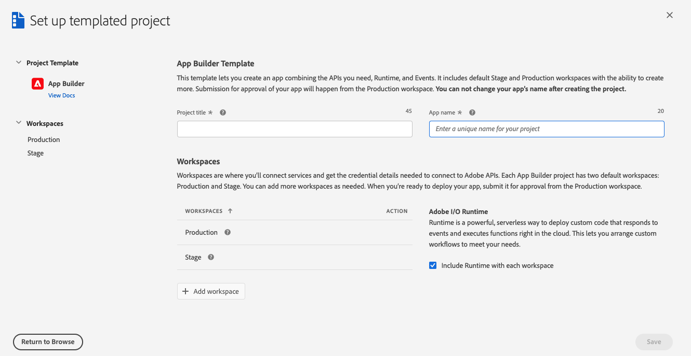
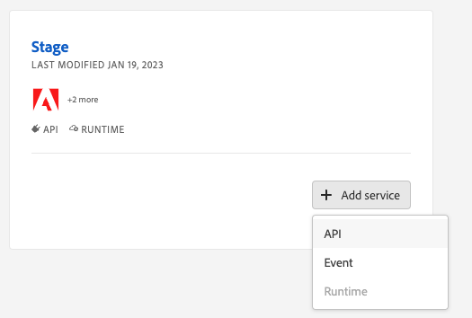

# Set up your Starter Kit project

To get started with Adobe Commerce Extensibility Starter Kit:

import ProjectRequirements from '/src/_includes/project-requirements.md'

<ProjectRequirements />

## Set up a project

[Projects Overview](https://developer.adobe.com/developer-console/docs/guides/projects/) describes the different types of projects and how to manage them. Here, we'll create a templated project.

1. Log in to the Adobe Developer Console and select the desired organization from the dropdown menu in the top-right corner.

1. Click **Create new project** > **Project from template**.

   

1. Select **App Builder**. The **Set up templated project** page displays.

   

1. Specify a project title and app name. Make sure the **Include Runtime with each workspace** checkbox is selected. Click **Save**. The Console creates a workspace.

   

1. In your workspace, click the **Add service** pop-up menu and select **API**.

   

1. On the **Add an API** page, filter on **Adobe Services** and select **I/O Management API**. Then click **Next**.

   

1. On the **Configure API** page, select the **OAuth Server-to-Server** option and click **Save configured API**.

   

   **Note**: You can set up server-to-server authentication using JSON Web Tokens (JWT). However, this method has been deprecated in favor of OAuth and must be replaced no later than January 1, 2025. See [Service Account (JWT) Authentication](https://developer.adobe.com/developer-console/docs/guides/authentication/JWT/) for details on implementing this solution.

1. On the front page of your workspace, click the **Add service** pop-up menu and select **API**.

   

1. On the **Add an API** page, filter by **Experience Cloud** and select **Adobe I/O Events for Adobe Commerce**. Then click **Next**.

1. On the **Configure API** page, click **Save configured API**.

1. If you are using JWT authentication, unzip the downloaded `config.zip` file. The extracted `config` directory should contain a `certificate_pub.crt` and a `private.key` file. The `private.key` file is required to configure the Commerce Admin.
