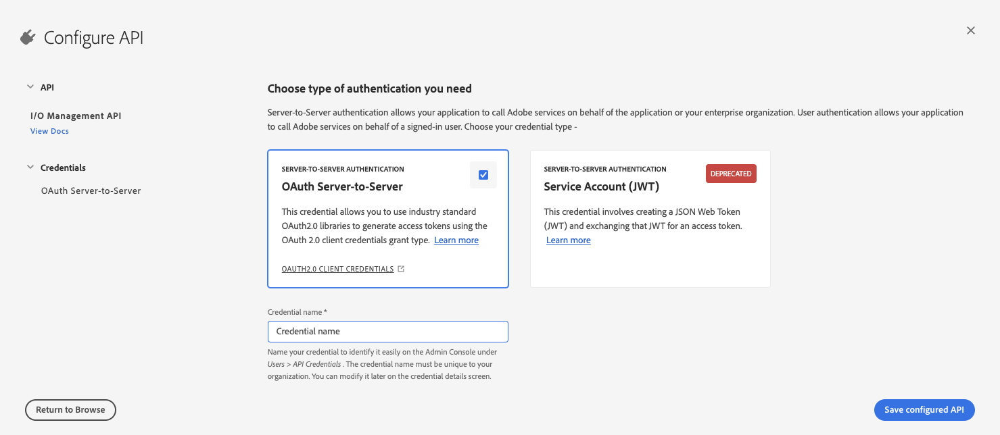
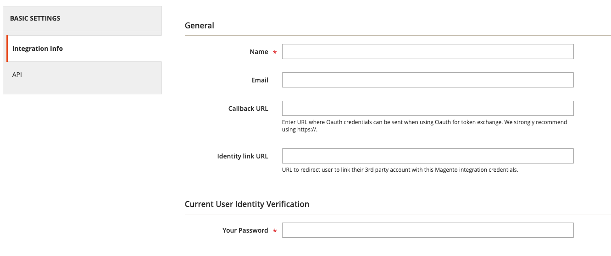

import BetaNote from '/src/_includes/starter-kit-beta.md';
import ProjectRequirements from '/src/_includes/project-requirements.md'

<BetaNote />

# Set up your Adobe Commerce Extensibility Starter Kit project

To get started with Adobe Commerce Extensibility Starter Kit:

<ProjectRequirements />

## Set up a project

[Projects Overview](https://developer.adobe.com/developer-console/docs/guides/projects/) describes the different types of projects and how to manage them. Here, we'll create a templated project.

1. Log in to the Adobe Developer Console and select the desired organization from the dropdown menu in the top-right corner.

1. Click **Create new project from template**.

   

1. Select **App Builder**. The **Set up templated project** page displays.

   

1. Specify a project title and app name. Make sure the **Include Runtime with each workspace** checkbox is selected. You can optionally create a custom workspace other than the default **Stage** workspace. To create a custom workspace, click **Add Workspace**, and enter a name and description. Click **Save**. The Console creates a project and workspaces.

   

1. In your workspace, click the **Add service** pop-up menu and select **API**.

   

1. Add the following services to your workspace. Each service must be added individually. You can add multiple services simultaneously.

   * I/O Management API
   * I/O Events
   * Adobe I/O Events for Adobe Commerce

   Click one of these services, such as **I/O Management API**. Then click **Next**.

   

1. On the **Configure API** page, select the **OAuth Server-to-Server** option and click **Save configured API**.

   

   **Note**: You can set up server-to-server authentication using JSON Web Tokens (JWT). However, this method has been deprecated in favor of OAuth and must be replaced no later than January 1, 2025. See [Service Account (JWT) Authentication](https://developer.adobe.com/developer-console/docs/guides/authentication/JWT/) for details on implementing this solution.

1. Use the **Add service** pop-up menu to select and add the other required services.

1. If you are using JWT authentication, unzip the downloaded `config.zip` file. The extracted `config` directory should contain a `certificate_pub.crt` and a `private.key` file. The `private.key` file is required to configure the Commerce Admin.

## Download the workspace configuration file

The console can generate a JSON file that defines the configuration of your workspace. You will use this file to configure the Commerce Admin and to set up the Starter Kit.

To download a `.json` file containing your workspace configuration:

1. Go to the overview page of your workspace.

1. Click the **Download All** button in the top-right corner.

   The `<Workspace-name>.json` file downloads automatically. In this example, the file is named `977AmethystGazelle-1340225-Stage.json`.

## Create an integration in Adobe Commerce

A Commerce integration generates the consumer key, consumer secret, access token, and access token secret that are required to connect to the Starter Kit. It also identifies the available API resources that are needed for the integration.

Use the following steps to create and activate an integration.

1. From the Admin, go to **System** > Extensions > **Integrations**.

1. Click **Add New Integration**. The **New Integration** page displays.

   

1. Enter a name for the integration in the **Name** field. Leave the other fields blank.

1. Click **API** under the Basic Settings menu to display the **Available APIs** screen. Change the value of the **Resource Access** drop-down menu to **All**.

1. Click **Integration Info** and enter your Admin password in the **Your Password** field. Click **Save** to return to the Integration page.

1. Click the **Activate** link in the grid.

  

1. On the next page, click the **Allow** button to display the **Integration Tokens for Extensions** page.

   

   You will need the integration details (consumer key, consumer secret, access token, and access token secret) to configure the Starter Kit. Copy these values to a safe place and click **Done**.

## Install Adobe I/O Events for Adobe Commerce (Commerce 2.4.4 and 2.4.5 only)

If you are running Adobe Commerce 2.4.4 or 2.4.5, you must install modules to enable eventing, as described in [Install Adobe I/O Events for Adobe Commerce](../../events/installation.md). These modules are installed automatically in subsequent versions of Commerce.
