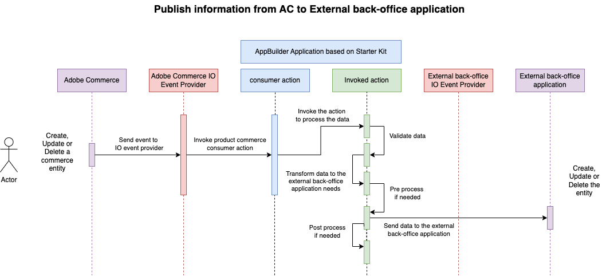

import BetaNote from '/src/_includes/starter-kit-beta.md'
import integration from '/src/_includes/integration.md'

<BetaNote />

# Expose Commerce data

This runtime action is responsible for notifying the external backoffice application when an `<object>` is created, updated, or deleted in Adobe Commerce.

<integration />

## Incoming event payload

The incoming event payload specified during [event registration](../../events/configure-commerce.md#subscribe-and-register-events) determines the incoming information.



The `order` runtime action requires the `created_at` and `updated_at` fields.

<CodeBlock slots="heading, code" repeat="4" languages="JSON, JSON, JSON, JSON" />

#### customer

```json
{
   "id": 1,
   "created_at":"2000-12-31 16:52:40",
   "updated_at":"2000-12-31 16:48:40"
}
```

#### customer_group

```json
{
  "customer_group_id": 6,
  "customer_group_code": "Group name code",
  "tax_class_id": 4,
  "tax_class_name": "Tax class name",
  "extension_attributes": {
    "exclude_website_ids":[]
  }
}
```

#### order

```json
{
  "real_order_id": "ORDER_ID",
  "increment_id": "ORDER_INCREMENTAL_ID",
  "items": [
    {
      "item_id": "ITEM_ID"
    }
  ],
  "created_at": "2000-01-01",
  "updated_at": "2000-01-01"
}
```

#### product

```json
{
   "created_at":"2023-11-24 16:52:40",
   "name":"Test product name",
   "sku":"2_4_7_TestProduct",
   "updated_at":"2023-11-29 16:48:55"
}
```

The `params` also specify the `event_code` and `event_id`.

## Payload transformation

If necessary, make any transformation changes necessary for the external backoffice application's formatting in the `transformData` function in the `transformer.js` file.

## Connect to the backoffice application

Define the connection information in the `sendData` function in the `sender.js` file.  Include all the authentication and connection information in the `sender.js` file or an extracted file outside `index.js`.

Parameters from the environment can be accessed from `params`. Add the necessary parameters in the `actions/<object>/commerce/actions.config.yaml` under `created -> inputs`, `updated -> inputs`, or `deleted -> inputs` as follows:

<CodeBlock slots="heading, code" repeat="3" languages="yaml, yaml, yaml" />

#### create

```yaml
created:
  function: commerce/created/index.js
  web: 'no'
  runtime: nodejs:16
  inputs:
    LOG_LEVEL: debug
    HERE_YOUR_PARAM: $HERE_YOUR_PARAM_ENV
  annotations:
    require-adobe-auth: true
    final: true
```

#### update

```yaml
updated:
  function: commerce/updated/index.js
  web: 'no'
  runtime: nodejs:16
  inputs:
    LOG_LEVEL: debug
    HERE_YOUR_PARAM: $HERE_YOUR_PARAM_ENV
  annotations:
    require-adobe-auth: true
    final: true
```

#### delete

```yaml
deleted:
  function: commerce/deleted/index.js
  web: 'no'
  runtime: nodejs:16
  inputs:
    LOG_LEVEL: debug
    HERE_YOUR_PARAM: $HERE_YOUR_PARAM_ENV
  annotations:
    require-adobe-auth: true
    final: true
```
