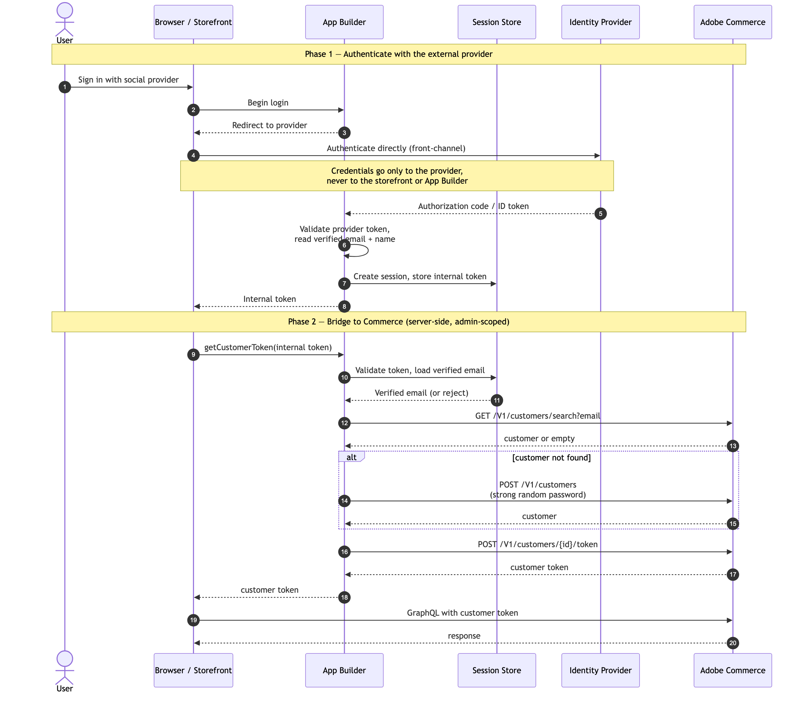

# Social login storefront SSO integration

Social login lets shoppers sign in to your storefront with an external identity provider (for example, Google or Meta) instead of creating and remembering a dedicated Commerce password. An [App Builder](https://developer.adobe.com/app-builder/) app handles the provider sign-in and then bridges the shopper into Adobe Commerce by obtaining a Commerce customer token. The storefront uses that token to authenticate the shopper's subsequent GraphQL requests.

The end-to-end flow has four steps:

1. Authenticate the shopper with the external provider and retrieve their verified profile data (at minimum, a verified email address, plus first and last name).
1. Check whether a Commerce customer already exists for that email.
1. Create a customer account if one does not already exist.
1. Generate a Commerce customer token and return it to the storefront for use in future GraphQL requests.

The same approach works on **Adobe Commerce as a Cloud Service** and **Adobe Commerce on Cloud/on-premises** using standard REST APIs without custom backend (PHP) code. Only the base URL, authentication, and one prerequisite differ between the two. The [REST endpoints and authentication](#rest-endpoints-and-authentication) section describes these differences.

## Prerequisites

On both platforms, your App Builder app must implement the OAuth/OpenID Connect flow for each external provider you support. It validates the identity token the provider returns. Trust profile data (such as the email address) only after the provider's token has been verified.

This integration pattern requires the `POST /V1/customers/{customerId}/token` endpoint, which is provided by the Storefront Compatibility Package. This package is always available on Adobe Commerce as a Cloud Service but requires separate installation on Adobe Commerce on Cloud and on-premises. On those platforms, the package version must be 4.7.6 or higher to include the token endpoint. See [Storefront Compatibility Package](https://experienceleague.adobe.com/developer/commerce/storefront/setup/configuration/storefront-compatibility/install/) for installation instructions.

## Overall flow



The diagram shows two phases:

1. **Authenticate with the external provider**: the shopper signs in from the storefront, and App Builder redirects them to the identity provider. The shopper authenticates directly with the provider, so their credentials never reach the storefront or App Builder. The provider returns an authorization code or ID token, which App Builder validates before reading the verified email and name. App Builder then starts a session, stores an internal token, and returns that token to the storefront.

1. **Bridge to Commerce (server-side, admin-scoped)**: the storefront exchanges the internal token for a Commerce customer token by calling App Builder. App Builder validates the internal token, loads the verified email, and searches Commerce for an existing customer with that email (`GET /V1/customers/search`). If none exists, App Builder creates one (`POST /V1/customers`). App Builder then generates a customer token (`POST /V1/customers/{customerId}/token`) and returns it to the storefront, which uses it as a bearer token on subsequent GraphQL requests.

## Where each call runs

All three endpoints are admin-scoped and must be called **server-side from your App Builder app**, never from the browser, because they require privileged credentials. The app returns only the resulting customer token to the storefront.

The token endpoint (`POST /V1/customers/{customerId}/token`) requires the `Magento_Customer::retrieve_tokens` permission (in the Admin, **Customer** > **Manage** > **Actions** > **Retrieve tokens**); the search and create endpoints require standard customer management access. Grant these to the credential your app uses, as described below.

## REST endpoints and authentication

The following endpoints are used in this flow:

- `GET /V1/customers/search` finds an existing customer by email.
- `POST /V1/customers` creates a customer account.
- `POST /V1/customers/{customerId}/token` generates a customer token.

The endpoint paths are identical on both platforms, but the base URL, request headers, and authentication token differ. In the examples further below, `<BASE_URL>` stands for the base URL for your platform, and requests use the headers described here.

The following sections describe the base URL and authentication for each platform. See [REST API Overview](https://developer.adobe.com/commerce/webapi/rest/) for more details about the differences between platforms.

### Adobe Commerce as a Cloud Service

When your app runs on Adobe Commerce as a Cloud Service, the following apply:

- **Base URL**: `https://<server>.api.commerce.adobe.com/<tenant-id>`. Find the exact value in your Commerce Cloud Manager instance details. Paths do **not** include `/rest` or a store view code.
- **Store scope**: supplied in a `Store` request header (for example, `Store: default`).
- **Authentication**: an Adobe Identity Management Service (IMS) access token. The admin and integration token methods used on PaaS are not available. The admin identity behind the token must hold the permissions listed in [Where each call runs](#where-each-call-runs), including `Magento_Customer::retrieve_tokens` for the token endpoint.

Obtain the IMS access token with a client-credentials request, then reuse it until it expires:

```bash
curl -X POST 'https://ims-na1.adobelogin.com/ims/token/v3' \
  -H 'Content-Type: application/x-www-form-urlencoded' \
  -d 'grant_type=client_credentials' \
  -d 'client_id=<CLIENT_ID>' \
  -d 'client_secret=<CLIENT_SECRET>' \
  -d 'scope=<SCOPES>'
```

A typical ACCS request:

```text
POST https://<server>.api.commerce.adobe.com/<tenant-id>/V1/customers
Authorization: Bearer <IMS_ACCESS_TOKEN>
Content-Type: application/json
Store: default
```

### Adobe Commerce on Cloud and on-premises

On Adobe Commerce on Cloud and on-premises, the following apply:

- **Base URL**: `https://<host>/rest/<store_code>`, where `<store_code>` is a store view code such as `default` (or `all` for global scope). Paths include `/rest` and the store code; there is no `Store` header.
- **Authentication**: an admin or integration bearer token. For a server-to-server integration, create an integration in the Admin (**System** > **Extensions** > **Integrations**). Grant it the `Magento_Customer::retrieve_tokens` permission (**Customer** > **Manage** > **Actions** > **Retrieve tokens**) for the token endpoint and customer management access for the search and create endpoints. Use its access token. Alternatively, request an admin token from `POST /V1/integration/admin/token`.

A typical request:

```text
POST https://<host>/rest/default/V1/customers
Authorization: Bearer <ADMIN_OR_INTEGRATION_TOKEN>
Content-Type: application/json
```

## REST API usage examples

Perform the calls in the order below, appending each path to your platform's `<BASE_URL>` and including the headers described above. Skip the create step when the search returns an existing customer.

### Search for an existing customer

Use the email address returned by the identity provider to look up the customer.

Request:

```bash
curl -X GET \
  -H "Authorization: Bearer <TOKEN>" \
  '<BASE_URL>/V1/customers/search?searchCriteria[filterGroups][0][filters][0][field]=email&searchCriteria[filterGroups][0][filters][0][value]=john.doe@example.com&searchCriteria[filterGroups][0][filters][0][conditionType]=eq'
```

Response (customer exists):

```json
{
  "items": [
    {
      "id": 123,
      "email": "john.doe@example.com",
      "firstname": "John",
      "lastname": "Doe"
    }
  ]
}
```

Response (customer not found):

```json
{
  "items": []
}
```

If `items` is empty, create the customer (next step). Otherwise, reuse the `id` from the first item and skip to generating the token.

### Create a customer account

Request:

```bash
curl -X POST \
  -H "Authorization: Bearer <TOKEN>" \
  -H "Content-Type: application/json" \
  -d '{
    "customer": {
      "email": "john.doe@example.com",
      "firstname": "John",
      "lastname": "Doe",
      "website_id": 1,
      "group_id": 1
    },
    "password": "<strong-random-password>"
  }' \
  '<BASE_URL>/V1/customers'
```

Response:

```json
{
  "id": 123,
  "email": "john.doe@example.com",
  "firstname": "John",
  "lastname": "Doe"
}
```

The response includes the customer `id`. Use it directly in the next step. See [Security considerations](#security-considerations) for guidance on the `password` value.

### Generate a customer token

Exchange the customer ID for a customer token.

Request:

```bash
curl -X POST \
  -H "Authorization: Bearer <TOKEN>" \
  '<BASE_URL>/V1/customers/123/token'
```

Response:

```json
"eyJ0eXAiOiJKV1QiLCJhbGciOiJIUzI1NiJ9..."
```

Return this token to the storefront. The storefront then sends it as a bearer token in the `Authorization` header of the shopper's GraphQL requests.

## Security considerations

When your integration creates a customer account on the shopper's behalf, the shopper never chooses or sees a password. Your app generates a strong, random password only to satisfy the `POST /V1/customers` call, then discards it immediately. The plaintext password is generated in memory, used for that single request, and never stored, logged, returned to the browser, or retained anywhere in your systems.

Because shoppers always authenticate through the SSO bridge—search, create if needed, then `POST /V1/customers/{customerId}/token`—the password is never used to sign in. It has no role once the account exists; it is set only because the create-customer API requires a value. (Commerce still keeps a password hash for the account, as it does for any customer, but this flow never relies on it.)

Also consider the following when hardening this integration:

- **Internal session token lifetime**: Keep the token your app issues after authenticating the shopper (see [Overall flow](#overall-flow)) short-lived and single-use. Generate it only when the storefront needs it and invalidate it after the Commerce exchange. A long-lived or reusable internal token increases the risk of token theft resulting in account takeover.
- **Commerce customer token lifetime**: the token returned by `POST /V1/customers/{customerId}/token` is a standard Commerce customer token—it remains valid, and can be reused for multiple GraphQL requests, until it expires or the customer's tokens are revoked. The **Customer Token Lifetime (hours)** setting under **Stores** > **Configuration** > **Services** > **OAuth** > **Access Token Expiration** controls its lifetime. Choose a value appropriate for the duration a shopper session remains valid without re-authenticating with the provider.
- **Credential rotation**: rotate the IMS client secret (ACCS) or the integration/admin token (PaaS) periodically, and immediately if you suspect it has leaked. Because every call in this flow is admin-scoped, a leaked credential lets an attacker search, create, and issue tokens for any customer.
