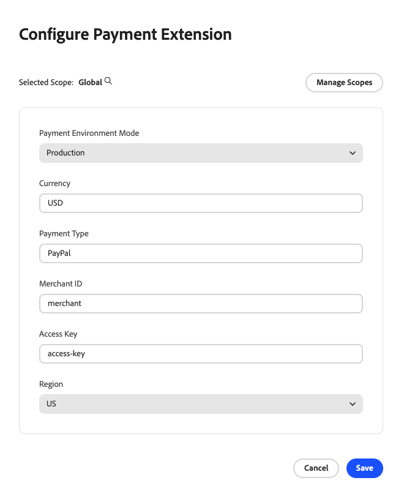

# Configuration schema reference

<InlineAlert variant="warning" slots="text" />

**Adobe Commerce App Management is for Beta users only and is not yet accessible to all customers.**

The `app.commerce.config` file is the central configuration file for your App Builder application. It defines your app [metadata](./app-metadata.md), business configuration schema, and other settings. Based on the `businessConfig` schema, the configuration library generates runtime actions while the App Management renders a configuration form with no custom code required.

<InlineAlert variant="info" slots="text"/>

The `app.commerce.config` file supports both JavaScript (`app.commerce.config.js`) and TypeScript (`app.commerce.config.ts`) file types.

## File structure

The basic structure of the configuration file is as follows:

```js
import { defineConfig } from "@adobe/aio-commerce-lib-app/config"
export default defineConfig({
  businessConfig: {
    schema: [
      // Field definitions
    ]
  }
});
```

## Schema properties

This schema contains the following properties:

| Property | Type | Required | Description |
|----------|------|----------|-------------|
| `name` | string | Yes | Unique field identifier. Used to retrieve values at runtime. |
| `label` | string | Yes | Display label of a configuration field. |
| `type` | string | Yes | Field type. See [Supported types](#supported-field-types). |
| `default` | varies | No | Default value. Must match the field type. |
| `description` | string | No | Help text displayed below the field. |
| `options` | array | Conditional | Required for `list`. Defines available options to be displayed in the dropdown list. |
| `selectionMode` | string | Conditional | Required for `list`. Values can be `single` or `multiple`. The type of selection that is allowed in the schema. |

## Supported field types

The following field types are available for your configuration schema:

| Field type | Type | Description |
|------------|------|-------------|
| `text` | string | Single-line text input |
| `password` | string | Masked input for sensitive values like API keys and tokens |
| `email` | string | Email address input with validation |
| `tel` | string | Phone number input with format validation |
| `url` | string | URL input with validation |
| `list` | string | Dropdown with preconfigured options |

## Example

The following example shows a complete configuration schema with various field types:

```js
import { defineConfig } from "@adobe/aio-commerce-lib-app/config"

export default defineConfig({
  businessConfig: {
    schema: [
      {
        name: "api-name",
        label: "API name",
        type: "text",
        default: "",
      },
      {
        name: "api-endpoint",
        label: "API Endpoint",
        type: "url",
        default: "https://api.example.com",
      },
      {
        name: "api-key",
        label: "API Key",
        type: "password",
      },
      {
        name: "level",
        label: "Risk Level",
        type: "list",
        options: [
          { label: "Low", value: "low" },
          { label: "Medium", value: "medium" },
          { label: "High", value: "high" },
        ],
        default: "medium",
        selectionMode: "single",
      },
    ],
  },
});
```



## Validate your schema

Run validation before deploying:

```bash
npx @adobe/commerce-lib-config validate schema
````

<InlineAlert variant="info" slots="text"/>

This will only function properly if `@adobe/aio-commerce-lib-config` is installed and included in your `package.json` file.

Validation checks that your configuration matches the expected schema. Common errors include:

* **Type mismatches**. A `text` field with a `number` default
* **Missing properties**. Fields must have `name`, `label`, and `type`

<InlineAlert variant="info" slots="text"/>

By default, schema validation runs automatically during `aio app build` through the `pre-app-build` hook configured by the library.

## Retrieve configuration at runtime

Use `getConfigurationByKey` from the configuration library to access configuration values in your runtime actions:

```js
import { getConfigurationByKey, byCodeAndLevel } from "@adobe/aio-commerce-lib-config";

async function main(params) {
  const storeCode = params.store_code || "default";
  const storeLevel = params.store_level || "store_view";

  // Use values in your app logic
  const { config: { value: endpoint } } = await getConfigurationByKey("api-endpoint", byCodeAndLevel(storeCode, storeLevel));
  const { config: { value: apiKey } } = await getConfigurationByKey("api-key", byCodeAndLevel(storeCode, storeLevel));
}
```

## Tutorial

Watch this video to learn how to define a configuration schema and see the auto-generated Admin UI in action.

[Configuration schema tutorial](https://video.tv.adobe.com/v/3478943)
