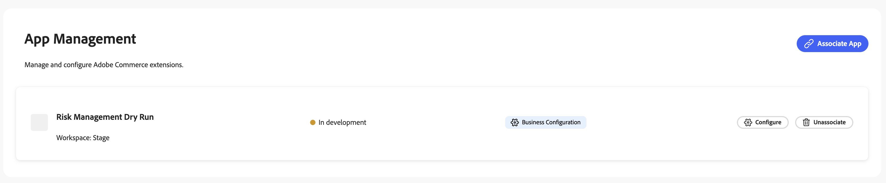

# App Management overview

<InlineAlert variant="warning" slots="text" />

**Adobe Commerce App Management is for Beta users only and is not yet accessible to all customers.**

App Management provides a unified experience for installing, configuring, and managing App Builder applications in Adobe Commerce. Define your configuration schema once, and the system auto-generates the runtime actions and Admin UI, with no custom code required.

App developers define the configuration schema, metadata, and runtime actions for their applications. App managers associate and configure deployed apps within their Commerce instances.

## Key benefits

* **Auto-generated runtime actions**. Define a configuration schema and the library automatically generates all required runtime actions.

* **Auto-generated Admin UI**. Configuration forms are rendered dynamically based on your schema, eliminating custom UI development.

* **Scope inheritance**. Configuration values cascade through Global, Website, Store, and Store View levels.

* **Unified lifecycle management**. Associate, configure, and unassociate apps from a single interface.

## Requirements

Before using App Management, ensure the following:

* Admin UI SDK version 3.3.0 is required.

  * SaaS instances include this version by default.
  * For PaaS, verify your [Admin UI SDK](../admin-ui-sdk/index.md) version before proceeding.

* App managers (Admin users) who associate apps must have App Management permissions. See [Associate and configure apps](./associate-apps.md).

## How it works

Follow these steps to set up and deploy an App Builder application with App Management:

1. **Define app metadata**. Add your [app metadata](./app-metadata.md) in `app.commerce.config`.

1. **Define your configuration schema**. Create your [configuration schema](./configuration-schema.md) in `app.commerce.config`.

1. Setup your project to use business configuration. See the [runtime actions section](./runtime-actions.md) for the required steps.

1. **Deploy**. Build and deploy your app with the `aio app build && aio app deploy` command.

1. **Link your app**. [Associate your app](./associate-apps.md) with a Commerce instance in the Admin.

1. **Configure settings**. Merchants configure settings through the auto-generated UI.
