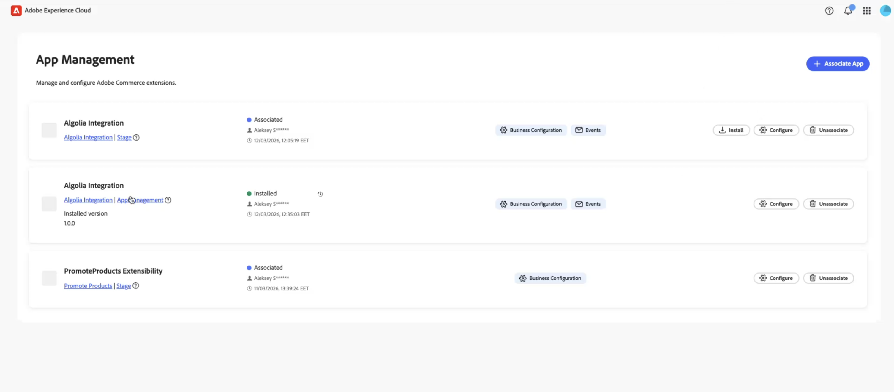
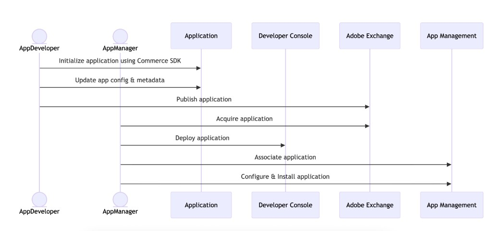

# App Management overview

App Management provides a unified experience for installing, configuring, and managing App Builder applications in Adobe Commerce. Define your configuration schema once, and the system auto-generates the runtime actions and Admin UI, with no custom code required.

App developers define the configuration schema, metadata, and runtime actions for their applications. App managers associate and configure deployed apps within their Commerce instances.

The following diagram illustrates the workflow between app developers and app managers:

## Key benefits

* **Auto-generated runtime actions**. Define a configuration schema and the library automatically generates all required runtime actions.

* **Auto-generated Admin UI**. Configuration forms are rendered dynamically based on your schema, eliminating custom UI development.

* **Event registrations**. Subscribe to Commerce and external events with declarative configuration and automatic event registration.

* **Custom installation workflows**. Define pre and post installation messages and custom scripts that run during app installation.

* **Unified lifecycle management**. Associate, configure, install, and unassociate apps from a single interface.

## Requirements

Before using App Management, ensure the following:

* [Admin UI SDK](../admin-ui-sdk/index.md) version 3.3.1, or greater, is required for App Management. [Verify your version](../admin-ui-sdk/installation.md#install-the-admin-ui-sdk) before proceeding.

* App managers (Admin users) who associate apps must have App Management permissions. See [Manage your app](https://experienceleague.adobe.com/en/docs/commerce/app-management/manage-app/manage-app) for more information.

* App Builder applications with the following minimum library versions.

  * `@adobe/aio-commerce-lib-config` version 1.0.0 or later.
  * `@adobe/aio-commerce-lib-app` version 1.0.0 or later.
  * `@adobe/aio-commerce-sdk` version 1.0.0 or later.

## SDK libraries

App Management uses the [Adobe Commerce SDK](https://github.com/adobe/aio-commerce-sdk) libraries:

| Library | Description |
|---------|-------------|
| `@adobe/aio-commerce-lib-app` | App definition, validation, and manifest generation. |
| `@adobe/aio-commerce-lib-config` | Configuration management with scope trees and inheritance. |

## How it works

All App Management configuration is defined in the `app.commerce.config` file at the root of your project. This single file contains your app metadata, business configuration schema, optional event subscriptions and webhook declarations, and installation settings.

Follow these steps to set up and deploy an App Builder application with App Management:

1. **Initialize your app**. Run the [initialization command](./initialize-app.md) to set up your project and create the `app.commerce.config` file.

1. **Define your app**. Add your [app metadata](./app-metadata.md) and [business configuration](./configuration-schema.md).

1. **Configure events**. Set up [events](./installation/events.md) to respond to Commerce and external events.

1. **Declare webhooks**. Add [Commerce webhooks](./installation/webhooks.md) in `app.commerce.config` so merchants can complete webhook setup in App Management.

1. **Customize installation**. Define [installation messages and custom scripts](./installation/customize.md) that run when merchants install your app.

1. **Build and deploy**. [Build and deploy](./build-deploy.md) your app with the `aio app build && aio app deploy` commands.

1. **Link your app**. [Associate your app](https://experienceleague.adobe.com/en/docs/commerce/app-management/manage-app/manage-app) with a Commerce instance in the Admin.

1. **Configure settings**. Merchants configure settings through the auto-generated UI.
