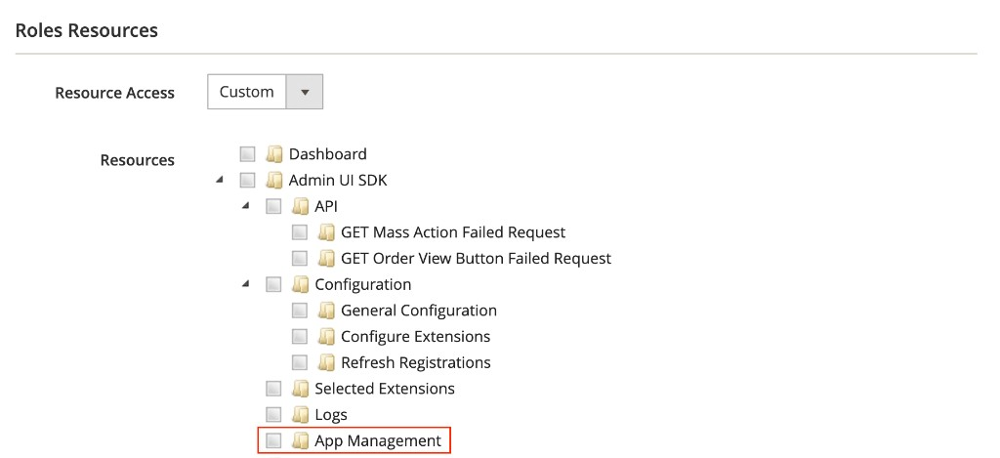

# Troubleshooting

Use the following solutions to resolve common issues with App Management.

## Cannot access App Management (permissions)

Only Admin users whose **role** includes the **App Management** resource can use App Management in the Adobe Commerce Admin. If **Apps** > **App Management** is missing or access is denied, the user’s role likely does not grant that permission.

1. Sign in as an Admin user who can edit roles.

1. Go to **System** > **User Roles** and open the role assigned to the user who needs access (or create or adjust a role for app managers).

1. Open the **Role Resources** tab. If you choose specific resources instead of **All**, set **Resource Access** to **Custom**.

1. In the tree, expand **Admin UI SDK** and select **App Management**.



1. Save the role and have the user sign out and back in if the menu does not update immediately.

For the full association and installation workflow, see [Manage your app](https://experienceleague.adobe.com/en/docs/commerce/app-management/manage-app/manage-app).

## Local Adobe Commerce instances

App Management is **not supported** for local Adobe Commerce development instances. Association, installation, and workflows in the Admin require an Adobe Commerce deployment that App Management can integrate with.

If you are developing against a local stack, plan to validate App Management behavior in a non-local environment.

## Configuration validation errors

The entire `app.commerce.config` is validated when the `pre-app-build` hook runs (for example during `aio app build`) and when you run `npx aio-commerce-lib-app generate …` manually. Schema validation is included. If validation fails, check:

1. **Required properties**. Fields must have `name`, `label`, and `type`.

1. **Type-matched defaults**. Default values must match the field type.

1. **Valid metadata**. App metadata must include `id`, `displayName`, `description`, and `version`.

## App not appearing in App Management

1. Verify app is deployed:

  ```bash
  aio app deploy --force-build --force-deploy
  ```

1. Check runtime actions are generated in `.generated` folders.

1. Confirm valid configuration schema.

1. Verify correct organization in Developer Console.

### Runtime actions not generated

1. Verify `app.commerce.config` exists with valid configuration.

1. Run a build so `pre-app-build` runs the generators:

  ```bash
  aio app build
  ```

1. If `.generated` folders are still missing or stale, run:

  ```bash
  npx aio-commerce-lib-app generate all
  ```

## Encryption key errors

1. Validate your encryption key configuration.

  ```bash
  npx aio-commerce-lib-config encryption validate
  ```

1. Generate an encryption key (only creates one if it does not already exist).

  ```bash
  npx aio-commerce-lib-config encryption setup
  ```
