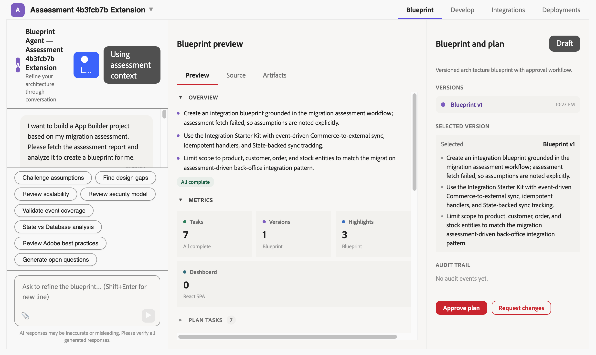
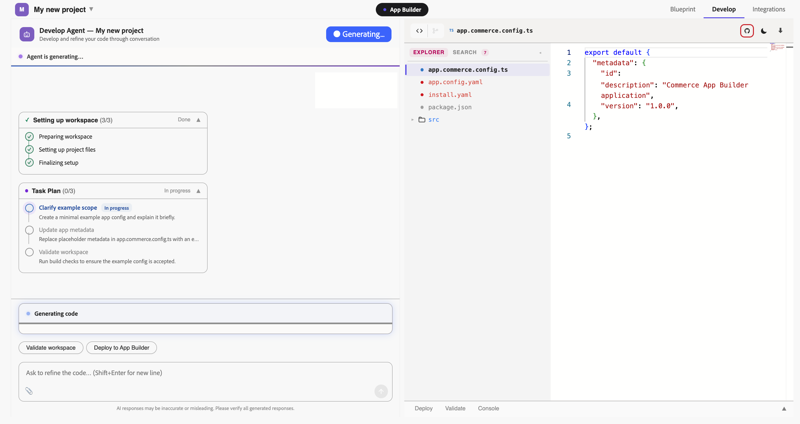

# Migration assessment development

>[!VIDEO](https://video.tv.adobe.com/v/3502483)

The following sections describe how to migrate existing Adobe Commerce modules, plugins, or customizations based on a completed [Migration Assessment](https://experienceleague.adobe.com/en/docs/commerce/cloud-service/migration/migration-tools/assessment).

For an overview of migrating to Adobe Commerce as a Cloud Service, see the [migration overview](https://experienceleague.adobe.com/en/docs/commerce/cloud-service/migration/overview).

## Requirements

Use this workflow when:

* You have completed a Commerce Migration Assessment.
* You are working on converting a specific PHP-based Commerce module, plugin, or customization that the Migration Assessment Tool has analyzed.
* You want the Commerce Developer Agent to use the existing assessment context, such as module metadata, dependency information, and detected customization details, to inform its blueprint.

## Tips for migration development

* **Be specific about the target outcome** — describe the behavior you want Commerce Developer Agent to generate, such as the event, webhook, external system, configuration need, or data flow.
* **Work from one assessment recommendation at a time** — the agent works best when each project focuses on a single recommendation or closely related customization.
* **Confirm the assessment context early** — if the preloaded recommendation context is incomplete or incorrect, correct it in your first prompt before asking for a blueprint.
* **Review the blueprint before approving** — use refinement prompts to challenge assumptions, find design gaps, and confirm the generated implementation plan matches the migration goal.

See [prompt crafting](prompting.md) for more effective prompting patterns specific to this workflow.

## Migration workflow

The following sections describe the workflow from running the Migration Assessment Tool to exporting code for continued development.

### Access the Commerce Developer Agent

1. Navigate to https://experience.adobe.com/#/commerce-migration-assessment/shared-assessments to view your completed migration assessments for your Adobe Commerce module or plugin.
   - To request an assessment, contact your support representative, see [Migration Assessment](https://experienceleague.adobe.com/en/docs/commerce/cloud-service/migration/migration-tools/assessment) for more information.
1. Select a completed assessment and navigate to the **Module Reports** section.
1. Select an individual module report and click **Open in Developer Agent**. You are redirected to the Commerce Developer Agent home screen with the assessment context pre-loaded.

<InlineAlert variant="info" slots="text"/>

The context passed includes the module identifier, file path, recommendation type, and a summary of detected customizations. The full ZIP archive of the assessment output is not automatically ingested.

### Review the pre-loaded context

Once in the Commerce Developer Agent, the agent displays a summary of the module context it has received:

* **Module name and path** — the module that was passed.
* **Detected customizations** — the types of overrides, plugins, or dependencies Migration Assessment Tool identified.

Click the **Context Attached** button to review the context summary.

Review this summary carefully. If the context looks incorrect or incomplete, you can correct it through a prompt before proceeding.

After adding any additional context, click **Generate Blueprint** to start the development workflow.

### Review the blueprint

>[!VIDEO](https://video.tv.adobe.com/v/3502479)

Once you confirm the pre-loaded assessment context, Commerce Developer Agent uses that context to prepare a blueprint. During this step, review the planning view for:

* Detected intent
* Assessment recommendation context
* Proposed target architecture
* Risks, assumptions, or key considerations
* Planning progress and generated implementation tasks

<InlineAlert variant="tip" slots="text"/>

Correct any misunderstandings as early as possible. This is the best point to redirect Commerce Developer Agent before approving the blueprint. Redirecting the agent later can be time-consuming and costly.

When the blueprint is ready, review the proposed architecture and implementation plan before execution. No code generation runs without your explicit approval.

* Use the **Preview** tab to review the blueprint overview, planned tasks, and architecture diagram.
* Use the **Source** tab to inspect the textual blueprint representation, currently shown in Markdown.



Common refinements include:

* Narrowing or expanding the generated workflow scope
* Requesting an alternative architecture approach
* Asking why a specific pattern was recommended
* Adding requirements for validation, tests, logging, documentation, or deployment setup

Example refinement prompts:

```shell
Narrow the generated workflow to the event-driven integration path.
Explain why you recommended an event handler instead of a webhook.
Add merchant-configurable settings for the external system endpoint.
Add tests and validation checks to the implementation plan.
```

When you request changes, Commerce Developer Agent creates a new blueprint version. You can review versions before approving the plan, including comparing blueprint versions side by side where available.

### Approve the blueprint

When you are satisfied with the blueprint, explicitly approve it using the approval control in the UI.

Blueprint approval starts code generation from the approved plan. If you need to change the plan before generation begins, request changes before approving the blueprint.

Click **Request changes** to iterate on the blueprint or click **Approve plan** to start code generation.

### Monitor code generation

After approval, the developer agent generates the project workspace from the approved blueprint. Depending on the assessment recommendation and selected workflow, this can include:

* Project directory structure for the generated App Builder Commerce extension or supported workflow
* Core implementation files based on the approved blueprint
* App Builder and Commerce App Management configuration files
* Event, webhook, business configuration, or persistence files
* Validation checks for the generated workspace

Real-time progress is shown in the Develop stage while generation runs. In the Develop stage, you can inspect generated files, review validation output, and continue refining the generated code through chat.



### Iterate on the generated code

If you need to refine the generated code, continue the conversation on the **Develop** tab.

Example follow-up prompts:

```shell
Make the log level configurable.
Add validation before sending data to the external system.
Add tests for the generated event handler.
Generate a README with setup and deployment instructions.
```

The agent retains project context and can update generated files without starting over.

To continue to iterate on your design refer to the [integrate](./integrations.md) and [deployment](./deployment.md) workflows.
