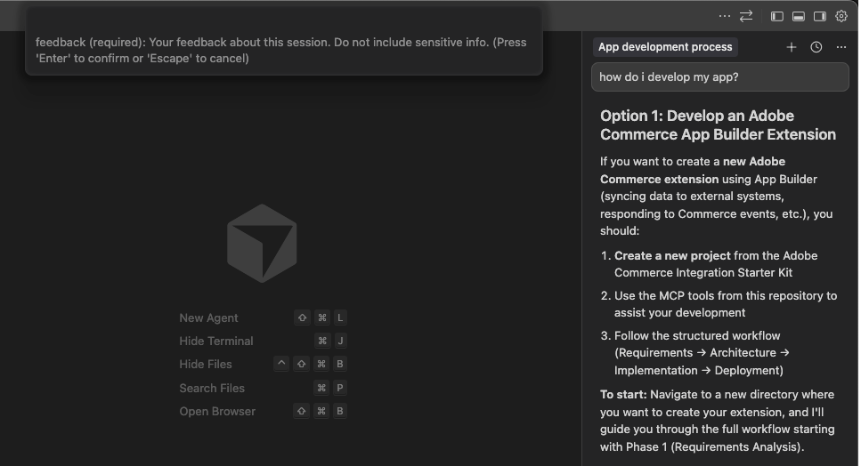
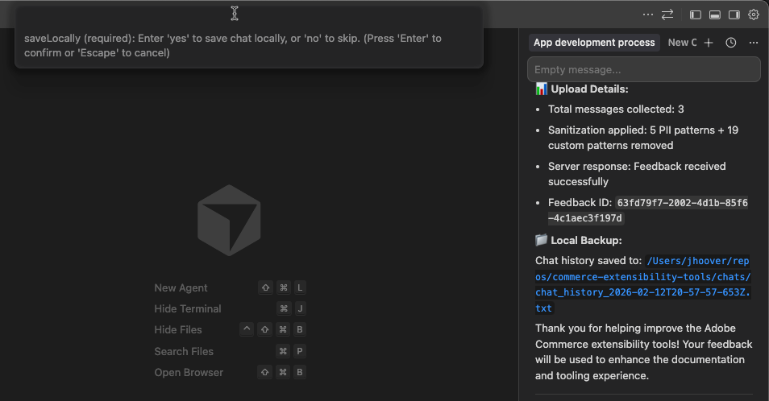

# Best practices for AI Commerce coding tools

Adobe recommends the following practices when using the AI coding tools for Commerce App Builder. For setup steps, see [Coding tools setup](./coding-tools.md). For skills and sample prompts, see [Skills, prompts, and commands](./skills-and-prompts.md).

## Plan mode

When chatting with your coding agent, use **Plan** mode to produce a detailed implementation plan.

The way you enable Plan mode depends on the agent. Refer to your agent's documentation, for example:

* [Cursor](https://cursor.com/docs/agent/modes)
* [Claude Code](https://code.claude.com/docs/en/common-workflows#when-to-use-plan-mode)
* [Gemini CLI](https://geminicli.com/docs/cli/plan-mode/)

## Checklist

### Before starting a development session

* Check for `REQUIREMENTS.md`
* Verify MCP tools are working
* Review current phase and goals
* Start from sample code or scaffolded projects

### During development

* Trust the [four-phase protocol](#protocol)
* Request implementation plans for complex work
* Use MCP tools when available
* Test each feature after implementation
* Test locally first, then deploy and test again
* Use the coding tools for testing support
* Question unnecessary complexity
* Deploy incrementally for faster iteration

### When starting a new chat

* Provide a clear session handoff
* Reference key files with `@`
* Set clear goals for the session
* Use phase-based boundaries

## Workflow

When developing with the AI coding tools, start with sample code or scaffolded projects. This approach ensures you are building on a solid foundation rather than starting from nothing, while also optimizing your AI development workflow.

This also allows you to leverage Adobe's templates and build upon proven patterns and architectures, while keeping established directory structures and conventions.

Consult the following resources to get started:

* [Integration starter kit](../starter-kit/integration/create-integration.md)
* [Checkout starter kit](../starter-kit/checkout/)
* [Adobe Commerce starter kit templates](https://github.com/adobe/adobe-commerce-samples/tree/main/starter-kit)
* [Adobe I/O Events starter templates](https://experienceleague.adobe.com/en/docs/commerce-learn/tutorials/adobe-developer-app-builder/io-events/getting-started-io-events)
* [App Builder sample applications](https://developer.adobe.com/app-builder/docs/resources/sample_apps)

### Why you should use these resources

* **Proven patterns**: Starter kits embody Adobe's best practices and architectural decisions
* **Faster development**: Reduces time spent on boilerplate and configuration
* **Consistency**: Ensures your application follows established conventions
* **Maintainability**: Easier to maintain and update when following standard patterns
* **Documentation**: Starter kits come with examples and documentation
* **Community support**: Easier to get help when using standard approaches
* **AI context efficiency**: Use familiar patterns and structures to work with, reducing the need for extensive explanations and improving code generation accuracy
* **Reduced token usage**: Reference existing patterns instead of generating everything from scratch, leading to more efficient conversations and fewer context summarizations

## Protocol

The following four-phase protocol is automatically enforced by the installed skills. The tools should follow this protocol automatically when developing applications:

* **Phase 1**: Requirements analysis and clarification
  * When asked clarifying questions, provide complete answers.
* **Phase 2**: Architectural planning and user approval
  * When presented a plan, review it carefully before approving.
* **Phase 3**: Code generation and implementation
* **Phase 4**: Documentation and validation

## Request implementation plans for complex development

For complex development involving multiple runtime actions, touchpoints, or integrations, explicitly request that the AI tools create a detailed implementation plan. When you see a high-level plan in [Phase 2](#protocol) that involves multiple components, ask for a detailed implementation plan to break it down into manageable tasks:

```shell
Create a detailed implementation plan for this complex development.
```

Complex Adobe Commerce applications often involve:

* Multiple runtime actions
* Event configuration across multiple touchpoints
* Integration with external systems
* State management requirements
* Testing across multiple components

## Use MCP tools

<InlineAlert variant="info" slots="text" />

Before relying on MCP tools, ensure you are [logged in to the Adobe I/O CLI](./coding-tools.md#log-in-to-the-adobe-io-cli).

The tooling defaults to MCP tools, but in certain circumstances it can use CLI commands instead. To ensure MCP tool usage, explicitly request them in your prompt.

If you see CLI commands being used and want to use MCP tools instead, use the following prompt:

```shell
Use only MCP tools and not CLI commands
```

* MCP tools: aio-app-deploy, aio-app-dev, aio-dev-invoke
* CLI commands: aio app deploy, aio app dev

CLI commands can be used for the following scenarios:

* Deployment scenarios are complex
* You are debugging a specific issue
* MCP tools have a limitation
* A one-off operation does not benefit from MCP integration

## Development

Question unnecessary complexity created by the AI tools.

When unnecessary files are added (`validator.js`, `transformer.js`, `sender.js`) for simple read-only endpoints, use the following prompts:

```shell
Why do we need these files for a simple read-only endpoint?
Perform a root cause analysis before adding complexity
Verify if simpler solutions exist
```

## Testing

Use the following best practices when testing:

### Test each feature after implementation

After completing development of a feature in your implementation plan, test it immediately. Early testing prevents compound issues and makes debugging easier.

* Do not wait until all features are complete
* Test incrementally to catch issues early
* Validate functionality before moving to the next feature

### Test locally first

Always test locally first using the `aio-app-dev` tool. This provides immediate feedback and allows for faster iteration cycles, easier debugging, and no deployment overhead.

1. Start local development server:

   ```bash
   aio-app-dev
   ```

1. Test actions locally:

   ```bash
   aio-dev-invoke action-name --parameters '{"test": "data"}'
   ```

### Deploy and test again

Once local testing is successful, deploy and test in the runtime environment. Runtime environments can have different behavior than local development.

1. Deploy to runtime:

   ```bash
   aio-app-deploy
   ```

1. Test deployed actions

1. Use web browser or direct HTTP requests

1. Check activation logs for debugging

### Leverage the coding tools for testing support

Ask for help with testing. The tools can help with debugging, log analysis, and creating appropriate test data for your specific runtime actions.

**Test runtime actions**

```shell
Help me test the customer-created runtime action running locally
```

**Debug failures**

```shell
Why did the subscription-updated runtime action activation fail?
```

**Check logs**

```shell
Help me check the logs for the last stock-monitoring runtime action invocation
```

**Create test payloads**

```shell
Generate test data for this Commerce event
```

```shell
Create a test payload for the customer_save_after event
```

**Find runtime endpoints**

```shell
What's the URL for this deployed action?
```

**Handle authentication**

```shell
How do I authenticate with this external API?
```

**Troubleshoot**

```shell
Help me debug why this action is returning 500 errors
```

## Debugging

Stop and assess when things go wrong. If you encounter issues:

* Stop and assess - Do not continue in a broken state
* Check logs - Use activation logs to identify issues
* Simplify - Remove complexity to isolate problems
* Test incrementally - Fix one issue at a time
* Validate - Test each fix before proceeding

## Deployment

Use the following best practices when deploying:

### Deploy incrementally

Deploy only modified actions to speed up development. This approach reduces the risk of breaking existing functionality and provides quicker feedback on changes.

* Use MCP tools to deploy specific actions

  ```bash
  aio-app-deploy --actions action-name
  ```

* Deploy individual actions after testing locally
* Deploy incrementally and avoid full application deployments during development

### Runtime cleanup

After major changes, leverage the tools to clean up orphaned actions. Let the AI tooling handle the cleanup process systematically. It can efficiently identify orphaned actions, verify their status, and safely remove them without manual intervention.

```shell
Help me identify and clean up orphaned runtime actions
```

Request the AI tooling to list deployed actions and identify unused ones:

```shell
List all deployed actions and identify which ones are no longer needed
```

Have the AI tools remove orphaned actions using appropriate commands:

```shell
Remove the orphaned actions that are no longer part of the current implementation
```

## Monitoring

Use the following best practices when monitoring your application:

### Watch for context quality indicators

* **Good context**: AI remembers recent decisions, references correct files
* **Poor context**: AI asks for previously provided info, repeats resolved issues

### Track development velocity

* **High velocity**: Clear progress, minimal clarification needed
* **Low velocity**: Repeated explanations, AI confusion, slow progress

### Monitor cost efficiency

Track token usage patterns:

* **Efficient**: Low token usage, few context summarizations
* **Inefficient**: High token usage, multiple summarizations, repeated work

## What to avoid

Avoid the following anti-patterns when using the AI coding tools:

* **Do not skip the clarification phase** - Always ensure Phase 1 is completed before implementation.
* **Do not skip testing after each feature** - Test incrementally, don't wait until everything is complete.
* **Do not add complexity without root cause analysis** - Question unnecessary file additions and request proper investigation.
* **Do not declare success without real data testing** - Always test with actual data, not just edge cases.
* **Do not forget runtime cleanup** - Always clean up orphaned actions after major changes.

## Providing feedback

Developers who are interested in providing feedback on the AI coding tools can use the `/feedback` command.

This command allows you to provide text feedback and send logs to Adobe. Any logs you send will be sanitized to remove any private or personal information.

<InlineAlert variant="info" slots="text" />

The user experience will vary slightly depending on the IDE you are using. The following process describes the experience in Cursor.

1. In your agent, type `/feedback` and select the `commerce-extensibility/feedback` command.

1. Provide your feedback for the tooling in the **Feedback** field that appears at the top of the IDE and press the **Enter** key.

   

1. In the **Save Locally** field, type either `yes` or `no` and press **Enter** to indicate if you want to save a local copy of your logs.

   

   If you selected **Yes**, you can review the logs in your `chats` folder after sending your feedback.

1. The `commerce-extensibility/feedback` command appears in your agent's chat input field. Press **Enter** or click **Send** to send your feedback to Adobe.

<InlineAlert variant="info" slots="text" />

If you do not see the `/feedback` command, you may need to [update to the latest version](./coding-tools.md#updating-to-the-latest-version).
