# Configure integrations

<Fragment src="/_includes/developer-agent.md" />

The **Integrations** tab is where you connect your Commerce development environment so the Commerce Developer Agent can generate, validate, deploy, and test your project. Configure integrations after you generate code on the **Develop** stage and before you [deploy your app](deployment.md).

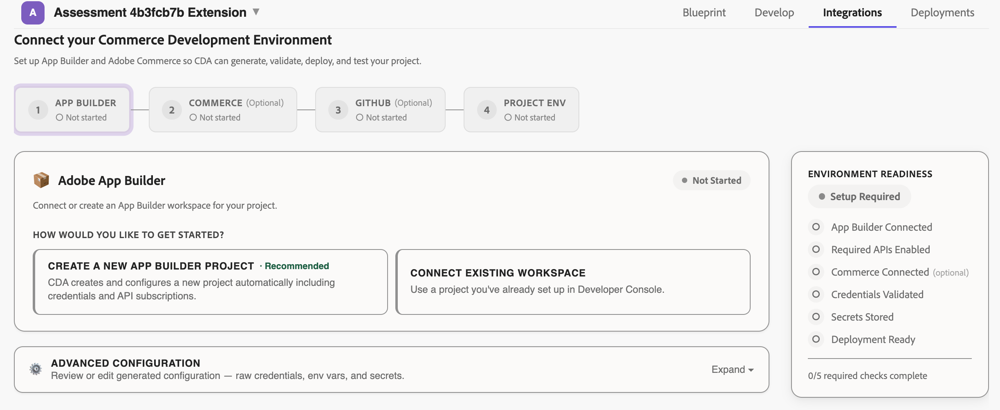

The tab guides you through four steps:

- [App Builder](#connect-or-create-an-app-builder-workspace) — Connect or create the App Builder workspace your app deploys to.
- [Commerce](#connect-to-commerce) (optional) — Connect the Adobe Commerce as a Cloud Service instance your app integrates with.
- [GitHub](#connect-to-github) (optional) — Connect a GitHub repository so you can push generated code for continued development.
- [Project env](#review-project-environment-variables) — Set the environment variables your project requires.

The agent shows only the integrations your generated project uses.

The **Environment readiness** panel on the right tracks your progress against the required checks and indicates when your environment is ready to deploy.

## Connect or create an App Builder workspace

Under **How would you like to get started?**, choose one of the following options:

### Create a new App Builder project (recommended)

Select **Create a new App Builder project** to have the agent create and configure a Developer Console project for you, including credentials and API subscriptions. This is the recommended option when you do not already have a project set up.

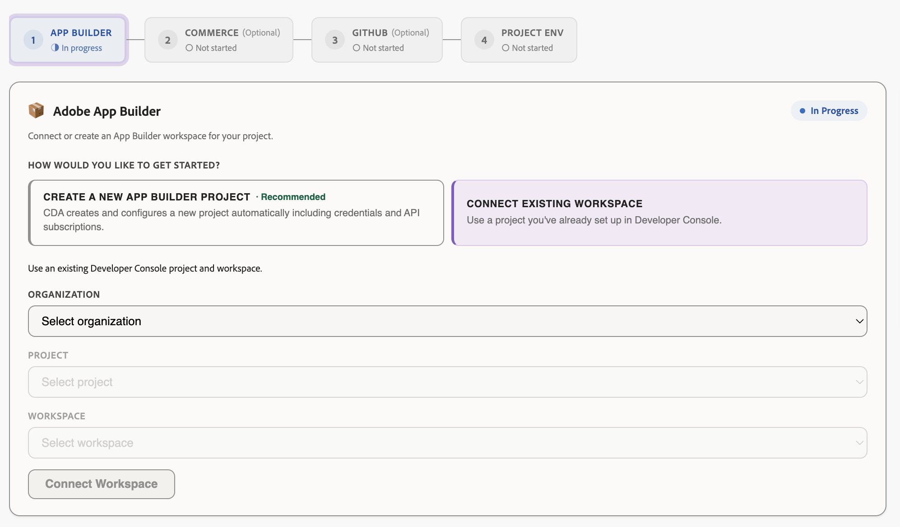

1. Select your **Organization** and enter a new **Project name**.
1. Click **Connect Workspace**.
1. Select if you want to use the **Production** or **Stage** workspace or if you want to **Create a new workspace**.
1. Click **Set up workspace**.

After the agent creates the project, manually add the **Adobe Commerce as a Cloud Service** API.

### Connect an existing workspace

Select **Connect existing workspace** to use a project and workspace you already set up in the Adobe Developer Console.

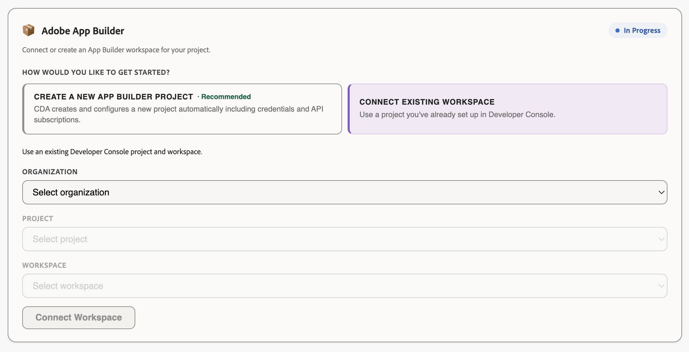

1. Select your **Organization**, **Project**, and **Workspace** from the lists.
1. Click **Connect Workspace**.

Make sure the workspace has the **Runtime** service added, along with the following APIs:

* Adobe Commerce as a Cloud Service
* I/O Management API
* App Builder Data Services
* I/O Events
* Adobe I/O Events for Adobe Commerce

The Required APIs section displays any missing APIs. After you add the missing APIs in the Developer Console, you can click **Re-check status** to update the list.

### Import the App Builder workspace

Use the **Import App Builder Workspace** section to populate your workspace credentials from your workspace JSON file. To download your workspace JSON:

1. Navigate to `https://developer.adobe.com/console/`.
1. Open your project and workspace.
1. Click **Download all** in the top-right to download the workspace JSON file.

Then import the file with one of the following methods:

* **Drag and drop** — Drag your `workspace.json` file into the designated area or click **Browse File** to select the file.
* **Paste JSON** — Click **Paste JSON instead**, paste the contents of your JSON file. Then click **Apply Workspace JSON**.

The agent populates all managed credentials from the imported workspace, so you do not enter them manually.

After you import the workspace, the **Setup Checklist** section indicates which credentials have been successfully imported. If any credentials are missing, you can enter them manually in the **Advanced Diagnostics** section.

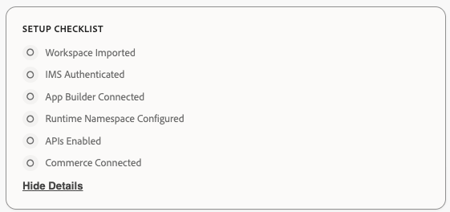

### Review advanced diagnostics

Expand **Advanced Diagnostics** to review or edit the raw credentials the agent captured from your imported workspace:

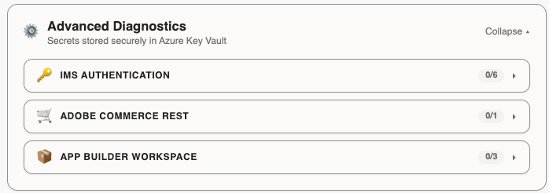

You can review or edit each group of values individually. The **Advanced Diagnostics** section includes the following groups.

#### IMS authentication

These credentials allow the agent to authenticate with Adobe Identity Management Services:

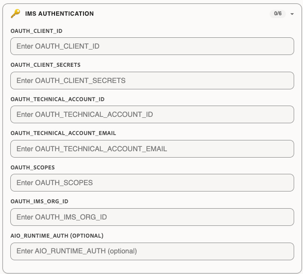

* `OAUTH_CLIENT_ID`
* `OAUTH_CLIENT_SECRETS`
* `OAUTH_TECHNICAL_ACCOUNT_ID`
* `OAUTH_TECHNICAL_ACCOUNT_EMAIL`
* `OAUTH_SCOPES`
* `OAUTH_IMS_ORG_ID`
* `AIO_RUNTIME_AUTH`

<InlineAlert variant="info" slots="text"/>

The **OAuth client secret** cannot be retrieved automatically. Open the workspace in the Adobe Developer Console and copy the **client secret** from the **OAuth Server-to-Server** tab, and paste it in the **OAUTH_CLIENT_SECRETS** field manually.

#### Adobe Commerce REST

These credentials allow you to connect to the Adobe Commerce REST API.

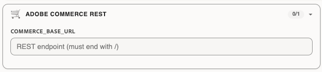

* `COMMERCE_BASE_URL` — The REST endpoint for your Commerce instance. The URL must end with a slash (`/`).

#### App Builder workspace

These values are auto-populated from the workspace after you connect. Edit them only if necessary:

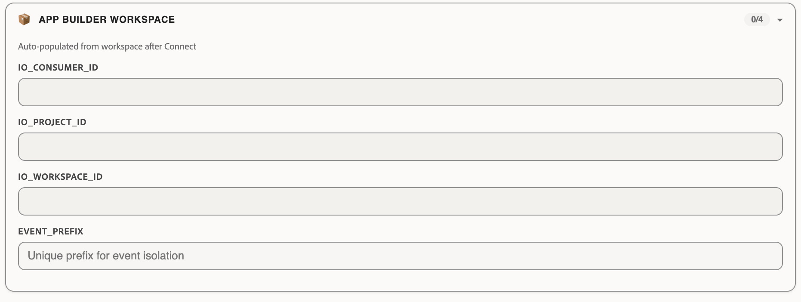

* `IO_CONSUMER_ID`
* `IO_PROJECT_ID`
* `IO_WORKSPACE_ID`
* `EVENT_PREFIX` — A unique prefix for event isolation.

After you review the advanced diagnostics, click **Next** to continue.

## Connect to Commerce

Connect an Adobe Commerce as a Cloud Service instance from your IMS organization to allow the agent to generate Commerce-aware configuration, events, and deployment settings.

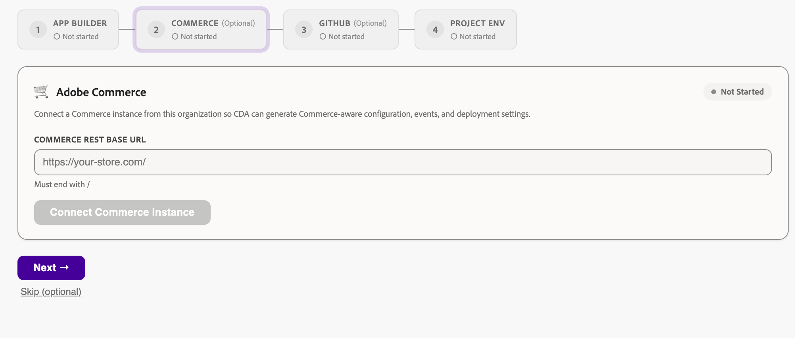

If you connect to IMS and select **Create a new App Builder project** on the **App Builder** tab, the agent automatically lists all available Commerce instances in the selected organization.

Alternatively, enter the URL for your Adobe Commerce as a Cloud Service instance in the **Commerce REST base URL**, field. The URL must end with a slash (`/`).

<InlineAlert variant="info" slots="text"/>

Adobe Commerce as a Cloud Service instance URLs can be accessed at: `https://experience.adobe.com/#/@<your-org-name>/commerce/cloud-service/instances`

Click **Validate URL** to verify the connection and then click **Connect**.

Click **Next** to continue, or click **Skip (optional)** to skip this step.

## Connect to GitHub

Connect a repository to allow the agent to push code directly to GitHub and create pull requests.

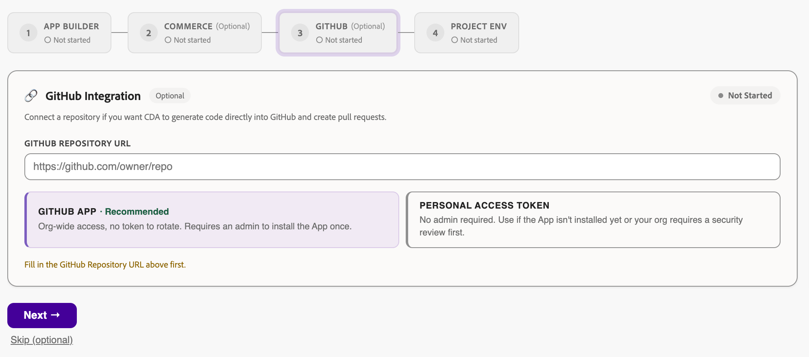

In **GitHub repository URL**, enter the repository address, such as `https://github.com/owner/repo`. Then authenticate with one of the following methods:

* **GitHub App** (recommended) — Provides org-wide access with no token to rotate. Requires an administrator to install the app once by clicking the link to the [install page](https://github.com/apps/commerce-dev-agent/installations/new) and installing the app to the desired repository.
* **Personal access token** — Requires no administrator. Use this method if the app is not installed yet or your organization requires a security review first.
  * Paste your GitHub token in the **Personal Access token** field and click **Connect**. The token must have access to the `Contents (read/write)` and `Pull requests (read/write)` scopes.

Connecting a repository here also enables pushing generated code to GitHub for continued development outside the agent.

Click **Next** to continue, or click **Skip (optional)** to skip this step.

## Review project environment variables

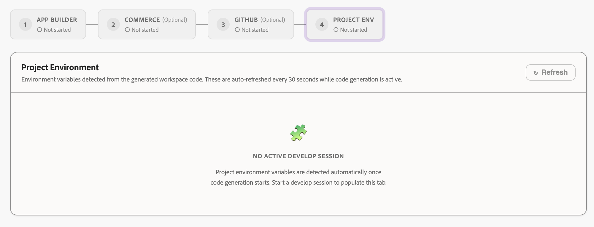

On the **Project env** step, the agent lists the environment variables it detects from the generated workspace code. These variables are separate from the managed credentials captured during the workspace import, so you do not re-enter those values here. While code generation is active, this list auto-refreshes regularly. You can also click **Refresh** to update it manually.

If no develop session is active, the tab is empty. Start a develop session to populate it.

## Track environment readiness

As you complete each step, the **Environment readiness** panel updates its status. The panel tracks the following checks:

* **App Builder connected**
* **Required APIs enabled**
* **Commerce connected** (optional)
* **Credentials validated**
* **Secrets stored**
* **Deployment ready**

When all required checks are complete, your environment is ready and you can deploy your app.

## Next step

After you configure integrations, [deploy and install your app](deployment.md).
