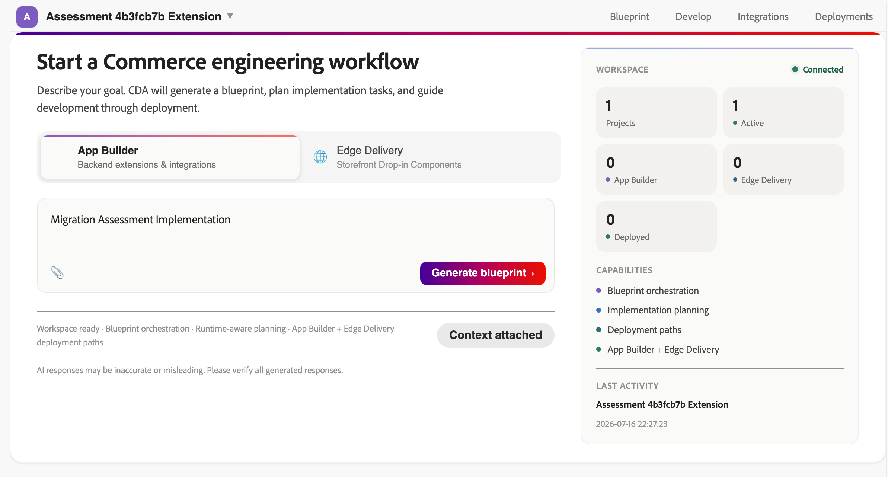
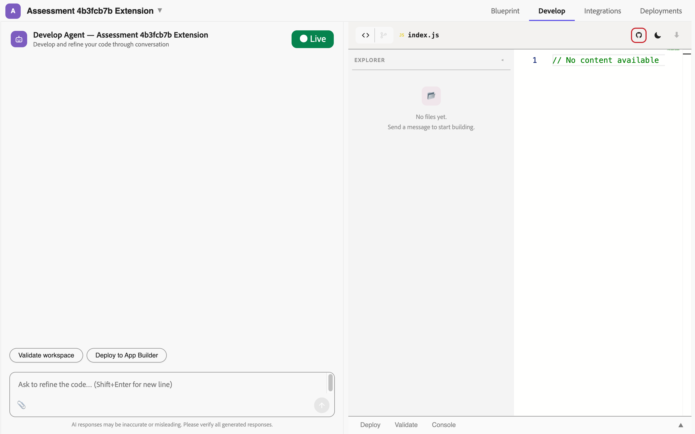

# Net-new development workflow

<Fragment src="/_includes/developer-agent.md" />

The net-new development workflow allows you to use the Commerce Developer Agent to scaffold the architecture and generate starter code for new Commerce extensions, integration layers, or storefront components.

## When to use this workflow

Use this workflow when:

* You are building a new App Builder extension or integration for Adobe Commerce.
* You are creating an Edge Delivery Services storefront drop-in or storefront component.
* You do not have a migration assessment and are not migrating the functionality from an existing codebase.

## Prerequisites

* A clear idea of what you want to build (project type, target capability, technology preference).
* Basic familiarity with Adobe Commerce extensibility patterns. However, if you lack familiarity, the agent will attempt to assist you.

## Tips for new development

* Be specific about the capability Commerce Developer Agent should build, not only the implementation detail. For example, prompt the agent with "I need to send order data to an external OMS when an order is placed" instead of "I need an action."
* Include relevant systems, events, webhook requirements, data mappings, configuration needs, or storefront behavior.
* Add supporting text-based attachments or links when they provide useful context, such as requirements, API documentation, examples, or existing code snippets.

## Recommended net-new scenarios

The following project types are recommended:

| Scenario | Reason |
| --- | --- |
| Customer-managed App Builder extension | Extensions managed through Commerce App Management work well with the developer agent. |
| Event-driven Commerce integration | The developer agent is designed for reacting to Adobe Commerce events asynchronously. |
| Webhook-based validation or enrichment | Useful when the extension needs to intercept, validate, or enrich Commerce operations. |
| Third-party integration through App Builder | Works well when the external API, authentication needs, and data mapping are described clearly. |
| Storefront drop-in on Edge Delivery | Good fit when building supported Edge Delivery storefront components. |

The following project types could produce lower-quality output and will require additional review and scrutiny:

| Scenario | Reason |
| --- | --- |
| Custom PWA/headless storefront scaffolding outside the supported Edge Delivery path | Not currently part of the supported workflow. |
| Complex multi-extension or cross-project dependencies | Currently, a single-project scope is better. |
| Custom payment gateway implementation | Requires careful security, compliance, and payment-domain review. |

## New development workflow

The following sections describe the workflow from starting a new project to exporting code for continued development.

### Access the Commerce Developer Agent

1. Navigate directly to the Commerce Developer Agent home screen. The URL depends on your IMS organization name: `https://experience.adobe.com/#/@<your-ims-org-name>/commerce-developer-agent/`.
1. Sign in with your Adobe IMS credentials when prompted.
1. From the Commerce Developer Agent home screen, click **New Project** or start entering your project details on the **App Builder** or **Edge Delivery** tab, depending on what you want to develop.



When creating your first prompt, consider providing the following information to help the agent understand your intent:

* **Project type** - Specify if you are creating a customer-managed extension, third-party integration, or storefront drop-in.
* **Target capabilities** - Describe the extension, integration, or storefront behavior you want Commerce Developer Agent to scaffold. For example, custom product attributes, order processing hook, or third-party payment integration.
* **Attachments** - Add supporting files or links, such as requirements, API documentation, examples, or existing code snippets.
* **Additional context** - Include relevant constraints, external systems, expected behavior, data mappings, configuration needs, or existing references.

### Review the blueprint

After you submit the intake, Commerce Developer Agent begins interpreting your request and preparing the blueprint. During this step, review the planning view for:

* Detected intent
* Proposed architecture pattern
* Workspace mode and runtime context
* Assumptions, key considerations, or readiness signals
* Planning progress and generated implementation tasks

Correct any misunderstandings here before proceeding. This is the lowest-cost point to redirect Commerce Developer Agent before approving the blueprint.


Use the **Preview** tab to review the blueprint overview, planned tasks, and architecture diagram. Use the **Source** tab to inspect the textual blueprint representation, currently shown in Markdown.

Common refinements include:

* Narrowing or expanding the scope of generated code
* Requesting an alternative architecture approach
* Asking why a specific pattern was recommended
* Adding requirements for validation, tests, logging, documentation, or deployment setup

Use the suggested refinement prompts above the chat field to review the blueprint from different angles, such as assumptions, design gaps, scalability, security, event coverage, state management, Adobe best practices, and open questions.

Click **Request changes** to iterate on the blueprint or click **Approve plan** to start code generation.

When you request changes, Commerce Developer Agent creates a new blueprint version. You can review versions before approving the plan, including comparing blueprint versions side by side where available.

### Generate the code

After blueprint approval, Commerce Developer Agent generates the project workspace. Depending on the selected workflow mode and approved blueprint, this may include:

* **Project directory structure** for the selected App Builder or Edge Delivery workflow
* **Core implementation files** based on the approved blueprint
* App Builder, Commerce App Management, or Edge Delivery **configuration files** where applicable
* **Business configuration** or persistence files where required by the blueprint
* **Validation checks** for the generated workspace

Real-time progress displays on the **Develop** tab while the code is generated. You can inspect generated files, review validation output, and continue refining the generated code through chat.



### Iterate on the code

After the initial generation, you can continue refining the generated workspace. Use follow-up prompts or the suggested actions above the chat field to request changes, validations, tests, logging, documentation, or performance improvements.

```shell
Make the log level configurable.
Add validation before sending data to the external system.
Add tests for the generated event handler.
Generate a README with setup and deployment instructions.
```

The agent retains all project context across your session and across return visits.

### Continue development externally

When you are ready to continue outside the Commerce Developer Agent, use one of the available export options:

* **Download artifact ZIP** — Download the generated workspace as a ZIP file and use it as the starting point in your local development workflow.
* **Push to GitHub** — Connect a GitHub repository through the **Integrations** tab, and push the generated code to that repo. You can then clone the repository locally and continue development using your normal Git workflow.
  * Pushing to GitHub requires setting up the integration and connecting a repository.
* Direct deployment will be available as a future update.
