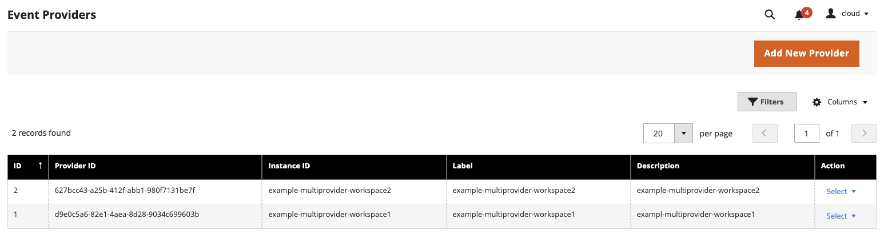
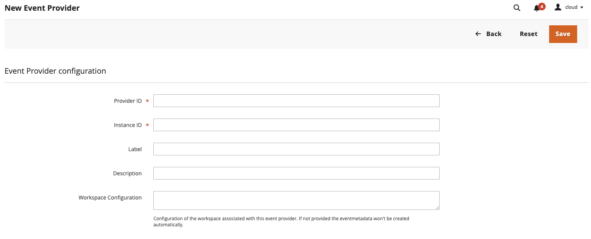

# Configure additional event providers in Adobe Commerce

You might need to connect your Adobe Commerce instance to other event providers besides the [default Commerce event provider](configure-commerce.md#create-an-event-provider) registered in the system configuration.

To link your event subscriptions to an additional event provider, the provider must be registered in the Adobe Commerce instance. You can configure the provider from the Adobe Commerce Admin or [through the API](api.md#event-providers-management).

## Configure event providers in the Admin

To manage event providers in the Adobe Commerce Admin, go to **System** > **Events** > **Event Providers**. The Event Providers page lists all additional event providers configured in your Adobe Commerce instance.

To add a new event provider, click **Add New Provider**. Keep in mind that the event provider must be created in the Adobe I/O Events before you can add it to your Commerce instance. You can create the event provider the using [`aio` CLI tool](https://developer.adobe.com/events/docs/guides/cli/#provider-commands) or to use the [Adobe I/O Events API](https://developer.adobe.com/events/docs/api/#tag/Providers/operation/createProvider).

`Provider ID` and `Instance ID` are required fields, while the `Workspace Configuration` field is optional. If provided, it synchronizes the event metadata registered with this provider. Otherwise, the creation of event metadata will be skipped. The `Workspace Configuration` must be provided from the workspace where the event provider was created. You can [download the workspace configuration from the Adobe Developer Console](./project-setup.md#download-the-workspace-configuration-file).

### Delete an event provider

To delete an event provider, select the action next to the provider you want to delete and click **Delete**. A confirmation dialog appears. Click **OK** to confirm the deletion.

<InlineAlert variant="info" slots="text1" />

The event provider cannot be deleted if it is used in any event subscriptions. You must first delete the event subscriptions that use this provider.
