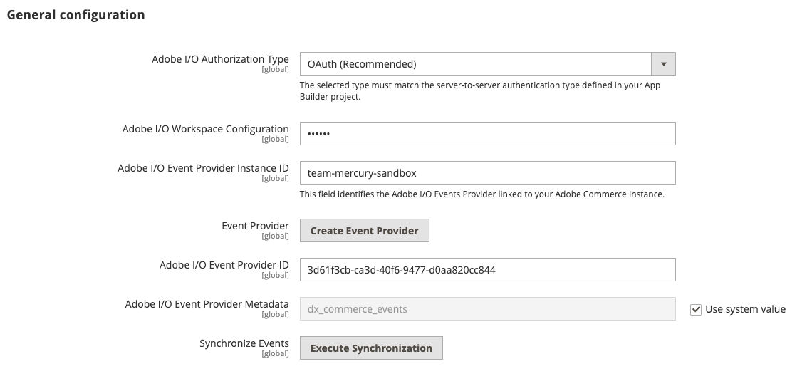

# Configure Adobe Commerce

After you have created an [App Builder project](./project-setup.md) and [install the eventing modules](./installation.md), you must download several files from the App Builder project and configure eventing in the Commerce admin.

## Configure the Adobe I/O connection

You must configure Commerce to communicate with your project. Configuration includes copying and pasting the contents of the [workspace configuration file](./project-setup.md#download-the-workspace-configuration-file) that you downloaded from the Adobe Developer Console. If you decided to use JSON Web Tokens (JWT) as your server-to server authentication method, you must also upload a private key.

1. In the Commerce Admin, navigate to **Stores** > Settings > **Configuration** > **Adobe Services** > **Adobe I/O Events** > **General configuration**. The following screen displays.

   

1. Select the server-to-server authorization method you implemented from the **Adobe I/O Authorization Type** menu. Adobe recommends using OAuth. JWT has been deprecated.

1. (JWT only) Copy and paste the contents of your `private.key` file into the **Service Account Private Key** field. Use the following command to copy the contents.

   ```bash
   cat config/private.key | pbcopy
   ```

   See [Service Account (JWT) Authentication](https://developer.adobe.com/developer-console/docs/guides/authentication/JWT/) for more information about the `private.key` file.

1. Copy the contents of the `<workspace-name>.json` file into the **Adobe I/O Workspace Configuration** field.

1. Enter a unique identifier in the **Adobe Commerce Instance ID** field. This value identifies your project and routes events from Adobe Commerce to the correct `Event Provider` in Adobe I/O. The value of this field is visible in App Builder during the [creation of Event Registration](#subscribe-and-register-events).

   **NOTE**: The **Adobe Commerce Instance ID** field only support alphanumeric characters, hyphens and underscores.

1. Click **Save Config**, but do not leave the page. The next section creates an event provider, which is necessary to complete the configuration.

## Create an Event Provider

Create an `Event Provider` in Adobe I/O Events to associate the Commerce Events subscriptions with the provider. The event subscriptions in Adobe Commerce are created as `Event Metadata` in Adobe I/O Events infrastructure.

Each `Event Provider` can link to multiple event subscriptions (`Event Metadata`). The event's subscriptions will be automatically linked to your `Event Provider` whenever you subscribe with the `events:subscribe` CLI command. You can also manually synchronize all subscriptions with the `events:metadata:populate` command.

You can find the list of Event Providers created in your organization, in the App Builder UI when [creating an Event Registration in App Builder](#subscribe-and-register-events).

You can also use the `aio` CLI tool to manage providers. See [Provider Commands](https://developer.adobe.com/events/docs/guides/cli/#provider-commands) for more information.

<InlineAlert variant="info" slots="text"/>

You cannot create an event provider until you have configured and saved instance ID values and a workspace file. If you are using JWT for server-to-server authentication, you must have previously specified the private key.

1. Run the following command to create an event provider:

   ```bash
   bin/magento events:create-event-provider --label "Provider Label" --description "Provider description"
   ```

   For example:

   ```bash
   bin/magento events:create-event-provider --label "My_server_provider" --description "Provides out-of-process extensibility for Adobe Commerce"
   ```

   The `label` field displays as the name of the created Event Provider in the App Builder UI. The `description` field provides more context about the Event Provider.

   **Note**: The label can contain English alphanumeric characters and underscores (_) only. The first character must be a letter.

   The command displays a message similar to the following:

   ```terminal
   No event provider found, a new event provider will be created
   A new event provider has been created with ID 63a1f8fe-e911-45a4-9d3f-f512d2ef4626
   ```

1. Copy the ID returned in the command output into the **Adobe I/O Event Provider ID** field in the Admin.

   

## Complete the Commerce configuration

1. Enable Commerce Eventing by setting **Enabled** to `Yes`.

   

   **Note**: You must [enable cron](#check-cron-and-message-queue-configuration) so that Commerce can send events to the endpoint.

1. Enter the merchant's company name in the **Merchant ID** and the environment name in **Environment ID** fields. The values of these fields will be combined and added as a `source` attribute to your event data to identify the source of the events. It can be useful for event filtration or other logic if you are using the same event provider for several environments or projects.

   **NOTE**: The **Merchant ID** and **Environment ID** fields only support alphanumeric characters and underscores.

```javascript
"source": "<merchant-id>.<environment-id>"
```

1. (Optional) By default, if an error occurs when Adobe Commerce attempts to send an event to Adobe I/O, Commerce retries a maximum of seven times. To change this value, uncheck the **Use system value** checkbox and set a new value in the **Maximum retries to send events** field.

1. (Optional) By default, Adobe Commerce runs a cron job (clean_event_data) every 24 hours that deletes event data that is three days old. To change the number of days to retain event data, uncheck the **Use system value** checkbox and set a new value in the **Event retention time (in days)** field.

1. Click **Save Config**.

After you have completely configured and saved your Adobe I/O event connection and your event provider, you can click the **Send Test Event** button to determine the status of the connection. The response displays beneath the button.

## Subscribe and register events

You must define which Commerce events to subscribe to, then register them in the project.

Commerce provides two sources for events: observers and plugins. You must specify the source as part of the event name. See [Subscribe to a Commerce event](./commands.md) for details about the syntax of the `events:subscribe` command.

1. If you don't have a module ready for integration with Adobe I/O Events, or you don't know exactly which events to register at this point, use the `events:subscribe` command to subscribe to some sample events, as shown in the following example commands:

   ```bash
   bin/magento events:subscribe observer.catalog_product_save_after --fields=sku --fields=stock_data.qty
   ```

   ```bash
   bin/magento events:subscribe observer.customer_login --fields=firstname --fields=lastname --fields=entity_id
   ```

    **Warning**: When you use the `events:subscribe` command to subscribe to events on a Cloud environment, configuration information is stored in the `app/etc/config.php` file. You must keep in mind that this file can be replaced with the `app/etc/config.php` file from Git during deployment. As a result, the event subscription will be replaced as well.
   To make these changes permanent, manually add the appropriate configuration to the `app/etc/config.php` file under Git.

   If you have a module ready or have specific events in mind, see [Register events](./module-development.md#register-events) for more information.

1. Return to your workspace. Click the **Add service** pop-up menu and select **Event**.

   

1. On the **Add events** page, select **Commerce events**. Then click **Next**.

   

   **Note:** If the **Commerce events** category is not shown, check that you have created an event provider, and that it has at least one subscribed event. You may need to run the `bin/magento events:metadata:populate` command to synchronize event registrations in Adobe Commerce with the created event provider.

1. On the **Configure event registration** page, select your event provider. Then click **Next**.

1. Select the events to subscribe to. Then click **Next**.

   

1. Optionally create a new OAuth or JWT credential. Then click **Next**.

1. Update the **Event registration name** and **Event registration description** fields. In the **How to receive events** section, under **Option 2**, select the runtime action you created in [Set up App Builder and define a runtime action](./project-setup.md#set-up-app-builder-and-define-a-runtime-action).

   

1. Select **Save configured events**.

You are now set up to develop your App Builder extension.

## Check cron and message queue configuration

Cron and message queues must be enabled. Commerce uses the `event_data_batch_send` cron job to transmit batches of event messages and the `clean_event_data` cron job to remove these messages from the database. These cron jobs are part of the `default` group.

The `commerce.eventing.event.publish` message queue consumer helps expedite registered events that have been designated as priority. The consumer processes priority events within a second of their receipt. By default, it can take up to 59 seconds for cron to process standard-priority events.

In Adobe Commerce on cloud infrastructure, update your `.magento.env.yaml` file with the following changes to the `global` and `deploy` stages:

```yaml
stage:
  global:
    ENABLE_EVENTING: true
  deploy:
    CRON_CONSUMERS_RUNNER:
      cron_run: true
      max_messages: 0
      consumers: []
```

<InlineAlert variant="warning" slots="text" />

The deployment process might become stuck if the consumer runs in the background. The [Troubleshooting](./troubleshooting.md#stuck-deployment-after-configuring-priority-events) topic describes how to resolve this condition.

See [Global variables](https://experienceleague.adobe.com/docs/commerce-cloud-service/user-guide/configure/env/stage/variables-global.html) for more information about the `ENABLE_EVENTING` variable.

Cloud infrastructure and on-premises instances require different cron management procedures as described here:

*  [Adobe Commerce on cloud infrastructure](https://experienceleague.adobe.com/docs/commerce-cloud-service/user-guide/configure/app/properties/crons-property.html)

*  [On premises](https://experienceleague.adobe.com/docs/commerce-operations/configuration-guide/crons/custom-cron-reference.html)
