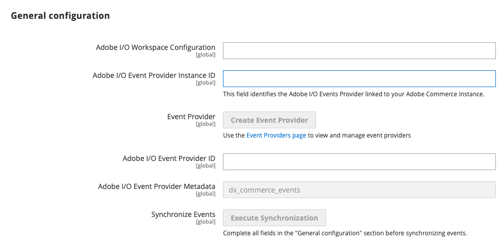

# Configure Adobe Commerce

After you have created an [App Builder project](./project-setup.md) and [install the eventing modules](./installation.md), you must download several files from the App Builder project and configure eventing in the Commerce admin.

## Configure the Adobe I/O connection

You must configure Commerce to communicate with your project. Configuration includes copying and pasting the contents of the [workspace configuration file](./project-setup.md#download-the-workspace-configuration-file) that you downloaded from the Adobe Developer Console. If you decided to use JSON Web Tokens (JWT) as your server-to server authentication method, you must also upload a private key.

1. In the Commerce Admin, navigate to **Stores** > Settings > **Configuration** > **Adobe Services** > **Adobe I/O Events** > **General configuration**. The following screen displays.

   

1. Select the server-to-server authorization method you implemented from the **Adobe I/O Authorization Type** menu. Adobe recommends using OAuth. JWT has been deprecated.

1. (JWT only) Copy and paste the contents of your `private.key` file into the **Service Account Private Key** field. Use the following command to copy the contents.

   ```bash
   cat config/private.key | pbcopy
   ```

   See [Service Account (JWT) Authentication](https://developer.adobe.com/developer-console/docs/guides/authentication/JWT/) for more information about the `private.key` file.

1. Copy the entire contents of the `<workspace-name>.json` file into the **Adobe I/O Workspace Configuration** field.

1. Enter a unique identifier in the **Adobe I/O Event Provider Instance ID** field. This unique value identifies your Commerce instance, which allows Commerce events to connect to the correct `Event Provider` in Adobe I/O. This ID corresponds to the **Provider** displayed when [subscribing to events](#subscribe-and-register-events).

   **Note**: The **Adobe I/O Event Provider Instance ID** field only supports alphanumeric characters, hyphens and underscores.

1. Click **Save Config**, but do not leave the page. The next section creates an event provider, which is necessary to complete the configuration.

 The event provider will not appear in the Developer Console until after you subscribe to an event emitted by Commerce, such as `io_events.xml` or `config.php`.

## Create an event provider

Create an event provider in Adobe I/O Events to associate the Commerce Events subscriptions with the provider. The event subscriptions in Adobe Commerce are created as event metadata in Adobe I/O Events infrastructure.

Each event provider can link to multiple event subscriptions (event metadata). The event's subscriptions will be automatically linked to your event provider whenever you subscribe with the `events:subscribe` command. You can also manually synchronize all subscriptions with the `events:metadata:populate` command or by clicking the **Execute Synchronization** button on the **General configuration** section of the Adobe I/O Events page in the Admin. Running the `setup:upgrade` command also synchronizes events subscriptions.

You can find the list of event providers created in your organization, in the App Builder UI when [creating an Event Registration in App Builder](#subscribe-and-register-events).

You can also use the `aio` CLI tool to manage providers. See [Provider Commands](https://developer.adobe.com/events/docs/guides/cli/#provider-commands) for more information.

<InlineAlert variant="info" slots="text"/>

You cannot create an event provider until you have configured and saved instance ID values and a workspace file. If you are using JWT for server-to-server authentication, you must have previously specified the private key.

You can create an event provider using either the [Command line](./configure-commerce.md#command-line) or [Commerce Admin](./configure-commerce.md#commerce-admin).

### Command line

1. Run the following command to create an event provider:

   ```bash
   bin/magento events:create-event-provider --label "Provider Label" --description "Provider description"
   ```

   For example:

   ```bash
   bin/magento events:create-event-provider --label "My_server_provider" --description "Provides out-of-process extensibility for Adobe Commerce"
   ```

   The `label` field displays as the name of the created Event Provider in the App Builder UI. The `description` field provides more context about the Event Provider.

   **Note**: The label can contain English alphanumeric characters, spaces, underscores (_), and hyphens (-) only. The first character must be a letter.

   The command displays a message similar to the following:

   ```terminal
   No event provider found, a new event provider will be created
   A new event provider has been created with ID ad667bc6-1678-49ff-99fc-215d71ebf82f
   ```

1. Copy the ID returned in the command output into the **Adobe I/O Event Provider ID** field in the Admin.

   

### Commerce Admin

1. In the Commerce Admin, navigate to **Stores** > Settings > **Configuration** > **Adobe Services** > **Adobe I/O Events** > **General configuration**. The following screen displays.

   

2. Click on the **Create Event Provider** button, enter the **Label** and **Description**, and then click submit. The **Adobe I/O Event Provider ID** field will be populated with the newly generated event provider ID

   

   

## Complete the Commerce configuration

1. Enable Commerce Eventing by setting **Enabled** to `Yes`.

   

   **Note**: You must [enable cron](#check-cron-and-message-queue-configuration) so that Commerce can send events to the endpoint.

1. Enter the merchant's company name in the **Merchant ID** and the environment name in **Environment ID** fields. The values of these fields will be combined and added as a `source` attribute to your event data to identify the source of the events. It can be useful for event filtration or other logic if you are using the same event provider for several environments or projects.

   **Note**: The **Merchant ID** and **Environment ID** fields only support alphanumeric characters and underscores.

```javascript
"source": "<merchant-id>.<environment-id>"
```

1. (Optional) By default, if an error occurs when Adobe Commerce attempts to send an event to Adobe I/O, Commerce retries a maximum of seven times. To change this value, uncheck the **Use system value** checkbox and set a new value in the **Maximum retries to send events** field.

1. (Optional) By default, Adobe Commerce runs a cron job (clean_event_data) every 24 hours that deletes event data that is three days old. To change the number of days to retain event data, uncheck the **Use system value** checkbox and set a new value in the **Event retention time (in days)** field.

1. Click **Save Config**.

After you have completely configured and saved your Adobe I/O event connection and your event provider, you can click the **Send Test Event** button to determine the status of the connection. The response displays beneath the button.

## Subscribe and register events

You must define which Commerce events to subscribe to, then register them in the project.

Commerce provides two sources for events: observers and plugins. You must specify the source as part of the event name. See [Subscribe to a Commerce event](./commands.md) for details about the syntax of the `events:subscribe` command.

1. If you don't have a module ready for integration with Adobe I/O Events, or you don't know exactly which events to register at this point, use the `events:subscribe` command to subscribe to some sample events, as shown in the following example commands:

   ```bash
   bin/magento events:subscribe observer.catalog_product_save_after --fields=sku --fields=stock_data.qty
   ```

   ```bash
   bin/magento events:subscribe observer.customer_login --fields=customer.firstname --fields=customer.lastname
   ```

    **Warning**: When you use the `events:subscribe` command to subscribe to events on a Cloud environment, configuration information is stored in the `app/etc/config.php` file. You must keep in mind that this file can be replaced with the `app/etc/config.php` file from Git during deployment. As a result, the event subscription will be replaced as well.
   To make these changes permanent, manually add the appropriate configuration to the `app/etc/config.php` file under Git.

   If you have a module ready or have specific events in mind, see [Register events](./module-development.md#register-events) for more information.

1. Return to your workspace. Click the **Add service** pop-up menu and select **Event**.

   

1. On the **Add events** page, select **Commerce events**. Then click **Next**.

   

   **Note:** If the **Commerce events** category is not shown, check that you have created an event provider, and that it has at least one subscribed event. You may need to run the `bin/magento events:metadata:populate` command to synchronize event registrations in Adobe Commerce with the created event provider.

1. On the **Configure event registration** page, select your event provider. Then click **Next**.

1. Select the events to subscribe to. Then click **Next**.

   

1. Optionally create a new OAuth or JWT credential. Then click **Next**.

1. Update the **Event registration name** and **Event registration description** fields. The Journaling API can consume your events by default. You can optionally select other consumption methods during this step. Learn more about your options in [Consuming Events](./consume-events.md).

   

1. Select **Save configured events**.

You are now set up to develop your App Builder extension.

## (Optional) Set up an App Builder project with event registrations and runtime actions

If you want to add `Event Registrations` with `Runtime Actions` as event consumers, you can use the App Builder template **@adobe/generator-app-events-generic** to easily set up your project.

1. Create a project directory on your local filesystem and change to that directory.

   ```bash
   mkdir myproject && cd myproject
   ```

1. Log in to Adobe IO from a terminal:

   ```bash
   aio login
   ```

   Your web browser displays the login page.

1. Enter your Adobe ID credentials.

1. Close the browser tab and return to your terminal. Enter the following command to bootstrap your application:

   ```bash
   aio app init -w <workspace-name>
   ```

   The terminal prompts you to select the path to your workspace.

   * Select your project's organization.

   * Select your project.

   * Select the **@adobe/generator-app-events-generic** option using &lt;space> and press &lt;enter>.

     ```terminal
     ? Select Org: MyOrg
     ? Select a Project, or press + to create new: DeveloperSandbox
     ? What templates do you want to search for? All Templates
     ✔ Downloaded the list of templates
     ? Choose the template(s) to install:
     Pressing <enter> without selection will skip templates and install a standalone application.

     ┌──────┬─────────────────────────────────────────────────────────────┬─────────────────────────────────────────────────────────────┬────────────────────────────────────────┬────────────────────────────────────────┐
     │      │ Template                                                    │ Description                                                 │ Extension Point                        │ Categories                             │
     ├──────┼─────────────────────────────────────────────────────────────┼─────────────────────────────────────────────────────────────┼────────────────────────────────────────┼────────────────────────────────────────┤
     │ ❯◉   │ @adobe/generator-app-events-generic *                       │ Adds event registrations and a generic action               │ N/A                                    │ action, events                         │
     ├──────┼─────────────────────────────────────────────────────────────┼─────────────────────────────────────────────────────────────┼────────────────────────────────────────┼────────────────────────────────────────┤
     │  ◯   │ @adobe/aem-cf-editor-ui-ext-tpl *                           │ Extensibility template for AEM Content Fragment Editor      │ aem/cf-editor/1                        │ action, ui                             │
     ├──────┼─────────────────────────────────────────────────────────────┼─────────────────────────────────────────────────────────────┼────────────────────────────────────────┼────────────────────────────────────────┤
     │  ◯   │ @adobe/generator-app-aem-react *                            │ Template for AEM React SPA based on WKND content.           │ N/A                                    │ ui                                     │
     ├──────┼─────────────────────────────────────────────────────────────┼─────────────────────────────────────────────────────────────┼────────────────────────────────────────┼────────────────────────────────────────┤
     │  ◯   │ @adobe/aem-cf-admin-ui-ext-tpl *                            │ Extensibility template for AEM Content Fragment Admin       │ aem/cf-console-admin/1                 │ action, ui                             │
     │      │                                                             │ Console                                                     │                                        │                                        │
     └──────┴─────────────────────────────────────────────────────────────┴─────────────────────────────────────────────────────────────┴────────────────────────────────────────┴────────────────────────────────────────┘
     ```

   * Enter the name of the non-web Runtime Action. The default value is `generic`.

     ```terminal
     ✔ Installed npm package @adobe/generator-app-events-generic
     ℹ Running template @adobe/generator-app-events-generic
     ? We are about to create a new sample action that A generic action that logs the events received from IO Events.
     How would you like to name this action? generic
     ```

   * Enter the name of event registration to create. The default value is `Event Registration`.

     ```terminal
     ? We are about to create a new Event registration.
     How would you like to name this registration? Customer Event Registration
     ```

   * Enter text that describes the purpose of the registration.  The default value is `Registration for IO Events`.

     ```terminal
     ? What is this registration being created for? Registration for receiving customer actions
     ```

   * Select `Commerce Events` from the list of event provider families.

     ```terminal
     ? Choose from the following provider families ( provider metadata ) Commerce Events
     ```

   * Select the event provider you created in the [Create an Event Provider](./configure-commerce.md#create-an-event-provider) section.

     ```terminal
     ? Choose from below provider for provider metadata: dx_commerce_events team-mercury-sandbox
     ```

   * Select the event metadata you want to associate with the event registration.

     ```terminal
     Choose event metadata for provider: team-mercury-sandbox Observer event customer_login, Observer event customer_logout
     ```

   The command initializes a project with a basic Adobe I/O Runtime Action and a configuration for the event registration.

1. Deploy the generated application to the App Builder project by running the following command:

   ```bash
   aio app deploy
   ```

   The command deploys the project and creates a new event registration that delivers events to the Adobe I/O Runtime Action.

1. You can add more Adobe I/O Runtime actions or event registrations by editing the `app.config.yaml` file and redeploying the project with `aio app deploy` CLI command.

   ```yaml
   application:
     runtimeManifest:
       packages:
         TemplateTest:
           license: Apache-2.0
           actions:
             generic:
               function: actions/generic/index.js
               web: 'no'
               runtime: nodejs:18
               inputs:
                 LOG_LEVEL: debug
               annotations:
                 require-adobe-auth: false
                 final: true
     events:
       registrations:
         Customer Event Registration:
           description: Registration for receiving customer actions
           events_of_interest:
             - provider_metadata: dx_commerce_events
               event_codes:
                 - com.adobe.commerce.observer.customer_login
                 - com.adobe.commerce.observer.customer_logout
           runtime_action: Stage/generic
   ```

[App Builder with IO Events](https://developer.adobe.com/events/docs/guides/appbuilder/#initialising-an-app-builder-app-with-io-events-template) provides additional information about setting up App Builder projects.

## Check cron and message queue configuration

Cron and message queues must be enabled. Commerce uses the `event_data_batch_send` cron job to transmit batches of event messages and the `clean_event_data` cron job to remove these messages from the database. These cron jobs are part of the `default` group.

The `commerce.eventing.event.publish` message queue consumer helps expedite registered events that have been designated as priority. The consumer processes priority events within a second of their receipt. By default, it can take up to 59 seconds for cron to process standard-priority events.

In Adobe Commerce on cloud infrastructure, update your `.magento.env.yaml` file with the following changes to the `global` and `deploy` stages:

```yaml
stage:
  global:
    ENABLE_EVENTING: true
  deploy:
    CRON_CONSUMERS_RUNNER:
      cron_run: true
      max_messages: 0
      consumers: []
```

<InlineAlert variant="warning" slots="text" />

The deployment process might become stuck if the consumer runs in the background. The [Troubleshooting](./troubleshooting.md#stuck-deployment-after-configuring-priority-events) topic describes how to resolve this condition.

See [Global variables](https://experienceleague.adobe.com/docs/commerce-cloud-service/user-guide/configure/env/stage/variables-global.html) for more information about the `ENABLE_EVENTING` variable.

Cloud infrastructure and on-premises instances require different cron management procedures as described here:

*  [Adobe Commerce on cloud infrastructure](https://experienceleague.adobe.com/docs/commerce-cloud-service/user-guide/configure/app/properties/crons-property.html)

*  [On premises](https://experienceleague.adobe.com/docs/commerce-operations/configuration-guide/crons/custom-cron-reference.html)
