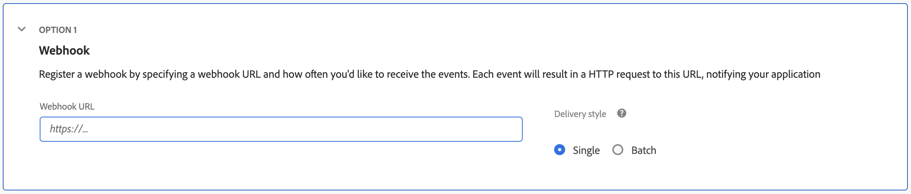

# Consume Events

You can consume events sent from Adobe Commerce to Adobe I/O events in several ways. The following options for consuming events are available when adding events to your App Builder project and creating an event registration:

* [Using the Journaling API](#using-the-journaling-api) (enabled by default)
* [Using a Webhook URL](#using-a-webhook-url)
* [Using a Runtime Action](#using-a-runtime-action)
* [Using Amazon EventBridge](#using-amazon-eventbridge)

## Using the Journaling API

When you create an Adobe I/O event registration, the subscribed events get added to an ordered list, referred to as the journal, by default. You can consume these events using a journaling endpoint URL that is unique to the registration. For more information on reading events from the journal, see the [Introduction to Journaling](https://developer.adobe.com/events/docs/guides/journaling_intro/).

You can also consume events from the Journaling API using the [Adobe I/O Events SDK](https://github.com/adobe/aio-lib-events). See [Subscribe to Events Using Journaling](https://developer.adobe.com/events/docs/guides/sdk/sdk_journaling/) for details and sample code.

## Using a Webhook URL

Consuming an event using a webhook URL is useful for cases that do not require App Builder to handle transformations to the event structure or additional API calls, which simplifies forwarding events from Adobe Commerce to a 3rd-party system using App Builder. The destination system must have an endpoint that can receive webhook requests to use this option.

You can register the webhook URL when creating or editing an event registration. If you are setting up the registration through the developer console UI, this option will appear in the final configuration step.

See [Introduction to Adobe I/O Events Webhooks](https://developer.adobe.com/events/docs/guides/) for more details.

<InlineAlert variant="warning" slots="text"/>

Be careful not to confuse this method of consuming events with [Runtime Actions as a Webhook](https://developer.adobe.com/events/docs/guides/runtime_webhooks/#benefits-of-using-runtime-action-as-webhook). Runtime Actions as a Webhook is a functionality for creating a URL for App Builder to receive events from a 3rd party system.

## Using a Runtime Action

An [Adobe I/O Runtime Action](https://developer.adobe.com/runtime/docs/guides/overview/entities/#actions) allows you to receive Commerce events in an event registration. You can create actions from JavaScript functions, as described in [Creating Actions](https://developer.adobe.com/runtime/docs/guides/using/creating_actions/). Within an action, you can execute business logic based on the received event payload, make API calls back to Adobe Commerce to update data, access additional information, and send data to another system.

See [Runtime Action with a Callback to Commerce](./consume-events-examples/runtime-action-commerce-callback.md) for an example of how a runtime action can consume an event and make an API call back to Commerce to get more information.

See more examples of end-to-end integrations between Commerce and 3rd party systems like ERPs that use runtime actions in our [Starter Kit](https://developer.adobe.com/commerce/extensibility/starter-kit/send-data/) documentation.

## Using Amazon EventBridge

You can configure an Adobe I/O event registration to forward received Commerce events to Amazon EventBridge. See [Adobe I/O Events and Amazon EventBridge Integration](https://developer.adobe.com/events/docs/guides/amazon_eventbridge/) for more details.
