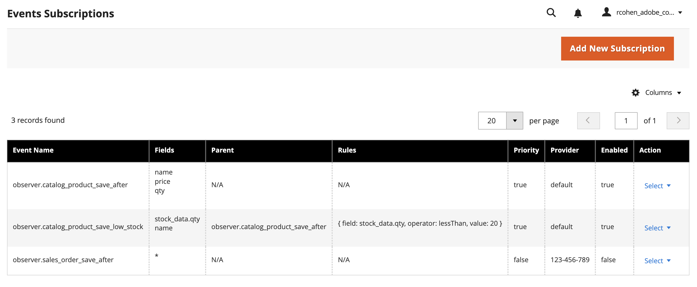
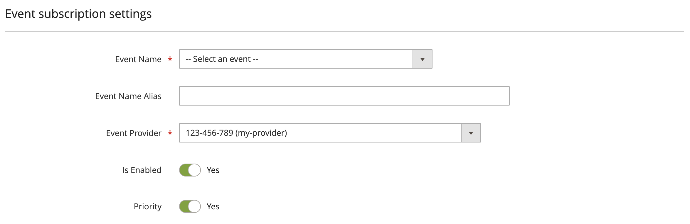
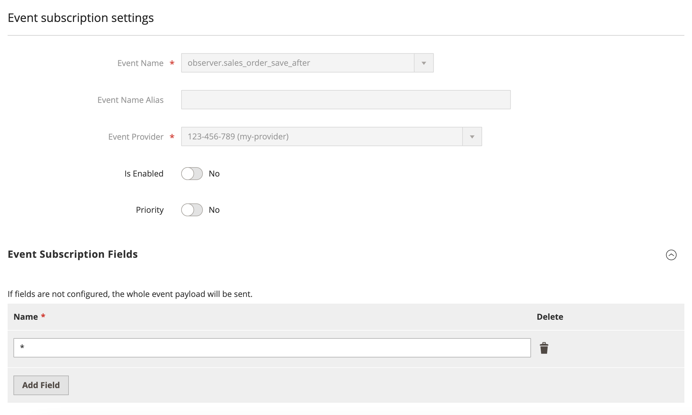

# Create events from the Admin

<InlineAlert variant="info" slots="text1" />

This feature is available only in Adobe Commerce as a Cloud Service (ACCS).

In addition to the available [REST endpoints for event subscriptions](./api.md), Adobe Commerce as a Cloud Service also supports managing events through the Admin.

## View event subscriptions

In the Admin, select **System** > **Events** > **Events Subscriptions** to display the _Events Subscriptions_ grid page.

The rows of this grid show configuration settings for all event subscriptions, both enabled and disabled.

## Create a new event subscription

Click **Add New Subscription** from the grid page to display the form for creating a new event subscription.

The **Event subscription settings** configuration panel contains the following fields:

Field | Description
--- | ---
**Event Name** | Select one of the supported Commerce event names from the dropdown.
**Event Name Alias** | A unique alias name for the event. An alias is required for events that have rules configured.
**Event Provider** | Select the event provider to which the event should be delivered. If a workspace configuration is set for the provider, event metadata will be created and linked to the provider when the event subscription is saved.
**Is Enabled** | Indicates whether the event is enabled. Commerce does not emit disabled events.
**Priority** | Indicates whether the event has priority status. Priority events are sent within a second, whereas non-priority events can take up to 59 seconds to send.

### Configure event subscription fields

The **Event Subscription Fields** configuration panel allows you to define the fields of the event payload to transmit from Commerce. The name provides the path to the field in the event payload. See [Register events](./module-development.md#register-events) for details on specifying event field names.

### Configure event subscription rules

The **Event Subscription Rules** configuration panel allows you to define rules that determine when an event with a name alias is triggered. [Create conditional events](./conditional-events.md) describes how to configure rules.

Field | Description
--- | ---
**Field** | The name of the event field to be evaluated.
**Value** | The value to be compared.
**Operator** | Defines which comparison operator to use. Examples include `lessThan`, `regex`, and `equal`.

## Events Subscriptions grid actions

Click **Select** > **Edit** in the **Action** column of an event subscription's row to display a form for editing the subscription.

Click **Select** > **Delete** in the **Action** column to delete an event subscription.
