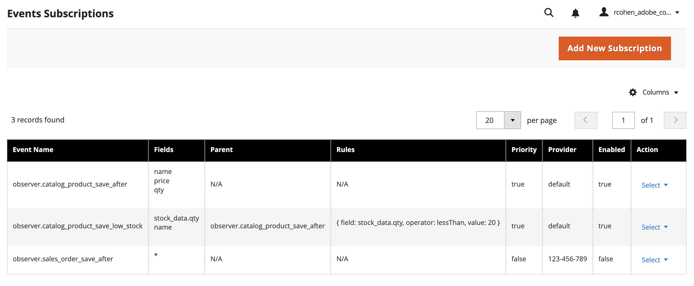
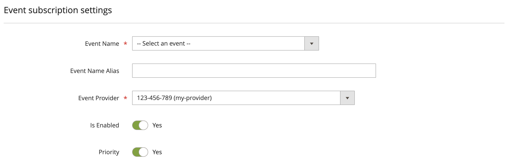
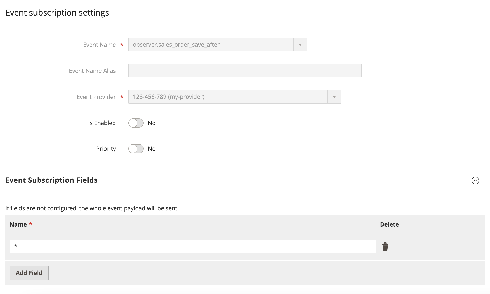

# Create event subscriptions from the Admin

<InlineAlert variant="info" slots="text1" />

Adobe Commerce as a Cloud Service (SaaS) customers can create event subscriptions from the Admin or by using [REST](api.md) calls. (Platform as a Service (PaaS) customers must either use REST or create a custom module.) SaaS does not support all possible events. To view the list of supported events, select **System** > Events > **Events List**. Contact Customer Support if you would like to implement other events.

## View event subscriptions

In the Admin, select **System** > Events > **Events Subscriptions** to display the _Events Subscriptions_ grid page.



The rows of this grid show configuration settings for all event subscriptions, both enabled and disabled.

## Create a new event subscription

Click **Add New Subscription** from the grid page to display the form for creating a new event subscription.



The **Event subscription settings** configuration panel contains the following fields:

| Field | Description |
|---|---|
| **Event Name** | Select one of the supported Commerce event names from the dropdown. SaaS does not support all possible events. Open a support ticket to request additional events. |
| **Event Name Alias** | A unique alias name for the event. An alias is required for events that have rules configured. |
| **Event Provider** | Select the event provider to which the event should be delivered. If a workspace configuration is set for the provider, event metadata will be created and linked to the provider when the event subscription is saved. |
| **Is Enabled** | Indicates whether the event is enabled. Commerce does not emit disabled events. |
| **Priority** | Indicates whether the event has priority status. Priority events are sent within a second, whereas non-priority events can take up to 59 seconds to send. |

### Configure event subscription fields

The **Event Subscription Fields** configuration panel allows you to define the fields of the event payload to transmit from Commerce. The name provides the path to the field in the event payload.

<Fragment src="/_includes/event-size-limitation.md" />

<Fragment src="/_includes/sample-event.md" />

<InlineAlert variant="info" slots="text" />

If you do not specify any fields, Commerce sends the entire event payload. Adobe recommends sending a limited number of fields per event. If you send all fields, you increase the risk of including sensitive or PCI compliance data in the event. In addition, specifying only the fields that are applicable to your business case is recommended for optimal performance and cost effectiveness.

The following example shows how three fields can be configured for the `observer.catalog_product_save_after` event:

```yaml
Name: entity_id
Name: sku
Name: is_new
```

The contents of an `observer.catalog_product_save_after` event are similar to the following:

```json
{
    "entity_id": "3",
    "sku": "test2",
    "is_new": "0"
}
```

#### Array of nested objects

<Fragment src="/_includes/nested-event.md" />

```yaml
Name: order_id
Name: items[].sku
Name: items[].qty
```

The contents of the transmitted event are similar to the following:

```json
{
   "order_id": "8",
   "items": [
      {
         "sku": "simple-product-2",
         "qty": "3.000000"
      },
      {
         "sku": "simple-product-1",
         "qty": "5.000000"
      }
   ]
}
```

### Configure event subscription rules

You may decide that you want Adobe I/O Events for Adobe Commerce to notify the client application when certain conditions occur. For example, by default, if you register an event that tracks the remaining quantity of a product, the eventing service sends that information to your client application each time Commerce emits the event. However, you might be interested in the remaining quantity only when it reaches a specific threshold, such as 20 units. Conditional events allow you to define exactly when to send events to your application. Otherwise, the client application must include code to filter out the unimportant and unnecessary data.

A conditional event acts as an extension of a custom or native Commerce event. You must specify the source, or parent, event and define one or more rules that evaluate the data that is present in the parent event payload. If all the individual rules defined in a conditional event evaluate as true, then the eventing service sends the conditional event to the application. If one or more rules evaluate as false, the service sends neither the parent event nor the conditional event, unless the parent has been subscribed separately, without any rules.

All conditional events contain the following information:

*  A unique name for the conditional event.

*  The name of the parent event. You must attach a conditional event to a specific registered event.

*  One or more rules.

Each rule contains the following:

*  A field that is defined in the parent event.

*  An operator, which is represented as a comparison statement between the value supplied in the parent event's payload and the threshold value.

   The operator must be one of the following:

   * **`greaterThan`** — Checks whether the value supplied in the payload of the event is greater than a specified value. Applicable for integer and float data types.
   * **`lessThan`** — Checks whether the payload value is less than a specified value. Applicable for integer and float data types.
   * **`equal`** — Checks whether the payload value matches the specified value. For Boolean data types, use `1` to compare to `true` and `0` to compare to `false`.
   * **`regex`** — A regular expression that checks for matches. The specified value must be compatible with the [regular expression match](https://www.php.net/manual/en/function.preg-match.php).
   * **`in`** — Checks whether the payload value is one of multiple specified values. The value must be a comma-separated list. You do not need to provide additional escape characters.
   * **`onChange`** — Checks whether the provided field's value has changed compared to its previous value. The value attribute is optional. If provided, the operator checks whether the field's new value is equal to the specified value field.

*  The value to compare against. When you assign the `regex` operator, you must delimit the regular expression value with valid characters, such as forward slashes (/). For example, `/^TV .*/i`, which checks whether the string starts with the string `TV`, ignoring the case of the letters.

*  The value in the `onChange` operator is a path to a field to compare against. By default, comparison is done against `field` and `_origData.field` values. In cases where the event payload has a different structure, you can provide a custom path to compare against.

#### Example

```yaml
Field: qty
Operator: lessThan
Value: 20

Field: category_id
Operator: in
Value: 3,4,5

Field: name
Operator: regex
Value: /^TV .*/i

Field: category.store_id
Operator: in
Value: 1,2
```

## Events Subscriptions grid actions

Click **Select** > **Edit** in the **Action** column of an event subscription's row to display a form for editing the subscription.



Click **Select** > **Delete** in the **Action** column to delete an event subscription.
