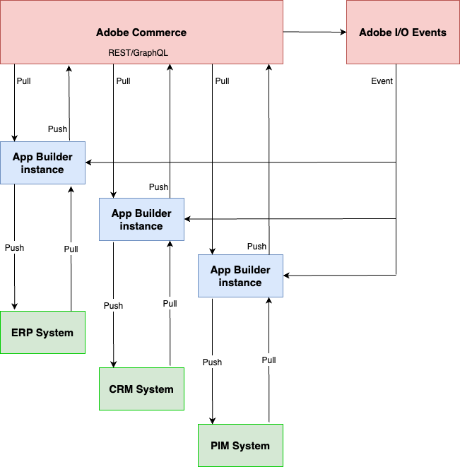

# Adobe I/O Events for Adobe Commerce Overview

With [Adobe I/O Events](https://developer.adobe.com/events/docs/), developers can create event-driven applications that take action when a shopper performs an action on an Adobe product. These capabilities are now available in Adobe Commerce and, as a result, Commerce can now make transactional data available to applications created with [Adobe App Builder](https://developer.adobe.com/app-builder/docs/getting_started/first_app/).

The following architectural diagram provides an overview of how Adobe I/O Events for Adobe Commerce works.

Imagine that you want to build an extension that notifies a third-party Enterprise Resource Planning (ERP) system every time a shopper places an order. In your Commerce module, you register the `plugin.magento.sales.api.order_management.place` event and possibly related events. When a shopper places an order, Commerce sends the event to Adobe I/O Events, which then routes the events to the appropriate App Builder application.

Your App Builder application uses any applicable details provided with the event to construct a REST or GraphQL request (pull) to Commerce to gather details about the transaction. Perhaps full details about the order are required. The App Builder application then pushes that information to the ERP system. The ERP system responds to the request, and then the App Builder application pushes any new data to Commerce.

This architecture helps merchants efficiently customize processes and integrate systems while maintaining SaaS-like upgradeability. Before event-driven applications, developers had to use API polling to determine if something had occurred. Lags in polling could result in merchants missing real-time activities, which could prevent shoppers from having an optimal experience. Eventing enables developers to focus on solving business problems with event data, rather than focusing on problems getting data to applications.
