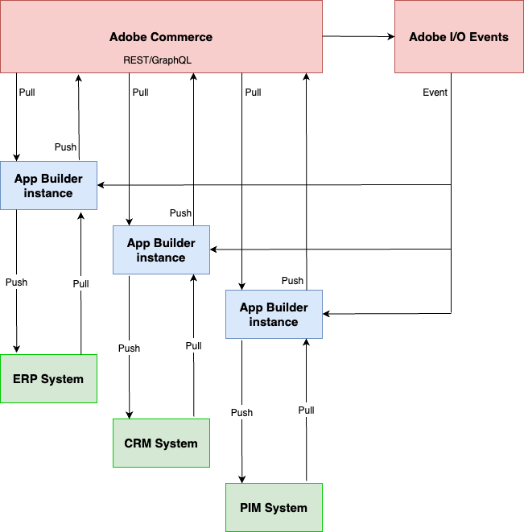

# Adobe I/O Events for Adobe Commerce overview

Commerce events are a core building block of [out-of-process extensibility](../get-started/index.md) in Adobe Commerce. When something happens in Commerce, such as a customer placing an order, a product being updated, or a shipment being created, Commerce emits an event through [Adobe I/O Events](https://developer.adobe.com/events/docs/). Your [Adobe App Builder](https://developer.adobe.com/app-builder/docs/getting_started/first_app/) application receives that event and takes action, all without running custom code inside the Commerce process.

This event-driven architecture keeps your integration logic isolated from the Commerce core. Your apps deploy independently, scale on their own, and never block Commerce upgrades.

<!---
To do: Determine whether to keep diagram

--->

## How events work with App Builder

When Commerce emits an event, Adobe I/O Events routes it to one or more App Builder applications that have registered for that event type. The App Builder application can then:

- Use details from the event payload to call back to Commerce for additional data via REST or GraphQL.
- Push data to an external system such as an ERP, OMS, or CRM.
- Receive a response from the external system and sync updates back to Commerce.

For example, when a shopper places an order, Commerce can emit the `plugin.magento.sales.api.order_management.place` event. An App Builder application receives the event, retrieves the full order details from Commerce, and forwards them to a third-party ERP system. The ERP responds with fulfillment data, which the App Builder application pushes back to Commerce.

Before event-driven applications, developers relied on API polling to detect changes. Polling introduces latency and resource overhead. Eventing replaces this pattern with near-real-time notifications, so developers can focus on business logic rather than data retrieval mechanics.

## Getting started with events

Most integrators work with Commerce events through [starter kits](../starter-kit/index.md), which provide pre-built event subscriptions, routing, and handler patterns for common integration scenarios:

- The [integration starter kit](../starter-kit/integration/events.md) handles bidirectional data synchronization (customers, orders, products, shipments, stock) between Commerce and back-office systems.
- The [checkout starter kit](../starter-kit/checkout/configure.md) uses events for order lifecycle processing and third-party event handling during checkout.

If your use case falls outside these patterns, you can subscribe to events directly. The approach depends on your Commerce edition:

- **SaaS** customers can [create event subscriptions from the Admin](./create-events.md) or through the REST API.
- **PaaS** customers can use REST APIs, CLI commands, or [custom module development](./module-development.md) with `io_events.xml` configuration.

The remaining pages in this section cover event configuration, subscription management, payload customization, and consumption patterns in detail.
