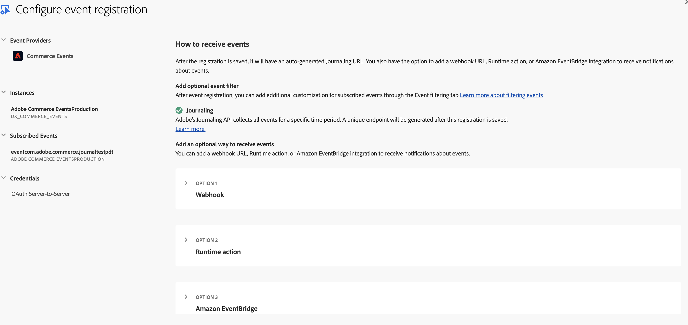

# Register and Validate your Journaling Integration

## Prerequisite Setup

Before configuring journaling, ensure that you have completed the standard setup for Adobe Commerce Events and App Builder.

- To create and configure an Event Provider in Adobe Commerce, follow the steps outlined in (Setting up Event Provider in Adobe Commerce) [https://developer.adobe.com/commerce/extensibility/events/tutorial/event-providers/#set-up-event-providers] up to the section
**Sync event metadata with App Builder**

- To set up your App Builder project, follow the steps in (Set up the Adobe Developer Console and App Builder project locally) https://developer.adobe.com/commerce/extensibility/events/tutorial/deployment/#set-up-the-adobe-developer-console-and-app-builder-project-locally up to the section **Set up your local App Builder environment using the CLI**.

## Register Commerce Events in Adobe Developer Console for Journaling

- Follow these steps to register Commerce events in the Adobe Developer Console:
- Open your Adobe Developer Console project workspace.
- From the Add Service menu, select Event.
- On the Add Events page, choose Commerce Events, then click Next.

- In the Configure Event Registration step:
    - Select the event provider that you created earlier in Adobe Commerce.
    - Click Next to review the list of available events from that provider.
- For Journaling, do not select any specific Delivery Method or Runtime Action.
- The Journaling API is automatically enabled for this integration.

## Validate Integration

- After registering Commerce events, you can verify that Adobe Commerce is successfully sending events to the journaling endpoint. This ensures your event registration and integration are working as expected.
- Follow these steps to validate event delivery:
  - In your Adobe Commerce Admin panel, delete a product from the catalog: Admin → Catalog → Products → Delete Product. This action triggers a product deletion event.
- Open the Adobe Developer Console and navigate to the Event Browser within your project workspace.
- Verify that the product deletion event appears in the Event Browser.
- Click the Go to Start button to refresh and load the latest events.
- The Event Browser provides a visual preview of received events and displays basic metadata such as Event ID, Timestamp, and Provider.
Once confirmed, the event flow from Adobe Commerce to the Journaling API is successfully validated.
