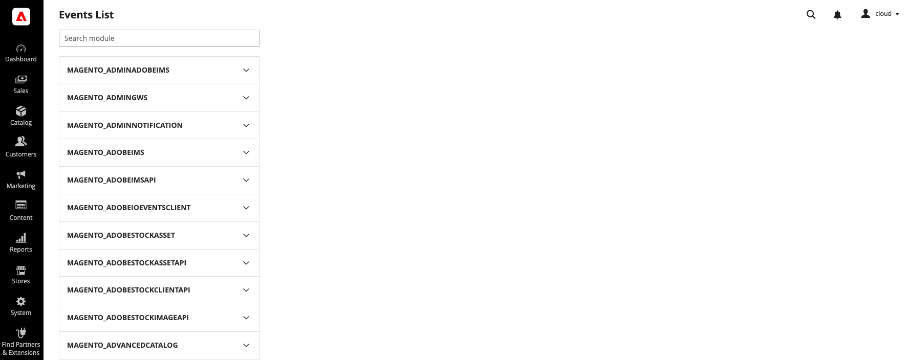

import SampleEvent from '/src/_includes/sample-event.md'
import NestedEvent from '/src/_includes/nested-event.md'

# Commerce module development

This topic describes how to enable your custom modules for Adobe I/O Events. You can also manually register observer events using the [`events:subscribe` command](./commands.md#subscribe-to-an-event).

## Find supported events

Adobe Commerce is capable of emitting thousands of different observer and plugin events, but most of them aren't good candidates for integrating with an external App Builder application. For example, Commerce emits events before and after a customer address is loaded, saved, or deleted, but the only events of consequence are those that indicate a change of status after the address is saved or deleted.

You can use the Commerce Admin or the command line to find supported events and their payloads:

*  In the Admin, select **System** > Events > **Events List** to display the _Events list_ page.

   

   The left navigation contains a list of enabled modules on your system. Click on a module name to display a list of supported events. When you select an event, the main panel of the Admin displays the event's payload.

*  The `bin/magento events:list:all` command returns all the detectable supported events in the specified module. Once you know the name of the event, you can use the `events:info` command to return its payload.

## Register events

You can programmatically register events using the following methods:

*  Create an `io_events.xml` file in your module or in the root `app/etc` directory
*  Declare them in the system `env.php` or `config.php` file

<SampleEvent />

After you've registered at least one event, run the [events:generate:module command](./commands.md#generate-a-commerce-module-based-on-a-list-of-subscribed-events) to generate the required plugins.

### io_events.xml

Create the `<module-root>/etc/io_events.xml` or `app/etc/io_events.xml` file and define a list of events that should always be transmitted. Events listed in this file cannot be disabled with the [`events:unsubscribe` command](./commands.md#unsubscribe-from-a-commerce-event).

You can transmit all the fields within an event by setting the value of the `field` element to `*` (`<field name="*"  />`). You cannot use the `*` wildcard character to match partial strings.

<InlineAlert variant="warning" slots="text"/>

Adobe recommends sending a limited number of fields per event. If you send all fields, you increase the risk of including sensitive or PCI compliance data in the event. In addition, specifying only the fields that are applicable to your business case is recommended for optimal performance and cost effectiveness. Also, including all fields may lead to larger payloads that could exceed size limit of 64 KB and as a result the event will not be created.

[Add custom fields to an event](custom-event-fields.md) describes how to enhance the payload of pre-defined events.

```xml
<config xmlns:xsi="http://www.w3.org/2001/XMLSchema-instance" xsi:noNamespaceSchemaLocation="urn:magento:module-commerce-events-client/etc/io_events.xsd">
    <event name="observer.catalog_product_save_after">
        <fields>
            <field name="entity_id" />
            <field name="sku" />
            <field name="is_new" />
        </fields>
    </event>
    <event name="plugin.magento.sales.api.invoice_item_repository.save">         
        <fields>
            <field name="entity_id" />
            <field name="parent_id" />
            <field name="base_price" />
            <field name="tax_amount" />
            <field name="base_row_total" />
            <field name="discount_amount" />
            <field name="qty" />
        </fields>
    </event>
    <event name="plugin.magento.catalog.model.resource_model.product.save">
        <fields>
            <field name="entity_id" />
            <field name="sku" />
            <field name="name" />
            <field name="price" />
            <field name="created_at" />
        </fields>
    </event>
</config>
```

The contents of an `observer.catalog_product_save_after` event are similar to the following:

```json
{
    "value": {
    "entity_id": "3",
    "sku": "test2",
    "is_new": "0"
  }
}
```

The `<field>` element can also contain the `converter` attribute. Use this attribute to change the value of a field in the event payload. [Convert payload field values](./convert-field-values.md) describes its usage.

### Array of nested objects

<NestedEvent />

```xml
<config xmlns:xsi="http://www.w3.org/2001/XMLSchema-instance" xsi:noNamespaceSchemaLocation="urn:magento:module-commerce-events-client/etc/io_events.xsd">
   <event name="observer.sales_order_invoice_save_after">
      <fields>
         <field name="order_id" />
         <field name="items[].sku" />
         <field name="items[].qty" />
      </fields>
   </event>
</config>
```

The contents of the event are similar to the following:

```json
{
   "order_id": "8",
   "items": [
      {
         "sku": "simple-product-2",
         "qty": "3.000000"
      },
      {
         "sku": "simple-product-1",
         "qty": "5.000000"
      }
   ]
}
```

### config.php and env.php

You can also create an `io_events` section in the Commerce [`app/etc/config.php file`](https://experienceleague.adobe.com/docs/commerce-operations/configuration-guide/files/deployment-files.html). As of version of **1.11.0** of Adobe I/O Events for Adobe Commerce, you can also create an `io_events` section in the Commerce [`app/etc/env.php file`](https://experienceleague.adobe.com/en/docs/commerce-operations/configuration-guide/files/deployment-files). Events registered using this mechanism can be disabled from the command line.

For example:

```config
'io_events' => [
    'observer.catalog_product_save_after' => [
        'fields' => [
            'entity_id',
            'sku',
            'is_new',
        ],
        'enabled' => 1
    ],
    'plugin.magento.sales.api.invoice_item_repository.save' => [
        'fields' => [
            'entity_id',
            'parent_id',
            'base_price',
            'tax_amount',
            'base_row_total',
            'discount_amount',
            'qty',
        ],
        'enabled' => 1
    ],
    'plugin.magento.catalog.model.resource_model.product.save' => [
        'fields' => [
            'sku',
            'entity_id',
            'name',
            'price'
        ],
        'enabled' => 1
    ],
]
```

The payload for the `observer.catalog_product_save_after` event is the same as shown in [`io_events.xml`](#io_eventsxml).

## Configuration merging from different modules

If multiple Commerce modules register the same event, the configuration manager merges the two configurations. The transmitted event includes all the fields defined in the modules.

In the following example, the `MODULE1/etc/io_events.xml` file registers the `observer.catalog_product_save_after` event with the `entity_id` and `sku` fields.

```xml
<config xmlns:xsi="http://www.w3.org/2001/XMLSchema-instance" xsi:noNamespaceSchemaLocation="urn:magento:module-commerce-events-client/etc/io_events.xsd">
    <event name="observer.catalog_product_save_after">
        <fields>
            <field name="entity_id" />
            <field name="sku" />
        </fields>
    </event>
</config>
```

The `MODULE2/etc/io_events.xml` file registers the same event with the `entity_id` field and two others.

```xml
<config xmlns:xsi="http://www.w3.org/2001/XMLSchema-instance" xsi:noNamespaceSchemaLocation="urn:magento:module-commerce-events-client/etc/io_events.xsd">
    <event name="observer.catalog_product_save_after">
        <fields>
            <field name="entity_id" />
            <field name="quantity_and_stock_status.qty" />
            <field name="stock_data.min_qty" />
        </fields>
    </event>
</config>
```

The resulting configuration:

```xml
<config xmlns:xsi="http://www.w3.org/2001/XMLSchema-instance" xsi:noNamespaceSchemaLocation="urn:magento:module-commerce-events-client/etc/io_events.xsd">
    <event name="observer.catalog_product_save_after">
        <fields>             
            <field name="entity_id" />
            <field name="sku" />
            <field name="quantity_and_stock_status.qty" />
            <field name="stock_data.min_qty" />
        </fields>
    </event>
</config>
```
