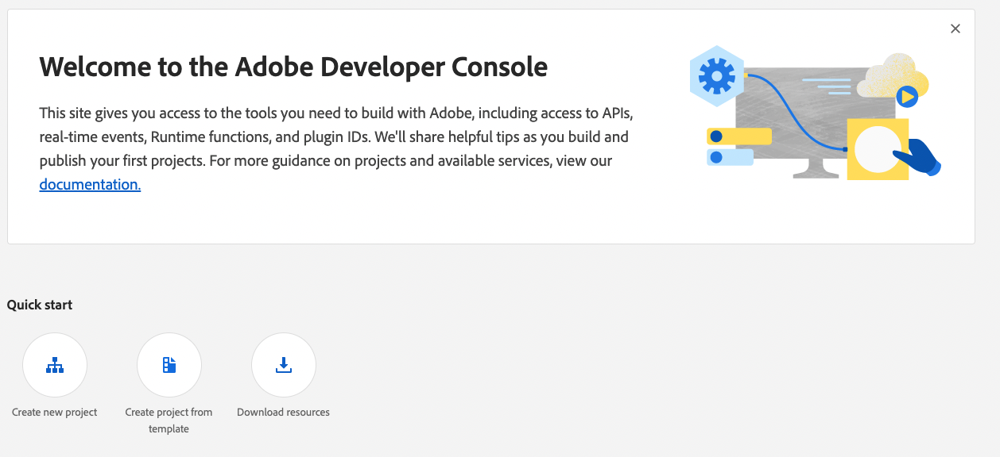

# Create an App Builder project

Adobe I/O Events for Adobe Commerce allows you to send and monitor custom Adobe Commerce user-driven events. Follow the instructions on this page to create and configure a project for Adobe I/O Events.

## Requirements

To get started with Adobe I/O Events, you must:

import ProjectRequirements from '/src/_includes/project-requirements.md'

<ProjectRequirements />

## Set up a project

[Projects Overview](https://developer.adobe.com/developer-console/docs/guides/projects/) describes the different types of projects and how to manage them. Here, we'll create a templated project.

1. Log in to the Adobe Developer Console and select the desired organization from the dropdown menu in the top-right corner.

1. Click **Create new project** > **Project from template**.

   

1. Select **App Builder**. The **Set up templated project** page displays.

   

1. Specify a project title and app name. Make sure the **Include Runtime with each workspace** checkbox is selected. Click **Save**. The Console creates a workspace.

   

1. In your workspace, click the **Add service** pop-up menu and select **API**.

   

1. On the **Add an API** page, filter on **Adobe Services** and select one of the following options. These APIs provide authentication and authorization services for your project.

   &#8203;<Edition name="paas" /> **I/O Management API**

   &#8203;<Edition name="saas" /> **Adobe Commerce as a Cloud Service**

   Then click **Next**.

   

1. On the **Configure API** page, select the **OAuth Server-to-Server** option and click **Save configured API**.

   

1. On the front page of your workspace, click the **Add service** pop-up menu and select **API**.

   

1. On the **Add an API** page, filter by **Experience Cloud** and select **Adobe I/O Events for Adobe Commerce**. Then click **Next**.

1. On the **Configure API** page, click **Save configured API**.

## Download the workspace configuration file

The console can generate a JSON file that defines the configuration of your workspace. You will use this file to configure the Commerce Admin.

To download a `.json` file containing your workspace configuration:

1. Go to the overview page of your workspace.

1. Click the **Download All** button in the top-right corner.

   

   The `<Workspace-name>.json` file downloads automatically. In this example, the file is named `485PeachHare-283976-Stage.json`.

You've completed the basic setup of your project. The next step is to install Adobe I/O Events for Adobe Commerce.
