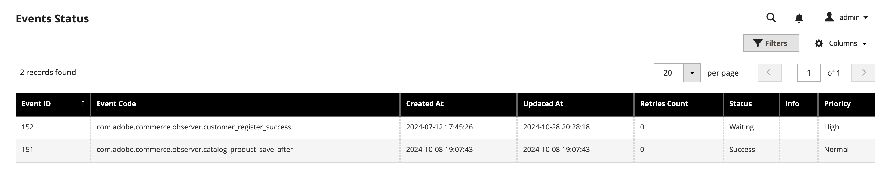

# Events troubleshooting

This topic describes how to resolve frequently encountered issues with Adobe I/O Events for Adobe Commerce.

## Events are not showing in App Builder event registration

If Commerce is correctly [configured](configure-commerce.md), but triggered events aren't being received, check if the events exist in the Commerce `event_data` table.
The `event_data` table temporarily stores events before transforming them into Adobe I/O events. The table contains a status column that can have the following values:

Status ID | Status
--- | ---
`0` | Waiting
`1` | Successfully sent
`2` | Failed to send event
`3` | Transmission is in progress

You can use the following SQL query to select all events from the `event_data` table:

`SELECT * FROM event_data`

Alternatively, the _Events Status_ grid, found by navigating to **System** > Events > **Events Status** in the Commerce admin, provides a way to view the status of triggered events contained in the `event_data` table through the UI.



Use the SQL query results or the content of the _Events Status_ grid to determine the next troubleshooting step.

### The table or grid is empty

If the `event_data` table or the _Events Status_ grid is empty, use the following procedure to diagnose the problem:

1. Run `bin/magento events:list` to ensure that you have subscribed events.

1. Check the `app/code/Magento` directory to determine whether the `AdobeCommerceEvents` module exists. If it does not exist, generate it with the `bin/magento events:generate:module` command.

   **Note**: You must regenerate the `AdobeCommerceEvents` module each time you subscribe to a new `plugin.*` type event so that Commerce can create the required plugins.

1. Run `bin/magento module:status Magento_AdobeCommerceEvents` to check that the `AdobeCommerceEvents` module is enabled. If it is not enabled, run `bin/magento module:enable Magento_AdobeCommerceEvents`.

1. On an Adobe Commerce on cloud infrastructure instance, check that eventing is enabled in `.magento.env.yaml`. If not, enable it and push the changes to trigger deployment.

   ```yaml
   stage:
      global:
         ENABLE_EVENTING: true
   ```

### The event status is `0` or `Waiting`

Events are sent by crons. If the status of an event is still `0` in the `event_data` table or `Waiting` in the _Events Status_ grid after a long period, then the crons are not configured correctly.
In a Cloud environment, check the logs. Cron execution might have been killed due to lack of space in the environment or other reasons.

### The event status is `2` or `Failure`

An event status of `2` in the `event_data` table, or `Failure` in the _Events Status_ grid, indicates there was an error during transmission. Additional information can be found in the `info` column of the table or in the `system.log` file.
The following CLI command can show only logs related to the event batch sending.

```bash
cat var/log/system.log | grep -i batch
```

The output contains information about any errors that occurred. For example:

```terminal
report.ERROR: Publishing of batch of 6 events failed: Error code: 500; reason: Server Error {"reason":null,"message":"Unexpected server error occurred"} [] []
report.INFO: Event data batch of 7 events was successfully published. [] []
report.INFO: Event data batch of 2 events was successfully published. [] []
```

### `Client ID is invalid` error

The following error indicates the project in the Developer Console is missing the `Adobe I/O Events for Adobe Commerce` API.

```terminal
Event publishing failed: Error code: 403; reason: Forbidden { "error": { "code": "Forbidden", "message": "Client ID is invalid", "details": { "error_code": "403003" } } }
```

[Set up a project](./project-setup.md#set-up-a-project) describes how to add the required API.
After adding the required API, download the workspace configuration for your project again and update it in the **Adobe I/O Workspace Configuration** field in the Adobe Commerce admin.

### The status shows the events have been successfully sent, but they were not received in the event registration

If events are not received, determine if you have a different value for the `Adobe Commerce Instance ID` configured in the Adobe Commerce environment that is used in the event registration of the Developer Console.


## Event subscribe CLI command error

You might encounter the following error when attempting to subscribe to events with the `bin/magento events:subscribe` command:

```terminal
Unsuccessful request: `POST https://api.adobe.io/events/xxxxx/eventmetadata` resulted in a `400 Bad Request` response:
{"reason":"Bad Request. Request id: xxxxxxx.","message":"The current event provider's is associated with another workspace (check the provider's rel:update links to its workspace).."}
```

This error indicates the event provider configured in the **Adobe I/O Event Provider ID** field in the Admin is associated with a different workspace than the one configured in the **Adobe I/O Workspace Configuration** field.
You cannot create a new event subscription with an event provider that is associated with another workspace.

You must specify an event provider created with the currently configured **Adobe I/O Workspace Configuration**.

## Event provider is not shown in App Builder

After you create a new event provider, it might not appear in App Builder until it has at least one active subscribed event. Synchronize your event subscriptions from Adobe Commerce by using the following command:

```bash
bin/magento events:metadata:populate
```

After refreshing the page with your App Builder project, you should be able to find the provider.

## Stuck deployment after configuring priority events

The deployment process can get stuck in some cases in the Cloud environment when consumers are running in the background. To resolve the issue, you must `ssh` into your environment and manually kill the consumer process.

1. Use SSH to log in to the remote environment.

   ```bash
   magento-cloud ssh
   ```

1. Find the consumer processes.

   ```bash
   ps aux | grep consumer
   ```

   The response lists the running consumers.

   ```terminal
   web          980  2.4  0.0 232176 163012 ?       S    22:22   0:00 /usr/bin/php8.1-zts /app/bin/magento queue:consumers:start commerce.eventing.event.publish
   ```

1. Use one of the following commands to kill the consumer:

   ```bash
   kill -9 <PROCESS_ID>
   ```

   ```bash
   vendor/bin/ece-tools cron:kill
   ```

By default, the consumer will restart within one minute, but this value may vary, based on your [cron configuration](https://experienceleague.adobe.com/docs/commerce-cloud-service/user-guide/configure/app/properties/crons-property.html) or whether you have set up a [worker](https://experienceleague.adobe.com/docs/commerce-cloud-service/user-guide/configure/app/properties/workers-property.html).
