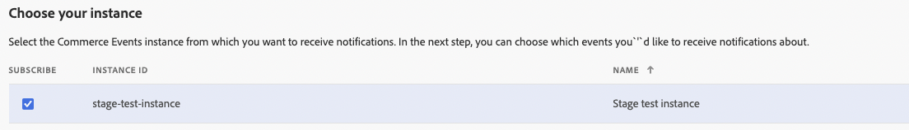
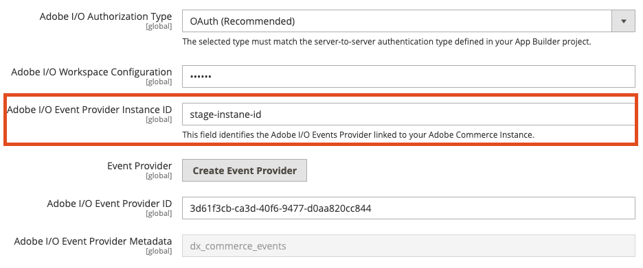

# Events troubleshooting

## Events are not showing in App Builder event registration

If everything has been configured according to the documentation but after triggering the event and waiting some time event wasn't received, check if events exist in the `event_data` table.
The `event_data` is a temporary storage of the events before transforming them into Adobe I/O events. Events in that table have a status column with 4 possible statuses:

Status id | Status
--- | ---
`0` | waiting
`1` | successfully sent
`2` | failed to sent
`3` | sending in progress

The SQL query to select all events from `event_data` table: `SELECT * FROM event_data`

### The events table is empty

1. Run `bin/magento events:list` to ensure that you have subscribed events.

2. Check `app/code/Magento` directory to ensure that `AdobeCommerceEvents` module exists, if it's not exists it should be generated with the next command `bin/magento events:generate:module`.

**Note**: It requires regenerating the `AdobeCommerceEvents` module each time you subscribe to the new `plugin.*` type event to create the required plugins based on it.

3. Run `bin/magento module:status Magento_AdobeCommerceEvents` to check that `AdobeCommerceEvents` module is enabled and enable it if not.

4. If it's a Cloud installation check that evenintg is enabled in `.magento.env.yaml`. If not enable it and push the changes to trigger deployment.

```yaml
   stage:
      global:
         ENABLE_EVENTING: true
```

### The events exist but status is 0

Events are sent by crons, and if for a long period the status of the events in the `event_data` is still `0` it means that crons are not configured correctly.
If it's a Cloud environment check logs as cron execution can be killed due to lack of space in the environment or other reasons.

### The events have status failed to sent

If events has status `2` it means there was error during sending. The additional information can be found in the `info` column or `sytem.log` file.
The next CLI command can show only logs related to the event batch sending.

```shell
cat var/log/system.log | grep -i batch
```

If there was an error the output will contain information about it, for example:

``` shell
report.ERROR: Publishing of batch of 6 events failed: Error code: 500; reason: Server Error {"reason":null,"message":"Unexpected server error occurred"} [] []
report.INFO: Event data batch of 7 events was successfully published. [] []
report.INFO: Event data batch of 2 events was successfully published. [] []
```

### Client ID is invalid error

If the next error is present in the logs:

```shell
Event publishing failed: Error code: 403; reason: Forbidden { "error": { "code": "Forbidden", "message": "Client ID is invalid", "details": { "error_code": "403003" } }
```

It means that the project in the Developer Console is missing `Adobe I/O Events for Adobe Commerce` api. See [Set up a project](./project-setup.md#set-up-a-project) how to add the required api.
After adding the required API, download the workspace configuration for your project again and update it in the Adobe Commerce admin in `Adobe I/O Workspace Configuration` field.

### The events have status successfully sent but still not received in the event registration

This can happen if you have a different value of `Adobe Commerce Instance ID` configured in the Adobe Commerce that is used in the event registration of the Developer Console.
Ensure that the same value is used in both Adobe Commerce and Developer Console:




## Event subscribe CLI command error:

If are trying to subscribe to events via CLI command and seeing the next error:

```shell
bin/magento events:subscribe observer.catalog_product_save_after --fields=name --fields=price
```

```shell
Unsuccessful request: `POST https://api.adobe.io/events/xxxxx/eventmetadata` resulted in a `400 Bad Request` response:
{"reason":"Bad Request. Request id: xxxxxxx.","message":"The current event provider's is associated with another workspace (check the provider's rel:update links to its workspace).."}
```

That means that the event provider configured in the `Adobe I/O Event Provider ID` field of Adobe Commerce admin UI is associated with another workspace then configured in `Adobe I/O Workspace Configuration` field.

**Note** You won't be able to create a new event subscriptions with event provider that is associated with another workspace.

The solution will be to use the event provider created with the currently configured `Adobe I/O Workspace Configuration`.

## Event provider is not show in the App Builder

After creating a new Event Provider it may not show in the App Builder until it has at least one active subscribed event. So, if you created a new event provider you need to synchronize your event subscriptions from Adobe Commerce it can be done by running `bin/magento events:metadata:populate` CLI command.
Now, after refreshing the page with your App Builder project you should be able to find the provider.
