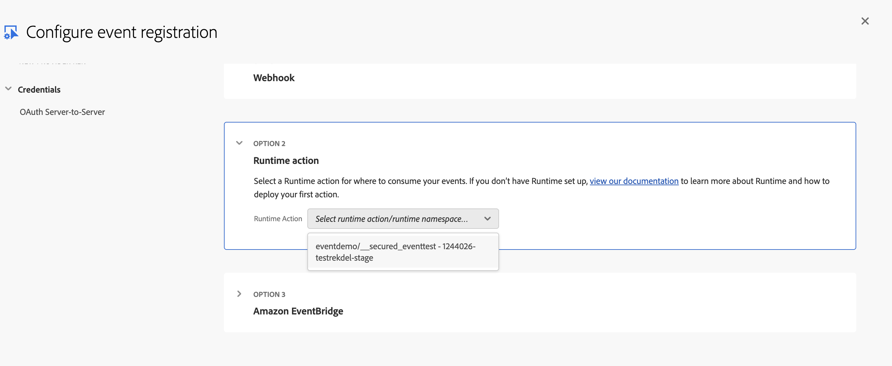
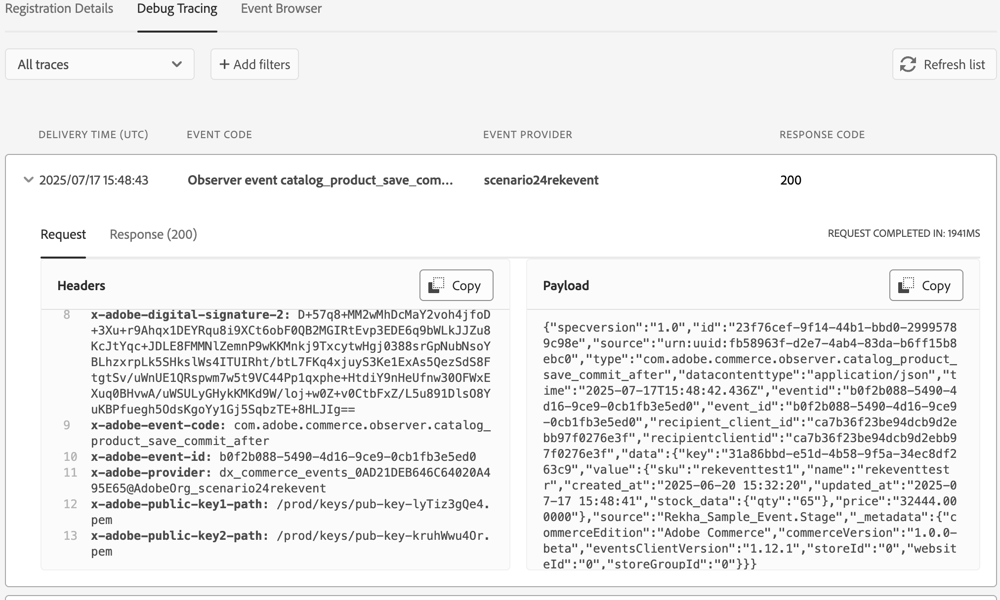

# Project setup and deployment

This topic explains how to perform the following tasks:

- Set up your development environment
- Create an Adobe App Builder project
- Implement runtime action code to process Commerce events
- Deploy your app.

It also covers registering Commerce events in the Adobe Developer Console and testing the end-to-end integration.

## Set up the Adobe Developer Console and App Builder project locally

Before you can start building your App Builder application, you need to set up your development environment and create a project in the Adobe Developer Console. This process involves installing the necessary tools, configuring your workspace, and creating a new project that will host your App Builder application.

### Prerequisites

- [Adobe Commerce as a Cloud Service](https://experienceleague.adobe.com/en/docs/commerce/cloud-service/overview) instance
- Access to [Adobe Developer Console](https://developer.adobe.com/console)
- Access to [Adobe Developer App Builder](https://developer.adobe.com/app-builder/docs/get_started/app_builder_get_started/set-up#access-and-credentials)
- [Adobe IO CLI](https://developer.adobe.com/app-builder/docs/guides/runtime_guides/tools/cli-install)

### Create a new project in Adobe Developer Console

Follow the steps in [Create an App Builder project](../project-setup.md) to set up your project. Make sure to select the **Stage** workspace when creating the project.

You must add the following services to your project:

- I/O Management API
- I/O Events
- Adobe I/O Events for Adobe Commerce
- Adobe Commerce as a Cloud Service

Be sure to follow the step to download the workspace configuration file and to note its location.

### Set up your local App Builder environment using the CLI

Use the Adobe I/O CLI tools to run your App Builder application locally and deploy it to Stage or Production workspaces configured in your Developer Console project.

Ensure you have the following tools installed:

- npm
- Node.js (v16.x or later)
- VS Code (or any other code editor of your choice)

Use the following steps to set up your local App Builder environment:

1. Install the Adobe I/O CLI.

   ```bash
   npm install -g @adobe/aio-cli
   ```

1. Enter the following command to login to the Adobe I/O CLI:

   ```bash
   aio login
   ```

   A browser tab should open, asking you to sign in with your Adobe ID. If the tab does not load automatically, copy/paste the URL shown in your browser to log in.

   Once you've logged in, you can close the browser tab and go back to your terminal. You will see your user token string displayed in the terminal. Tokens are automatically stored in the CLI configuration, so the CLI can use them to talk to Adobe Developer Console.

1. Run the following command to load the workspace configuration file you downloaded when creating your project.

   ```bash
   aio app use <location to the downloaded json file>
   ```

   The command should display output similar to the following:

   ```terminal
      You are currently in:
      1. Org: <org name>
      2. Project: <project name specified in development console>
      3. Workspace: Stage
    ```

    **Tip:** You can use the `aio where` command to check your current organization, project, and workspace. This information can also be viewed in the Developer Console.

1. Run the following command to initialize your project:

   ```bash
   aio app init < your projectname >
   ```

   The command prompts you to select a template and choose the features you want to include in your project. Follow these guidelines when making your selections:

   - Select the **Organization** and **Project** you created earlier using the Developer Console.
   - Choose a template listed under **Supported by My Org** to ensure compatibility with your environment.
   - At the **Select a template** prompt, choose **All Templates → @adobe/generator-app-events-generic**
   - At the **Which Adobe I/O App features do you want to use?** prompt, select **Actions: Deploy Runtime actions for I/O App features**
   - At the **Which type of actions do you want to generate?**, select **Generic**
   - At the **Which UI framework do you want to use?** prompt, select **React Spectrum 3**
   - At the **Provide a name for the action** prompt, enter your preferred action name

When the command completes, the folder structure in your project directory should be similar to the following:

```tree
<project name>/
├── README.md
├── app.config.yaml
├── dist/
├── e2e/
├── jest.setup.js
├── node_modules/
├── package-lock.json
├── package.json
├── test/
├── web-src/
└── actions/
    |__ <action-name>/
        └── index.js
    ├── constants.js
    ├── responses.js
    └── utils.js
```

### Implement runtime actions

This section describes how to write a runtime action that processes product event data from Adobe Commerce. The action is triggered when product-related events such as stock or price updates occur. The `aio app init` command generates an `index.js` file under the `actions/<action-name>` directory. You must edit this file to support our use case. You must create additional files to support your action and handle responses.

Upon complete these tasks, the `actions` directory will contain the following files:

```tree
── actions
    ├── constants.js
    ├── responses.js
    ├── testevent/
    │   └── index.js
    └── utils.js
```

#### `index.js` file

The `index.js` file acts as the main entry point for the runtime action. It performs key functionalities such as:

- Log the incoming request using Adobe I/O Core Logger.
- Validate required parameters like type, sku, and stock_data.qty
- Extract product details such as SKU, name, price, and quantity from the event payload
- Check for conditions, such as low stock or a price change, and logs them for debugging or alerting purposes
- Return a success or error response based on the outcome of processing.

Update the `index.js` file with the following code:

```js
const { Core } = require('@adobe/aio-sdk')
const { stringParameters, checkMissingRequestInputs } = require('../utils.js')
const { HTTP_BAD_REQUEST, HTTP_INTERNAL_ERROR } = require('../constants.js')
const { errorResponse, successResponse } = require('../response.js')

/**
 * Main function that processes the incoming request params.
 * @param {object} params - Input parameters containing product data and request info.
 * @returns {object} - Success or error response based on processing.
 */
async function main(params) {
  // Initialize logger with a custom label and log level (default to 'info' if none provided)
  const logger = Core.Logger('product-commerce-consumer', { level: params.LOG_LEVEL || 'info' })

  logger.info('Start processing request')
  logger.info(`Consumer main params: ${stringParameters(params)}`)

  // List of required parameters to validate input
  const requiredParams = ['type', 'data.value.sku', 'data.value.stock_data.qty']

  // Check if any required parameters are missing from the input
  const errorMessage = checkMissingRequestInputs(params, requiredParams, [])

  if (errorMessage) {
    // Log error and return HTTP 400 Bad Request if validation fails
    logger.error(`Invalid request parameters: ${stringParameters(params)}`)
    return errorResponse(HTTP_BAD_REQUEST, `Invalid request parameters: ${errorMessage}`)
  }

  try {
    // Extract relevant data from params for easier access
    const { type, data } = params
    const product = data.value
    const sku = product.sku
    const name = product.name || 'Unknown'  // Fallback name if missing
    const price = parseFloat(product.price || 0)  // Convert price to float, default 0
    const qty = parseInt(product.stock_data.qty || product.stock || 0)  // Parse quantity, fallback to 0

    logger.info(`Processing product: ${sku}`)

    logger.info(`Product Name: ${name}, Price: ${price}, Qty: ${qty}`)

    // Check if stock quantity is low, log a stock alert if so
    if (qty < 5) {
      logger.info(`Stock Alert: Product ${sku} has low stock (${qty})`)
    }

    // Detect and log if product price has changed
    if (product.original_price && product.original_price !== product.price) {
      logger.info(`Price changed: ${product.original_price} → ${product.price}`)
    }

    // Return a success response indicating product was processed successfully
    return successResponse(type, `Processed product ${sku}`)
  } catch (error) {
    // Log any unexpected errors during processing and return HTTP 500 Internal Server Error
    logger.error(`Processing error: ${error.message}`)
    return errorResponse(HTTP_INTERNAL_ERROR, error.message)
  }
}

// Export main function as the module's entry point
exports.main = main
```

#### `,responses.js` file

The `response.js`contains helper functions to send consistent success or error responses from your action. It uses the status codes defined in `constants.js` to ensure all responses follow the same format. This keeps your main logic cleaner and more organized.

Add the following code to create the `responses.js` file:

```js
const { HTTP_OK } = require('./constants.js')
 
/**
 *
 * Returns an error response object, this method should be called on the consumers and public webhooks
 *
 * @param {number} statusCode the error status code.
 *        e.g. 400
 * @param {string} message the error message.
 *        e.g. 'missing xyz parameter'
 * @returns {object} the error object, ready to be returned from the action main's function.
 */
function errorResponse(statusCode, message) {
  return {
    statusCode,
    body: {
      error: message
    }
  }
}
 
/**
 *
 * Returns a success response object, this method should be called on the consumers
 *
 * @param {string} type the event type received by consumer
 *        e.g. 'adobe.commerce.observer.catalog_product_save_commit_after'
 * @param {object} response the response object returned from the event handler
 *        e.g. '{ success: true, message: 'Product created successfully'}'
 * @returns {object} the response object, ready to be returned from the action main's function.
 */
function successResponse (type, response) {
  return {
    statusCode: HTTP_OK,
    body: {
      type,
      response
    }
  }
}

module.exports = {
  successResponse,
  errorResponse
}
```

#### `utils.js` file

The `utils.js` file provides helper functions used across the app for common tasks such as masking sensitive data in logs, validating required inputs, extracting bearer tokens from headers, and formatting standardized error responses.

Add the following code to create the `utils.js` file:

```js
/**
 *
 * Returns a log ready string of the action input parameters.
 * The `Authorization` header content will be replaced by '<hidden>'.
 *
 * @param {object} params action input parameters.
 *
 * @returns {string}
 *
 */
function stringParameters (params) {
  // hide authorization token without overriding params
  let headers = params.__ow_headers || {}
  if (headers.authorization) {
    headers = { ...headers, authorization: '<hidden>' }
  }
  return JSON.stringify({ ...params, __ow_headers: headers })
}
 
/**
 *
 * Returns the list of missing keys giving an object and its required keys.
 * A parameter is missing if its value is undefined or ''.
 * A value of 0 or null is not considered as missing.
 *
 * @param {object} obj object to check.
 * @param {array} required list of required keys.
 *        Each element can be multi level deep using a '.' separator e.g. 'myRequiredObj.myRequiredKey'
 *
 * @returns {array}
 * @private
 */
function getMissingKeys (obj, required) {
  return required.filter(r => {
    const splits = r.split('.')
    const last = splits[splits.length - 1]
    const traverse = splits.slice(0, -1).reduce((tObj, split) => { tObj = (tObj[split] || {}); return tObj }, obj)
    return traverse[last] === undefined || traverse[last] === '' // missing default params are empty string
  })
}
 
/**
 *
 * Returns the list of missing keys giving an object and its required keys.
 * A parameter is missing if its value is undefined or ''.
 * A value of 0 or null is not considered as missing.
 *
 * @param {object} params action input parameters.
 * @param {array} requiredHeaders list of required input headers.
 * @param {array} requiredParams list of required input parameters.
 *        Each element can be multi level deep using a '.' separator e.g. 'myRequiredObj.myRequiredKey'.
 *
 * @returns {string} if the return value is not null, then it holds an error message describing the missing inputs.
 *
 */
function checkMissingRequestInputs (params, requiredParams = [], requiredHeaders = []) {
  let errorMessage = null
 
  // input headers are always lowercase
  requiredHeaders = requiredHeaders.map(h => h.toLowerCase())
  // check for missing headers
  const missingHeaders = getMissingKeys(params.__ow_headers || {}, requiredHeaders)
  if (missingHeaders.length > 0) {
    errorMessage = `missing header(s) '${missingHeaders}'`
  }
 
  // check for missing parameters
  const missingParams = getMissingKeys(params, requiredParams)
  if (missingParams.length > 0) {
    if (errorMessage) {
      errorMessage += ' and '
    } else {
      errorMessage = ''
    }
    errorMessage += `missing parameter(s) '${missingParams}'`
  }
 
  return errorMessage
}
 /**
 *
 * Returns an error response object and attempts to log.info the status code and error message
 *
 * @param {number} statusCode the error status code.
 *        e.g. 400
 * @param {string} message the error message.
 *        e.g. 'missing xyz parameter'
 * @param {*} [logger] an optional logger instance object with an `info` method
 *        e.g. `new require('@adobe/aio-sdk').Core.Logger('name')`
 *
 * @returns {object} the error object, ready to be returned from the action main's function.
 *
 */
function errorResponse (statusCode, message, logger) {
  if (logger && typeof logger.info === 'function') {
    logger.info(`${statusCode}: ${message}`)
  }
  return {
    error: {
      statusCode,
      body: {
        error: message
      }
    }
  }
}
 
module.exports = {
  errorResponse,
  stringParameters,
  checkMissingRequestInputs
}
```

#### `constants.js` file

The `constants.js` file has centralized constants for action logic. It stores commonly used values like HTTP status codes and event type identifiers (such as those for stock or price updates). Keeping them in one place helps avoid repetition and makes the code easier to maintain.

Add the following code to create the `constants.js` file:

```js
// Define standard HTTP status codes used for API responses
const HTTP_OK = 200                 // Request was successful
const HTTP_BAD_REQUEST = 400        // Client-side error: invalid request parameters
const HTTP_NOT_FOUND = 404          // Resource not found on the server
const HTTP_INTERNAL_ERROR = 500     // Server-side error: unexpected failure

// Export the constants so they can be reused in other modules/files
module.exports = {
  HTTP_OK,
  HTTP_BAD_REQUEST,
  HTTP_NOT_FOUND,
  HTTP_INTERNAL_ERROR
} 
```

#### Update the `app.config.yaml`

The `app.config.yaml` file defines how your Adobe App Builder project is structured and deployed. It includes information about where the code lives and how it should behave in the cloud environment.

In this example, under the `runtimeManifest` section, a package named after the project name created earlier is defined. Inside it, there's an action called `testevent`, which points to the JavaScript file `actions/testevent/index.js` This action is configured to run on Node.js 22 and accepts an environment variable LOG_LEVEL set to info for controlling log verbosity.

A key setting here is `web: 'no'`, which means the action is not exposed as a public web endpoint. Instead, it's intended to be triggered internally by Adobe I/O Events. Since event-based actions don't need a public URL, this setting helps keep the action private and secure.

Other annotations like `require-adobe-auth: false`(indicating no Adobe authentication is required) and final: true(marking the action as finalized) provide additional metadata for execution.

To use this configuration in the project, copy the following snippet into the app.config.yaml file located in the root of the App Builder project:

```yaml
application:
  actions: actions
  web: web-src
  runtimeManifest:
    packages:
      <project name>:
        license: Apache-2.0
        actions:
          testevent:
            function: actions/testevent/index.js
            web: 'no'
            runtime: nodejs:22
            inputs:
              LOG_LEVEL: info
               
            annotations:
              require-adobe-auth: false
              final: true
```

### Build the project

Use the following command to build your project. This compiles your code and prepares it for deployment.

```bash
aio app deploy
```

## Register Commerce events in Adobe Developer Console

We need to define which Commerce events to subscribe to and register them within your Adobe Developer Console project.

1. Return to your project workspace in the Developer Console, click the **Add Service** menu, and select **Event**.

1. On the **Add Events** page, choose **Commerce Events**, then click **Next**.

1. In the Configure Event Registration step, select the event provider that was created earlier in Adobe Commerce. Click **Next**.

1. Select the specific events to subscribe to, and continue.

1. On the next screen, update the Event Registration **Name** and **Description** fields, then choose the **Runtime Action** that should handle the events and save the configuration.



### Test the integration

To test the end-to-end integration, follow these steps:

1. After `aio app deploy`, create or update a product in Adobe Commerce Admin (**Catalog > Product**).

1. Go to **System** > **Event Status** to verify an event triggered with status "Success".

1. In the Developer Console, go to **Project** > **Workspace** > **Event Registration** > **Debug Tracing** and check for event delivery and an HTTP 200 response.

#### Verify event delivery in Developer Console

After deploying your app and triggering the event by creating a new product in Commerce Admin, go to your **Adobe Developer Console** > **Project** > **Workspace** > **Event Registration** > **Debug Tracing**. You should see an entry with your event code (e.g., com.adobe.commerce.`provider name`) and response code 200, confirming successful delivery to your App Builder action.

To learn more about using the debug tracer feature, refer to Adobe's documentation: Debug tracing in [Adobe Developer Console](https://developer.adobe.com/events/docs/support/tracing).



## Invoke the action code locally and test

To invoke the Runtime action locally during development, run the following command from the project root to launch the App Builder development environment. This starts a local server.

``` bash
aio app dev
```

The command also outputs a URL like `https://localhost:9080/api/v1/web/<your-project-name>/<action-name>`

### Send a test payload

- Use Postman or curl to POST a sample event payload to the local endpoint with `Content-Type: application/json`.
- Check logs in terminal to validate business logic.

Example payload:

```json
{
  "specversion": "1.0",
  "id": "23f76cef-9f14-44b1-bbd0-29995789c98e",
  "source": "urn:uuid:fb58963f-d2e7-4ab4-83da-b6ff15b8ebc0",
  "type": "com.adobe.commerce.observer.catalog_product_save_commit_after",
  "datacontenttype": "application/json",
  "time": "2025-07-17T15:48:42.436Z",
  "data": {
    "key": "31a86bbd-e51d-4b58-9f5a-34ec8df263c9",
    "value": {
      "sku": "eventtest1",
      "name": "eventtest r",
      "created_at": "2025-06-20 15:32:20",
      "updated_at": "2025-07-17 15:48:41",
      "stock_data": {
        "qty": "65"
      },
      "price": "32444.000000"
    },
    "source": "<your-subscriber-name>.Stage"
  }
}
```
