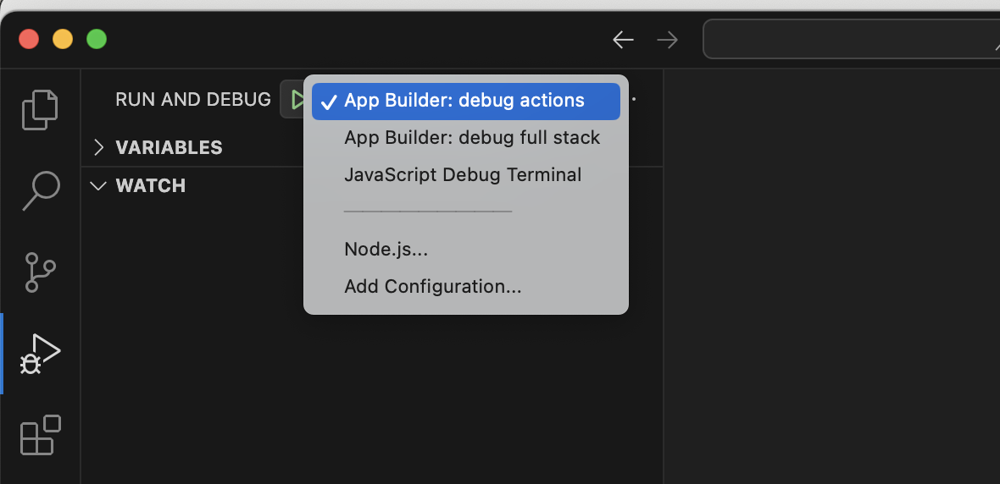

# Debugging code in App Builder project

Use the local environment to simulate and troubleshoot your Adobe I/O App Builder code before deploying.

<InlineAlert variant="info" slots="text"/>

Debugging web actions with Adobe Commerce as a Cloud Service or a deployed instance is not supported. They can only be simulated locally.

## Prerequisites

Set `require-adobe-auth: false` and `web: 'yes'` in the `app-config.yaml` file when debugging runtime actions.

## Configure the debugger

To debug your Adobe I/O App Builder project in Visual Studio Code (VS Code), set up a launch configuration. This allows you to run and debug your app directly from VS Code, making it easier to inspect code, set breakpoints, and view logs.

1. Create a `.vscode` folder in the root of your project if one does not already exist. Inside this folder, create or edit the `launch.json` file.

1. Copy and paste the recommended content from [debugging with VS Code](https://developer.adobe.com/app-builder/docs/guides/app_builder_guides/development#debugging-with-vs-code).

1. Save your changes.

This configuration sets up the VS Code debugger to work with Adobe I/O App Builder projects.

## Enable source maps

In the root folder of your project, create a `webpack-config.js` file with the following content:

```js
module.exports = {
    devtool: 'inline-source-map'
  }
```

## Rebuild the project

Use the following command to rebuild your project to apply the changes.

```bash
aio app build
```

### Start debugging

To start debugging your action code:

1. In VS Code, on the **Run and Debug** tab, select the launch configuration you created in "Configure the debugger". This will allow you to run your app in debug mode.

   

1. Click the Run button or press **F5** to start the debugger. This starts the app using the `aio app dev` command. Output similar to the following is displayed in the terminal:

   ```terminal
Debugger attached.
Building the app...
To view your local application:
  -> https://localhost:9080
To view your deployed application in the Experience Cloud shell:
  -> https://experience.adobe.com/?devMode=true#/custom-apps/?localDevUrl=https://localhost:9080
 
Your actions:
web actions:
  -> https://https://localhost:9080/api/v1/web/{your-project-name}/{name-of-your-action}`
  
non-web actions:
 
press CTRL+C to terminate the dev environment
2025-05-22T06:41:55.969Z [watcher] info: watching action files at...
```

### Invoke Action with a sample payload

Now that your local debugger is running, you can test your web action by sending a request to the local endpoint.
Use tools like Postman or any other API client to send a POST request to the listed URL, such as `https://localhost:9080/api/v1/web/{your-project-name}/{name-of-your-action}`, with the sample JSON payload.

```json
{
    "specversion": "1.0",
    "id": "23f76cef-9f14-44b1-bbd0-29995789c98e",
    "source": "urn:uuid:fb58963f-d2e7-4ab4-83da-b6ff15b8ebc0",
    "type": "com.adobe.commerce.observer.catalog_product_save_commit_after",
    "datacontenttype": "application/json",
    "time": "2025-07-17T15:48:42.436Z",
    "eventid": "b0f2b088-5490-4d16-9ce9-0cb1fb3e5ed0",
    "event_id": "b0f2b088-5490-4d16-9ce9-0cb1fb3e5ed0",
    "recipient_client_id": "ca7b36f23be94dcb9d2ebb97f0276e3f",
    "recipientclientid": "ca7b36f23be94dcb9d2ebb97f0276e3f",
    "data": {
        "key": "31a86bbd-e51d-4b58-9f5a-34ec8df263c9",
        "value": {
            "sku": "eventtest1",
            "name": "eventtest r",
            "created_at": "2025-06-20 15:32:20",
            "updated_at": "2025-07-17 15:48:41",
            "stock_data": {
                "qty": "65"
            },
            "price": "32444.000000"
        },
        "source": "<eventprovider>.Stage",
        "_metadata": {
            "commerceEdition": "Adobe Commerce",
            "commerceVersion": "1.0.0-beta",
            "eventsClientVersion": "1.12.1",
            "storeId": "0",
            "websiteId": "0",
            "storeGroupId": "0"
        }
    }
}
```

The request should trigger the web action and hit the breakpoint you set earlier in your code, allowing you to inspect the incoming payload and debug the action logic.

### Test using curl

You can also test your web action using `curl` from the command line. Use the following command, replacing the URL with your local endpoint:

```bash

curl --insecure --request POST \
  --url https://localhost:9080/api/v1/web/<your-project-name>/{name-of-your-action}} \
  --header 'Content-Type: application/json' \
  --header 'User-Agent: insomnia/10.1.1-adobe' \
  --data '{"specversion":"1.0","id":"23f76cef-9f14-44b1-bbd0-29995789c98e","source":"urn:uuid:fb58963f-d2e7-4ab4-83da-b6ff15b8ebc0","type":"com.adobe.commerce.observer.catalog_product_save_commit_after","datacontenttype":"application/json","time":"2025-07-17T15:48:42.436Z","eventid":"b0f2b088-5490-4d16-9ce9-0cb1fb3e5ed0","event_id":"b0f2b088-5490-4d16-9ce9-0cb1fb3e5ed0","recipient_client_id":"ca7b36f23be94dcb9d2ebb97f0276e3f","recipientclientid":"ca7b36f23be94dcb9d2ebb97f0276e3f","data":{"key":"31a86bbd-e51d-4b58-9f5a-34ec8df263c9","value":{"sku":"eventtest1","name":"eventtest r","created_at":"2025-06-20 15:32:20","updated_at":"2025-07-17 15:48:41","stock_data":{"qty":"65"},"price":"32444.000000"},"source":"eventprovider","_metadata":{"commerceEdition":"Adobe Commerce","commerceVersion":"1.0.0-beta","eventsClientVersion":"1.12.1","storeId":"0","websiteId":"0","storeGroupId":"0"}}}'
  ```

## Development Tips For App Development

These tips will help you streamline development and improve reliability while building event-driven applications using Adobe App Builder.

## Redeploy changes

1. If you've made changes to the action code, run the below commands:

   ```bash
   aio app build
   ```

1. If you have multiple actions in your project and want to deploy only a specific action you modified, run the following command to rebuild and redeploy only the specified action.

   ```bash
   aio app deploy --action=testevent
   ```

## Debugging action failures

When an App Builder action fails, you can debug it using either the **Debug Tracer** in Developer Console or the **CLI activation commands**.

### Option 1: Debug tracer (UI)

1. Open the project in [Adobe Developer Console](https://developer.adobe.com/console/).
2. Go to the **Debug Tracer** tab.
3. Trigger your action (e.g., `aio app deploy` or `aio runtime action invoke <namespace>/<package>/<actionName>`).

If the action fails, Debug Tracer shows:

- The **Activation ID** (unique execution ID)
- The **Error response** from the runtime (e.g., `application error`, `server error`, `401 unauthorized`, `403 forbidden`, etc.)
- Any `logger.info` / `logger.error` messages the code emitted

**Example Debug tracer error:**

``` json
application error
{
"error": "server error"
}
```

You can copy the **Activation ID** directly from Debug Tracer to investigate further using the CLI.

### Option 2: CLI

To get more details, activation commands can be used.

``` terminal
aio rt activation list

Datetime        Status    Kind      Version    Activation ID
─────────────── ───────── ───────── ───────── ────────────────────────────────
08/13 20:32:24  app error sequence  0.0.1     7d2470aa1bc84bc6a470aa1bc85bc67c journalevent/eventjournal
```

The last column shows the Activation ID.

**To get logs explicitly**

```terminal
aio rt activation logs <ACTIVATION_ID>
```

<InlineAlert variant="info" slots="text"/>

**Tip:** Start with **Debug Tracer** for quick troubleshooting.  
If you need more details (like raw JSON response, timing, annotations, logs), switch to the **CLI** with the Activation ID.

## Interpreting event delivery logs in Adobe I/O Events

When an event is triggered and delivered through Adobe I/O Events, you can inspect the delivery status using the Debug Tracer in the Adobe Developer Console. The delivery record contains the following fields:

- **DELIVERY TIME (UTC):** Timestamp when the event delivery was attempted.

- **EVENT CODE:** Unique identifier representing the event type triggered

- **EVENT PROVIDER:** Name of the configured provider in Adobe Commerce

- **RESPONSE CODE:** HTTP response code returned by the Runtime action.

Use the [Adobe I/O Events Tracing Guide](https://developer.adobe.com/events/docs/support/tracing) to interpret these response codes and troubleshoot event delivery issues.
