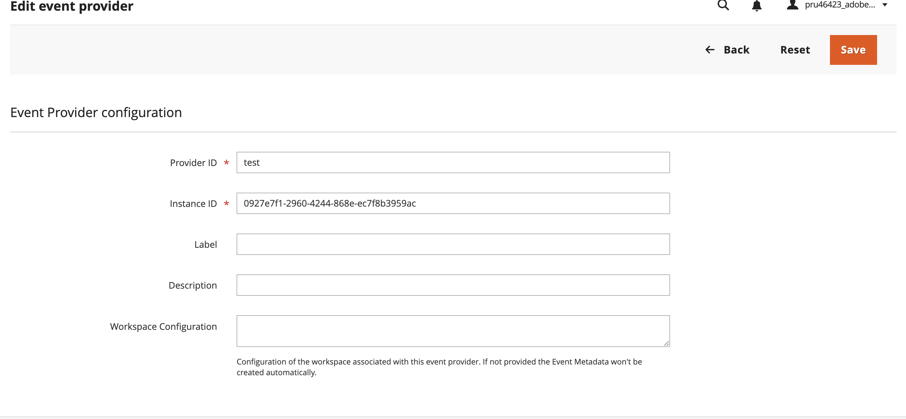

# Extend Adobe Commerce with events and App Builder

This tutorial explains how to create and configure an end-to-end event-driven integration using Adobe App Builder and Adobe Commerce asynchronous events. Whether the goal is to capture product updates, send order confirmation data to external systems, or trigger downstream workflows, Adobe Commerce asynchronous events and Adobe App Builder offer a scalable way to extend platform functionality.

A simple use case involving product updates is used to illustrate these steps and demonstrate event-based communication between Adobe Commerce and App Builder.

<InlineAlert variant="info" slots="text"/>

This tutorial specifically covers event registration using a runtime action in Adobe App Builder. This only applies to Adobe Commerce as a Cloud Service (SaaS) deployments. This tutorial also covers the limitations of this method, including execution time constraints, in later sections.

## How it works

This guide walks you through a typical event-driven integration using Adobe Commerce and Adobe App Builder. For an overview of Adobe I/O Events and how they facilitate building reactive applications across various Adobe services, see the [Adobe I/O Events Overview](https://developer.adobe.com/events/docs). The following diagram illustrates how events triggered within Adobe Commerce flow through to Adobe App Builder, enabling responsive downstream processing.


Consider a use case where you are saving or updating an object in Adobe Commerce that causes an asynchronous event to be emitted. For this event to reach Adobe App Builder, you must define an event provider in Adobe I/O Events. This provider defines the types of events that can be sent to Adobe I/O, such as product updates. It also ensures that Adobe I/O Events can receive and route them correctly. Adobe Commerce provideThe event provider is then configured in Adobe Commerce using the Adobe I/O Events for Adobe Commerce module. This setup allows Adobe Commerce to emit specific events to Adobe I/O Events.

The provider is then linked during event registration in App Builder. Event registration specifies how and where the event should be delivered, such as to a Runtime action. To explore this and other supported registration types, refer to event registration in Adobe I/O Events.

Events emitted from Adobe Commerce are routed through Adobe I/O Events. This routing is enabled by the event provider configuration and the corresponding registration. Based on the registration setup, Adobe I/O Events invokes the appropriate consumer. In this case, the consumer is a Runtime action deployed as part of an App Builder app.

The runtime action receives the event payload and processes it. In this use case, it checks whether there is a price change or if the stock falls below a defined threshold.

If either condition is met, the function logs the details using App Builder's built-in logger. These logs help trace the flow of events and verify that the logic is executing correctly.

The function can also be extended to trigger alerts, update external systems, or launch downstream workflows, all without modifying the Commerce runtime.

## Set up an event provider and event metadata in Adobe Commerce

To create and configure an event provider in Adobe Commerce, which is then registered in the Adobe Developer Console as part of the App Builder project:

1. An Adobe I/O Event Provider and Event Metadata must first be created using the Adobe Event Provider API. Inputs such as the label, description, and instanceId are provided during this step.

1. Take note of the provider ID from the response for future use.

1. Using these details, a corresponding event provider is then created in the Adobe Commerce Admin. The instanceId input from the API request is used here to establish the link between Adobe Commerce and Adobe I/O Events.

1. The configured provider is finally registered in the Adobe Developer Console during event registration for the App Builder project.

### Setting up event provider and event metadata in Adobe Commerce

This section covers creating and configuring an **Event Provider** in Adobe Commerce and registering it with the Adobe Developer Console, as well as creating **Event Metadata** for specific events.

#### Parameters and authentication for Adobe I/O Events API

These parameters are used for **both** Event Provider creation and Event Metadata creation. Values are obtained from the App Builder project's configuration JSON file, which can be downloaded from the Adobe Developer Console:

1. Go to [Adobe Developer Console](https://developer.adobe.com/console).  
2. Select your project.  
3. Choose the desired environment (Stage or Prod).  
4. Click **Download All** to get the configuration JSON file.  

#### Path parameters (common)

| Parameter       | JSON Field                        | Purpose |
|-----------------|-----------------------------------|---------|
| `workspaceId`   | `project.workspace.id`            | The ID of the environment workspace where you are creating the provider and metadata. |
| `projectId`     | `project.id`                      | The ID of the App Builder project. |
| `consumerOrgId` | `project.org.id`                  | The organization ID for your Adobe account. |

### Additional path parameter for Event Metadata creation

| Parameter     | Source | Purpose |
|---------------|--------|---------|
| `providerId`  | From Event Provider API response (`id` field) | The ID of the event provider for which you are creating metadata. |

### Header parameters (common)

| Header          | JSON Field | Purpose |
|-----------------|------------|---------|
| `Authorization` | Generated from Adobe Developer Console (OAuth Server-to-Server) | Used for authenticating API calls. |
| `x-api-key`     | `project.workspace.details.credentials[0].oauth_server_to_server.client_id` | Client ID for authentication. |

### Create an Adobe I/O event provider

The Event Provider acts as a bridge between Adobe Commerce and Adobe's event-driven ecosystem. It enables Adobe Commerce to emit system events (such as product updates or order placements) to external systems or applications through Adobe I/O.
Before configuring the event provider in Adobe Commerce, Adobe I/O Event Provider must be created using the Adobe Events API. To do this:

- Visit the [Adobe I/O Events API documentation](https://developer.adobe.com/events/docs/api#operation/createProvider).
- Click **Try it** under the **Create an Adobe I/O Events Provider** section.
- The interface will allow you to enter the required provider details and send the payload directly to the Adobe I/O API.

### Key fields to include in the API body

| Field Name        | Description |
|-------------------|-------------|
| `description`     | A short explanation of what this event provider does. |
| `instance_id`     | A unique string that can be any value, used internally to identify the Commerce provider instance and distinguish it from others. |
| `label`           | A user-friendly display name for the provider. |
| `provider_metadata` | A technical identifier used to map the event provider to Adobe Commerce. |

**Sample payload**

```json
{
  "label": "Adobe Commerce EventsProduction",
  "description": "Event provider for Adobe Commerce to emit real-time commerce events to Adobe I/O.",
  "instance_id": "commerceeventsprod",
  "provider_metadata": "dx_commerce_events"
}
```

Once all required fields are completed and Click **Send** button, the Event Provider will be created successfully. The API response will look like this:

``` json
{
"_links": {
    "rel:eventmetadata": {},
    "rel:update": {},
    "self": {}
  },
  "id": "xxxxxxxx-xxxx-xxxx-xxxx-xxxxxxxxxxxx",
  "label": "Your Event Provider Name",
  "description": "A brief description of your event provider",
  "source": "urn:uuid:xxxxxxxx-xxxx-xxxx-xxxx-xxxxxxxxxxxx",
  "docs_url": "https://developer.adobe.com/commerce/extensibility/events/",
  "provider_metadata": "dx_commerce_events",
  "instance_id": "your_provider_instance_id",
  "event_delivery_format": "cloud_events_v1",
  "publisher": "YourPublisher@AdobeOrg"
}
```

This response confirms that the Event Provider has been registered successfully in Adobe I/O.Make sure to note down the **id**, **label**, **description**, and **instance_id** values from the response, as these will needed in the next step.

## Create event metadata

Event Metadata defines the individual events that your Event Provider can emit. Each metadata entry includes a label, description, instance identifier, provider metadata, and a unique event code.To do this:

- Visit the [Adobe I/O Events API documentation](https://developer.adobe.com/events/docs/api#operation/createProvider).
- Click **Try it** under the **Create an Adobe I/O Events Provider** section.
- The interface will allow you to enter the required provider details and send the payload directly to the Adobe I/O API.

### Key fields to include in the API body

| Field Name         | Description |
|--------------------|-------------|
| `label`            | A user-friendly display name for the event. |
| `description`      | A short explanation of what the event does. |
| `instance_id`      | A unique identifier for the Commerce provider instance (must match the Event Provider). |
| `provider_metadata`| A technical identifier linking the event to Adobe Commerce. |
| `event_code`       | The unique code for this event, used to identify it in Adobe I/O. |

**Sample payload**

```json
{
  "label": "Adobe Commerce EventsProduction",
  "description": "Event provider for Adobe Commerce to emit real-time commerce events to Adobe I/O.",
  "instance_id": "your_instance_id_here",
  "provider_metadata": "dx_commerce_events",
  "event_code": "observer.catalog_product_save_commit_after"
}
```

**Expected response**
Once all required fields are completed and Click **Send** button, the Event Provider will be created successfully. The API response will look like this:

```json
{
  "_links": {
    "rel:sample_event": {},
    "rel:update": {},
    "self": {}
  },
  "description": "Event provider for Adobe Commerce to emit real-time commerce events to Adobe I/O.",
  "label": "Adobe Commerce *************",
  "event_code": "observer.*****************_after"
}
```

## Create and configure an event provider in Adobe Commerce

Event Providers act as connectors that enable Adobe Commerce to send system events (like order creation or product updates) to Adobe I/O. They define the source of events and ensure that events are delivered securely and in the correct format to subscribed applications. After noting down the values from the API call, to add a new Event Provider in Adobe Commerce, navigate to **System** > **Events** > **Event Providers**. Then click **Add New Event Provider** and provide the required details. These fields are essential for establishing the connection between Adobe Commerce and the newly created Event Provider.



Enter a user-friendly name in the **Event Name Alias** field. The Event Provider created in the earlier step will appear in the dropdown; select it to link the subscription to the correct provider.

In the **Event Subscription Fields** section, enter the specific fields to include in the event payload. This limits the payload to only the selected fields rather than sending the full event data, improving efficiency.Other configuration fields such as **Is Enabled** and **Priority** should be left to their default values unless specific requirements dictate otherwise. For additional details and advanced configuration options, refer to the  [Create events from the Admin](https://developer.adobe.com/commerce/extensibility/events/create-events/).

- **Provider ID** and **Instance ID** are required fields.

- The **Workspace Configuration** value must come from the same Adobe Developer Console workspace where the event provider was originally created. You can download this configuration file directly from the Developer Console.

## Create a subscription in Adobe Commerce

This step links a specific Adobe Commerce event to the event provider created earlier. It defines which events should be sent, how they should be identified, and what data should be included in the payload.

To create an Event Subscriber in Adobe Commerce, go to **System** > **Event Subscriptions** and click **Add New Subscription**. In this tutorial example, select **observer.catalog_product_save_commit_after** as the event to subscribe to. Complete the **Event subscription settings** section with the following values:

Field | Value
--- | ---
**Event Name** | `observer.catalog_product_save_commit_after`
**Event Name Alias** | Optional. Any user-friendly name.
**Event Provider** | Select the Event Provider created in the previous step.
**Is Enabled** | Yes
**Priority** | Yes

In the **Event Subscription Fields** section, specify the following fields to be included in the event payload. This limits the payload to only the selected fields rather than sending the full event data, improving efficiency.

- `id`
- `sku`
- `name`
- `created_at`
- `updated_at`
- `description`
- `stock_data.qty`
- `price`

After filling in all the details, click **Save** to create the subscription.

## Sync event metadata with App Builder

The next step is to sync the workspace details, subscription, and event provider configuration so that it becomes available during the event registration step in your App Builder project. Click **Stores** > Configuration, **Adobe I/O** > **Adobe I/O Events**. In the **General Configuration** section, click **Execute Synchronization**. This ensures that the event provider is registered and can be selected while setting up event registration in the App Builder project.
