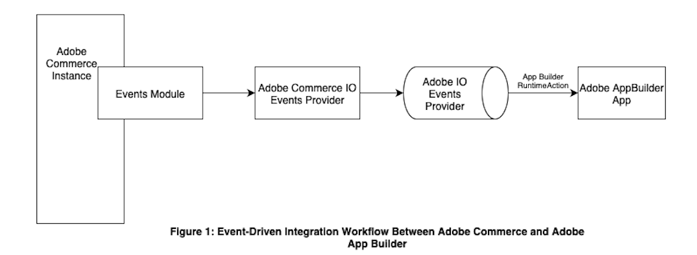

# Use events and App Builder to extend Adobe Commerce

This tutorial explains how to create and configure an end-to-end event-driven integration using Adobe App Builder and Adobe Commerce asynchronous events. Whether the goal is to capture product updates, send order confirmation data to external systems, or trigger downstream workflows, Adobe Commerce asynchronous events and Adobe App Builder offer a scalable way to extend platform functionality.

A simple use case involving product updates is used to illustrate these steps and demonstrate event-based communication between Adobe Commerce and App Builder.

<InlineAlert variant="info" slots="text"/>

This tutorial specifically covers event registration using a runtime action in Adobe App Builder. This only applies to Adobe Commerce as a Cloud Service (SaaS) deployments. This tutorial also covers the limitations of this method, including execution time constraints, in later sections.

## How it works

This guide walks you through a typical event-driven integration using Adobe Commerce and Adobe App Builder. For an overview of Adobe I/O Events and how they facilitate building reactive applications across various Adobe services, see the [Adobe I/O Events Overview](https://developer.adobe.com/events/docs). The following diagram illustrates how events triggered within Adobe Commerce flow through to Adobe App Builder, enabling responsive downstream processing.

Consider a use case where you are saving or updating an object in Adobe Commerce that causes an asynchronous event to be emitted. For this event to reach Adobe App Builder, you must define an event provider in Adobe I/O Events. This provider defines the types of events that can be sent to Adobe I/O, such as product updates. It also ensures that Adobe I/O Events can receive and route them correctly. Adobe Commerce provideThe event provider is then configured in Adobe Commerce using the Adobe I/O Events for Adobe Commerce module. This setup allows Adobe Commerce to emit specific events to Adobe I/O Events.

The provider is then linked during event registration in App Builder. Event registration specifies how and where the event should be delivered, such as to a Runtime action. To explore this and other supported registration types, refer to event registration in Adobe I/O Events.

Events emitted from Adobe Commerce are routed through Adobe I/O Events. This routing is enabled by the event provider configuration and the corresponding registration. Based on the registration setup, Adobe I/O Events invokes the appropriate consumer. In this case, the consumer is a Runtime action deployed as part of an App Builder app.

The runtime action receives the event payload and processes it. In this use case, it checks whether there is a price change or if the stock falls below a defined threshold.

If either condition is met, the function logs the details using App Builder's built-in logger. These logs help trace the flow of events and verify that the logic is executing correctly.

The function can also be extended to trigger alerts, update external systems, or launch downstream workflows, all without modifying the Commerce runtime.

## Runtime action limitations

When configuring an event registration to invoke a Runtime action in Adobe App Builder, be aware that aregistered Runtime action **must complete within 60 seconds**. If the action does not return a response within this period, the Adobe I/O runtime platform will terminate it. This makes it unsuitable for long-running operations in action code. A discussion of potential workarounds is provided below.

### Asynchronous processing

Modify the Runtime action to **immediately acknowledge the event** and offload the actual processing to:

- An external service
- A queue (such as **Kafka** or **Pub/Sub**)
- A background worker

This approach helps ensure a **fast response** to the event system while managing heavier workloads efficiently.

**Notes:**

 - Debug tracing might not capture full details if something goes wrong during the offloaded processing.

 - I/O Events will not retry the event if the processing fails after it has been acknowledged.

### Journaling-based event registration

Instead of directly triggering a Runtime action, configure **Journaling** through Adobe's event registration system.

- Journaling **persists incoming events for up to 7 days**, allowing developers to consume and process them **asynchronously** at their own pace.
- Journalling provides better flexibility for longer or deferred processing.
- Journaling does **not support persisting events to external data stores**.

Learn more about Journalling in [Adobe Events Runtime Journalling Guide](https://developer.adobe.com/events/docs/guides/api/journaling-api).

For further assistance or inquiries, consult the [#app-builder-community](https://magentocommeng.slack.com/) Slack channel
