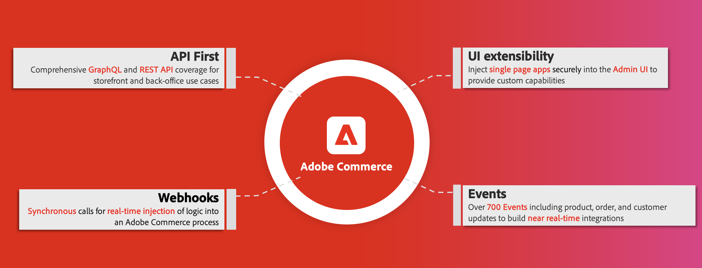

<Hero slots="image, heading, text"/>

# Adobe Commerce extensibility

Learn how to develop Out-of-Process apps that extend and customize Adobe Commerce.

Extensibility, as a concept, reflects the possibility for growth and the ease of extending functionality in a system. When referring to extensibility in Adobe Commerce, we mean the ability of developers to expand, customize, and control their interactions with Adobe Commerce.

The following diagram highlights the main components of the Adobe Commerce [extensibility strategy](https://experienceleague.adobe.com/docs/commerce-operations/implementation-playbook/architecture/extensibility-strategy.html):

Extensibility generally has two variations, in-process extensibility and out-of-process extensibility. In the context of Adobe Commerce, in-process extensibility refers to extended functionality that is located inside or alongside the Adobe Commerce monolith. Conversely, out-of-process extensibility refers to extended functionality and services that operate outside the core software.

Out-of-process extensibility can reduce the total cost of ownership by simplifying upgrades and giving developers more control of the timing, coding, and implementation of their systems.

Other benefits of out-of-process extensibility include:

- Scalability - Extensions can be scaled separately from the core software, allowing for greater efficiency.

- Isolation - An isolated environment means that developers can upgrade or modify their extensions however they want and whenever they want without relying on a core release.

- Technological Independence - Developers can choose whichever tech stacks and coding languages that fit their needs.

## In-process development tools

Adobe Commerce and Magento Open Source provide the following in-process extensible development tools:

- [REST](https://developer.adobe.com/commerce/webapi/rest) - Use REST calls to interact with your Commerce instance on behalf of an administrator, customer, guest, or integration.

- [GraphQL](https://developer.adobe.com/commerce/webapi/graphql/) - Use GraphQL requests to transfer information between the storefront and backend.

- [PHP Extensions](https://developer.adobe.com/commerce/php/development/) - Develop or modify Adobe Commerce and Magento Open Source components.

- [Marketplace Extensions](https://developer.adobe.com/commerce/marketplace/guides/sellers/extensions/) - Create and sell PHP extensions in the [Adobe Commerce Marketplace](https://commercemarketplace.adobe.com).

## Out-of-process development tools

Adobe Commerce offers the following out-of-process development tools:

- [API Mesh for Adobe Developer App Builder](https://developer.adobe.com/graphql-mesh-gateway/) - Coordinate and combine multiple API, GraphQL, REST, and other sources into a single, queryable GraphQL endpoint.

- [App Builder](https://developer.adobe.com/app-builder/docs/overview/) - Build and deploy secure and scalable web applications that extend Commerce functionality and integrate with third-party solutions.

- [Events](./events/index.md) - Use custom event triggers to interact with other extensible development tools.

- [Webhooks](./webhooks/index.md) - Use webhooks to automatically trigger interactions between Commerce and third-party systems.

- [Admin UI SDK](./admin-ui-sdk/index.md) - Customize and enhance your Admin with new pages and features for your merchants.

Additionally, [Marketplace Apps](./app-development/index.md) allow you to create and sell custom single-page applications on the [Adobe Commerce Marketplace](https://commercemarketplace.adobe.com).

<InlineAlert variant="info" slots="text"/>

Out-of-process development tools are only available with Adobe Commerce and are not available with Magento Open Source.

### Related information

<DiscoverBlock slots="link, text"/>

[App Builder](https://developer.adobe.com/app-builder/docs/overview/)

Is a complete framework that enables enterprise developers to build and deploy custom web applications that extend Adobe Experience Cloud solutions and run on Adobe infrastructure.

<DiscoverBlock slots="link, text"/>

[API Mesh for Adobe Developer App Builder](https://developer.adobe.com/graphql-mesh-gateway/)

Allows developers to integrate private and third-party APIs and other software interfaces with Adobe Commerce and other Adobe products using Adobe IO.

## Contributing to this documentation

We encourage you to participate in our open documentation initiative. If you have suggestions, corrections, additions, or deletions for this documentation, check out the source on [GitHub](https://github.com/AdobeDocs/commerce-extensibility), and open a pull request.
