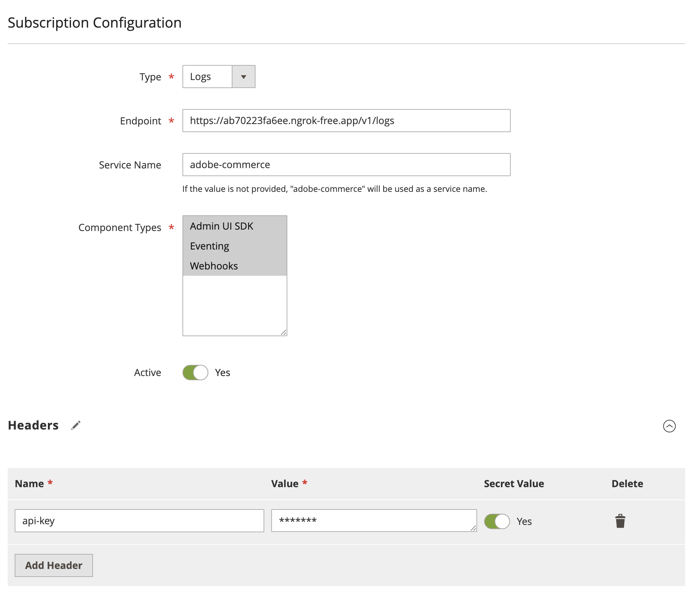

import InstallObservabilityModule from '/src/_includes/observability-module-installation'

# Adobe Commerce Observability Overview

<InlineAlert variant="important" slots="text" />

This functionality is automatically available on [Adobe Commerce as a Cloud Service](https://experienceleague.adobe.com/en/docs/commerce/cloud-service/overview) (SaaS) projects. Adobe Commerce on-premises and Cloud infrastructure (PaaS) projects can [install separate modules](#install-observability-module) to provide this functionality.

Observability allows you to monitor and understand the behavior of extensibility tools such as Webhooks, Events, and Admin UI SDK. It allows you to forward logs from Adobe Commerce and connect them with App Builder logs using context propagation. This enables you to trace the flow of requests and responses across different components of your application, providing a comprehensive view of your system's performance and behavior.

<Edition name="paas" />

**Note:** The message queue must be configured and running to use observability. The message queue is used to send logs asynchronously, ensuring that the main application flow is not blocked by logging operations. Consumers must be configured to run by cron jobs or as a workers.

## Configure observability

To start using observability, you need to configure Adobe Commerce by creating a new subscription. A subscription can be created in two ways: in the Admin UI or through the Rest API. You can create multiple subscriptions, each with its own configuration. The subscription configuration includes the following parameters:

- **Type**: The type of subscription, at the moment only `logs` is supported.
- **Destination**: The type of destination where the logs will be sent. Supported values are `NewRelic`, `Datadog`, and `Splunk` and `OpenTelemetry`.
- **Destination endpoint**: The endpoint of the destination where the logs will be sent.
- **Destination API key**: The API key for the destination, if required.
- **Component**: The component for which the subscription is created. Supported values are `Webhooks`, `Eventing`, and `Admin UI SDK`. You can select one or more components to monitor.
- **Service name**: The name of the service that will be used to identify the logs in the destination.
- **Is active**: A flag that indicates whether the subscription is active or not.
- **Headers**: Additional headers that will be sent with the logs to the destination. This is useful for adding custom metadata or authentication information. You can specify if header has secret value or not to hide in the Admin UI or Rest API response.
- **Log message configuration**: Enables or disables the additional data in the log message. This includes such options as the request headers and payload, and response payloads for webhooks.

### Configuration Admin UI

To configure observability in the Admin UI, navigate to `System > Observability > Subscription List`. Here you can create, update, and delete subscriptions.

To create a new subscription, click the **Add New Subscription** button. Fill in the required fields and click **Save Subscription**. The new subscription will be added to the list.

## Install observability module

<InstallObservabilityModule />
