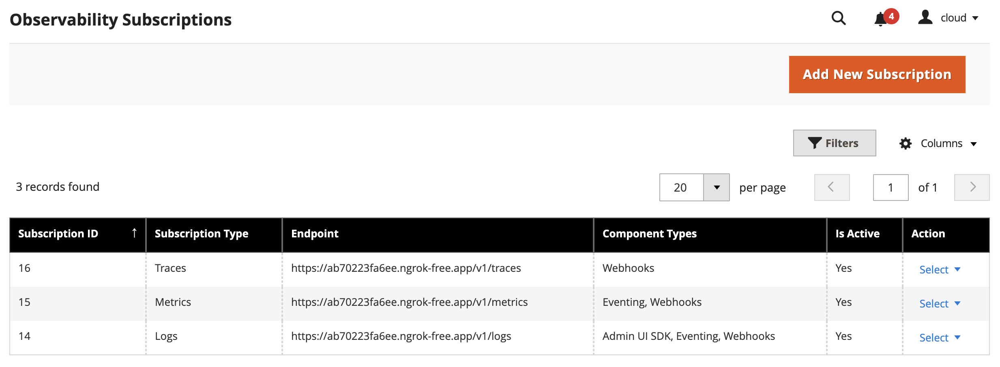

# Adobe Commerce observability overview

<InlineAlert variant="important" slots="text" />

This functionality is automatically available on [Adobe Commerce as a Cloud Service](https://experienceleague.adobe.com/en/docs/commerce/cloud-service/overview) (SaaS) projects. Adobe Commerce on-premises and Cloud infrastructure (PaaS) projects can [install separate modules](./installation.md) to provide this functionality.

Observability allows you to monitor and understand the behavior of extensibility tools such as [webhooks](../../webhooks/index.md), [events](../../events/index.md), and the [Admin UI SDK](../../admin-ui-sdk/index.md). This module allows you to forward logs, traces and metrics from Adobe Commerce and connect them with App Builder using context propagation. This enables tracing the flow of requests and responses across different components of your application, providing a comprehensive view of your system's performance and behavior.

<Edition name="paas" />

<InlineAlert variant="info" slots="text"/>

The message queue must be configured and running to use observability. The message queue is used to send observability data asynchronously, ensuring that the main application flow is not blocked by observability operations. Consumers can be configured to run by cron jobs or as workers.

## Configure observability

<InlineAlert variant="info" slots="text"/>

For [storefront](https://experienceleague.adobe.com/developer/commerce/storefront) observability, refer to [Operational Telemetry](https://www.aem.live/docs/rum-explorer#user-interface-overview).

To start using the observability module, you need to configure Adobe Commerce by creating a new subscription. You can create a subscription in two ways: in the Admin UI or through the REST API. You can create multiple subscriptions, each with its own configuration. The subscription configuration includes the following parameters:

- **Type**: The type of subscription: `logs`, `metrics`, or `traces`.
- **Endpoint**: The endpoint where observability data will be sent. This is the URL of an observability collector that supports OpenTelemetry protocol such as New Relic, Datadog, or a custom collector.
- **Component**: The component the subscription is created for. Supported values are `Webhooks`, `Eventing`, and `Admin UI SDK`, depending on the selected type. You can select one or more components to monitor.
- **Service name**: The name of the service that will be used to identify the logs in the destination.
- **Is active**: A flag that indicates whether the subscription is active.
- **Headers**: Additional headers that will be sent with the logs to the destination. They are useful for adding custom metadata or authentication information. You can specify if a header has secret values to hide in the Admin UI or REST response.
- **Log message configuration**: Enables or disables the additional data in the log message. This data includes the request headers, payload, and response payloads for webhooks.

Commerce sends all data in the OpenTelemetry format.

### Configure from the Admin

To configure observability in the Admin UI, navigate to **System** > Observability > **Subscription List**. Here you can create, update, and delete subscriptions.

To create a new subscription, click the **Add New Subscription** button. Enter the required information and click **Save Subscription**. The new subscription is added to the list.

## Connect with an Observability platform

You can connect Adobe Commerce observability data with various observability platforms that support the OpenTelemetry protocol, such as New Relic, Datadog, Splunk, or a custom collector. To do this, you must configure the endpoint URL and any required headers in the observability subscription.

- [New Relic OTLP](https://docs.newrelic.com/docs/opentelemetry/best-practices/opentelemetry-otlp/)
- [Datadog OTLP](https://docs.datadoghq.com/opentelemetry/setup/otlp_ingest/)
- [Splunk OTLP](https://help.splunk.com/en/splunk-observability-cloud/manage-data/splunk-distribution-of-the-opentelemetry-collector/get-started-with-the-splunk-distribution-of-the-opentelemetry-collector/collector-components/exporters/splunk-hec-exporter)
