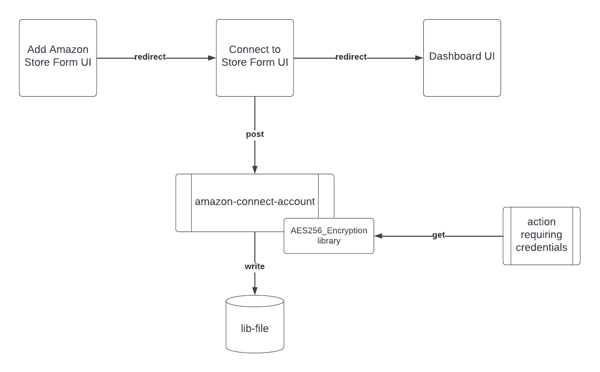

# Credentials management

<InlineAlert variant="info" slots="text" />

This topic references the Amazon Sales Channel reference app, which is no longer available. However, the methods described in this topic can be applied to any App Builder application that requires credential management.

App Builder is an excellent framework for building integrations that connect Commerce to 3rd-party systems like Amazon or ERPs. These systems often require credentials to support your application to securely communicate and update them.

The Amazon Sales Channel app requires credentials and secrets to perform certain actions and interact with the Amazon API. These items must be changed every 180 days to comply with Amazon standards, and they could be updated in runtime. Therefore, creating a static set of credentials is not an option.

This topic describes the method the development team used to safely store these credentials in a way that allows for easy updating when necessary.

## Use case

The development team chose to implement a cypher algorithm to safely store and retrieve these credentials. This algorithm encrypts the credentials of each store using a unique vector that is randomly generated when the store is created.

The merchant enters credentials and secrets when creating a new store through the Admin using the **Add Amazon Store** menu.


Once the merchant completes the form, an action is triggered to randomly generate an initialization vector specific to the new account and to store the account information. It's important that the initialization vector is generated in the backend so that it's not visible from the UI.

This vector is then used in another action that encrypts the credentials and stores them in the [`lib-file` storage system](https://github.com/adobe/aio-lib-files). To use or update the credentials, they must be retrieved from `lib-file` and decrypted with the same vector used for encryption.

The following diagram describes the generic flow of the credential storage and encryption process.



## Encryption algorithm

We recommend using the AES-256 encryption algorithm, which requires a 32-character encryption key, an initialization vector, and a 16-bit authentication tag. AES-256 is a resilient encryption algorithm that is nearly impossible to brute force.

The [`encrypt.ts`](https://github.com/adobe/amazon-sales-channel-app-builder/blob/main/actions-src/shared/security/encrypt.ts) file provides encryption and decryption functions, as shown below:

```typescript
import { createCipheriv, createDecipheriv } from 'node:crypto';
import { DecryptionError } from './decryptionError';
 
interface CipherArgs {
  key: Buffer;
  iv: Buffer;
}
 
const ALGORITHM = 'aes-256-gcm';
 
export function encrypt(text: string, cipherArgs: CipherArgs): string {
  const { key, iv } = cipherArgs;
 
  const cipher = createCipheriv(ALGORITHM, key, iv);
  let encrypted = cipher.update(text);
  encrypted = Buffer.concat([encrypted, cipher.final()]);
 
  const authTag = cipher.getAuthTag().toString('hex');
  return [encrypted.toString('hex'), authTag].join(':');
}
 
export function decrypt(text: string, cipherArgs: CipherArgs): string {
  const [encryptedData, authTag] = text.split(':');
 
  const { key, iv } = cipherArgs;
  const encryptedText = Buffer.from(encryptedData, 'hex');
  try {
    const decipher = createDecipheriv(ALGORITHM, key, iv);
    decipher.setAuthTag(Buffer.from(authTag, 'hex'));
    let decrypted = decipher.update(encryptedText);
    decrypted = Buffer.concat([decrypted, decipher.final()]);
 
    return decrypted.toString();
  } catch {
    throw new DecryptionError('Unable to decipher encrypted message');
  }
}
```

## Credentials Data Schema

Each data file is identified by the `accountId` parameter and contains the account's set of credentials required to access the Amazon API and other sensitive data that should be encrypted before being stored in the `lib-file` as a safety precaution.

* `amazonsp-credentials-<accountId>` - Once saved, this `string`-type blob will be an encrypted AES256 string containing the following structure:

   ```typescript
   {
     sellingPartnerAppClientId: string,
     sellingPartnerAppClientSecret: string,
     awsAccessKeyId: string,
     awsSecretAccessKey: string,
     awsSellingPartnerRole: string,
   }
   ```

* `amazonsp-refreshToken-<accountId>` - This `string`-type blob contains the Amazon refresh token.

## Credentials storage code samples

The following code block shows the helper class that receives the encryption key and initialization vector. The class then uses this data to evoke the methods that either encrypt or decrypt the passed data, using the algorithms previously shown.

For local development, the encryption key and initialization vector can be stored in the `.env` file. Since this file cannot be uploaded to GitHub, we recommend that you store these secrets as GitHub secrets. Furthermore, AES-256 best practices recommend that you use a different initialization vector for each encryption.

The [`CredentialsEncryptionHelper`](https://github.com/adobe/amazon-sales-channel-app-builder/blob/main/actions-src/shared/security/credentialsEncryptionHelper.ts) class provides encryption and decryption methods.

```typescript
import { randomBytes } from 'node:crypto';
import { decrypt, encrypt } from './encrypt';
import Credentials = AmazonSalesChannel.Model.Credentials;
 
export class CredentialsEncryptionHelper {
  private readonly key: Buffer;
 
  private readonly iv: Buffer;
 
  constructor(key: string, iv?: string) {
    this.key = Buffer.from(key);
 
    this.iv = iv === undefined || iv === '' ? randomBytes(16) : Buffer.from(iv);
  }
 
  public encryptCredentials(credentials: Credentials): string {
    return this.encrypt(JSON.stringify(credentials));
  }
 
  public decryptCredentials(text: string): Credentials {
    return JSON.parse(this.decrypt(text)) as unknown as Credentials;
  }
 
  public encrypt(text: string): string {
    return encrypt(text, { key: this.key, iv: this.iv });
  }
 
  public decrypt(text: string): string {
    return decrypt(text, { key: this.key, iv: this.iv });
  }
}
```

### Encryption example

In [this example](https://github.com/adobe/amazon-sales-channel-app-builder/blob/main/actions-src/api/account/runtime/storeCredentials.ts), we initialize the encryption helper with the encryption key and initialization vector. Data is encrypted and stored in the database using the `accountId` as the identifier.

```typescript
const credentialsRepository = new CredentialsRepository(logger);
 
const credentialsEncryptionHelper = new CredentialsEncryptionHelper(
  params.ENCRYPTION_KEY,
  params.ENCRYPTION_IV,
);
const encryptedCredentials = credentialsEncryptionHelper.encryptCredentials({
  sellingPartnerAppClientId: params.sellingPartnerAppClientId,
  sellingPartnerAppClientSecret: params.sellingPartnerAppClientSecret,
  awsAccessKeyId: params.awsAccessKeyId,
  awsAccessKeySecret: params.awsSecretAccessKey,
  awsSellingPartnerRole: params.awsSellingPartnerRole,
});
 
await credentialsRepository.saveCredentials(
  accounts[params.accountId].id,
  encryptedCredentials,
);
```

### Decryption example

In [this example](https://github.com/adobe/amazon-sales-channel-app-builder/blob/main/actions-src/api/account/runtime/getCredentials.ts), we retrieve the list of accounts, and the encryption helper is initialized with the encryption key and initialization vector.

The account's credentials are retrieved from the `lib-file` storage system and decrypted using the encryption library.

```typescript
const accountRepository = new AccountRepository(logger);
const accounts: Accounts = await accountRepository.getAccounts();
 
if (accounts[params.accountId] === undefined) {
  throw new NotFoundError(`Account ${params.accountId} was not found}`);
}
 
const credentialsEncryptionHelper = new CredentialsEncryptionHelper(
  params.encryptionKey,
  params.encryptionIv,
);
 
const credentialsRepository = new CredentialsRepository(logger);
 
const encryptedCredentials = await credentialsRepository.getCredentials(
  accounts[params.accountId].id,
);
const credentials: Credentials =
  credentialsEncryptionHelper.decryptCredentials(encryptedCredentials);
```
