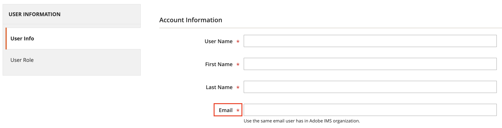
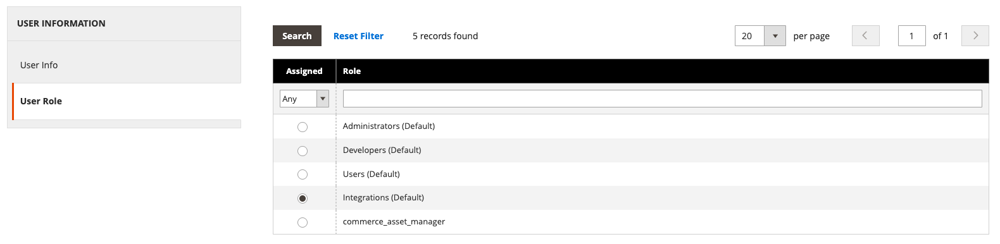

# Connect to Adobe Commerce

This guide explains how to integrate the checkout starter kit with Adobe Commerce.

The [`adobe-commerce.js`](https://github.com/adobe/commerce-checkout-starter-kit/blob/main/lib/adobe-commerce.js) file provides a set of methods to interact with the Adobe Commerce instance. The client uses the Adobe Commerce HTTP Client, which is a wrapper around the Adobe Commerce REST API.

To use the Adobe Commerce HTTP Client, update the `COMMERCE_BASE_URL` value in the `.env` file, and complete the authentication setup.

- &#8203;<Edition name="paas" />For PaaS (On-Premise/Cloud):

  - `COMMERCE_BASE_URL` includes your base site URL + `/rest/<store_view_code>/`
  - Example: `https://<commerce_instance_url>/rest/<store_view_code>/`

- &#8203;<Edition name="saas" />For SaaS (Adobe Commerce as a Cloud Service):

  - `COMMERCE_BASE_URL` must be the REST API endpoint provided by Adobe Commerce
  - Example: `https://na1.api.commerce.adobe.com/<tenant_id>/`

## Authentication

Depending on your Adobe Commerce setup, there are two options to authenticate and communicate with App Builder:

- [Adobe Identity Management Service (IMS)](#adobe-identity-management-service-ims)

- &#8203;<Edition name="paas" /> [Commerce Integration](#create-a-commerce-integration)

If IMS authentication is detected, it has precedence over Commerce integration. However, if neither option is detected or configured, then client instantiation will fail.

### Adobe Identity Management Service (IMS)

<InlineAlert variant="info" slots="text1, text2"/>

&#8203;<Edition name="paas" /> This process requires a Commerce instance with [Adobe Identity Management Service (IMS) for Adobe Commerce](https://experienceleague.adobe.com/docs/commerce-admin/start/admin/ims/adobe-ims-integration-overview.html) configured.

SaaS instances already include IMS configuration.

Use the following steps to create OAuth credentials for App Builder authentication:

1. Access your IMS credentials through the [Adobe Developer Console](https://developer.adobe.com/console). Select the project and workspace you set up during the [initial configuration](./getting-started.md#initial-configuration). Then click **OAuth Server-to-Server** in the side-navigation menu.

   Copy the IMS credentials to the `.env` file in the root of the project.

   **NOTE**: These credentials are automatically populated in [Configure OAuth Server-to-Server Credential](./configure.md#configure-oauth-server-to-server-credential).

   ```js
   OAUTH_CLIENT_ID=<client id>
   OAUTH_CLIENT_SECRETS=<client secret>
   OAUTH_TECHNICAL_ACCOUNT_ID=<technical account id>
   OAUTH_TECHNICAL_ACCOUNT_EMAIL=<technical account email>
   OAUTH_SCOPES=<scope>
   OAUTH_IMS_ORG_ID=
   ```

1. Add a technical account with server-to-server credentials to the Commerce Admin with the appropriate permissions using the [Admin User Creation Guide](https://experienceleague.adobe.com/en/docs/commerce-admin/systems/user-accounts/permissions-users-all#create-a-user).

1. When associating the user with the account, find your **Technical Account email** as a part of generated IMS credentials with following pattern: `<technical-account>@techacct.adobe.com` and use that value in the **Email** field during user creation:

   

1. On the **User Role** tab, select the role that provides all necessary permissions for API integrations.

   

### Create a Commerce integration

&#8203;<Edition name="paas" /> This option allows communication between Commerce and App Builder.

1. Create a new Adobe Commerce Integration by following the [systems integration](https://experienceleague.adobe.com/en/docs/commerce-admin/systems/integrations) guide.

1. Copy the integration details (consumer key, consumer secret, access token, and access token secret) to the `.env` file in the root of the project.

   ```js
   COMMERCE_CONSUMER_KEY=<key>
   COMMERCE_CONSUMER_SECRET=<secret>
   COMMERCE_ACCESS_TOKEN=<access token>
   COMMERCE_ACCESS_TOKEN_SECRET=<access token secret>
   ```

## Debugging requests

After following one of the connection options above, you can debug your application and access customized logs using the `LOG_LEVEL` environment variable. If this variable is set, logs from different phases of the commerce client display with detailed information.
