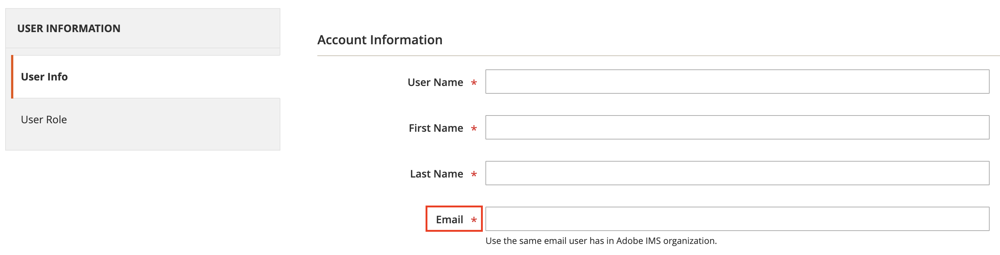

# Connect to Adobe Commerce

This guide explains how to integrate the checkout starter kit with Adobe Commerce.

The [`adobe-commerce.js`](https://github.com/adobe/commerce-checkout-starter-kit/blob/main/lib/adobe-commerce.js) file provides a set of methods to interact with the Adobe Commerce instance. The client uses the Adobe Commerce HTTP Client, which is a wrapper around the Adobe Commerce REST API.

To use the Adobe Commerce HTTP Client, update `COMMERCE_BASE_URL=<commerce_instance_url>` in the `.env` file, and complete the authentication setup.

## Authentication

Depending on your Adobe Commerce setup, there are 2 options to authenticate and communicate with App Builder:

1. [Configure Adobe Identity Management Service (IMS)](#configure-adobe-identity-management-service-ims)

1. [Configure Commerce Integration](#configure-commerce-integration)

If a commerce integration is detected, it has precedence over IMS authentication. However, if neither option is detected or configured, than client instantiation will fail.

### Configure Adobe Identity Management Service (IMS)

IMS authentication requires the following setup:

1. Configure IMS for Commerce following the steps in [Configure the Commerce Admin Integration with Adobe ID](https://experienceleague.adobe.com/en/docs/commerce-admin/start/admin/ims/adobe-ims-config).

1. Create new IMS credentials through the [Adobe Developer Console](https://developer.adobe.com/console). Add a new `API` service in the workspace. From the list of API's, select `I/O Management API` and follow the displayed steps. After adding the API, all credentials are generated.

1. Add a Technical Account to the Commerce Admin:

   1. Add a technical account with server-to-server credentials to the Commerce Admin with the appropriate permissions using the [Admin User Creation Guide](https://experienceleague.adobe.com/en/docs/commerce-admin/systems/user-accounts/permissions-users-all#create-a-user). If a technical account with appropriate permissions already exists, you can use it instead.

   1. When associating the user with the account, find your `Technical Account email` as a part of generated IMS credentials with following pattern: `<technical-account>@techacct.adobe.com` and use that value in the `Email` field during user creation:

      

   1. On the `User Role` tab, select the `Administrators` role to provide all necessary permissions.

Copy the generated credentials (client ID, client secret, technical account ID, and technical account email) to the `.env` file in the root of the project:

```js
OAUTH_CLIENT_ID=<client id>
OAUTH_CLIENT_SECRETS=<client secret>
OAUTH_TECHNICAL_ACCOUNT_ID=<technical account id>
OAUTH_TECHNICAL_ACCOUNT_EMAIL=<technical account email>
OAUTH_SCOPES=<scope>
OAUTH_IMS_ORG_ID=
```

### Configure Commerce the integration

This option also allows communication between Commerce and App Builder.

1. Create a new Adobe Commerce Integration by following the [systems integration](https://experienceleague.adobe.com/en/docs/commerce-admin/systems/integrations) guide.

1. Copy the integration details (consumer key, consumer secret, access token, and access token secret) to the `.env` file in the root of the project.

   ```js
   COMMERCE_CONSUMER_KEY=<key>
   COMMERCE_CONSUMER_SECRET=<secret>
   COMMERCE_ACCESS_TOKEN=<access token>
   COMMERCE_ACCESS_TOKEN_SECRET=<access token secret>
   ```

## Debugging requests

After following one of the connection options above, you can debug your application and access customized logs using the `LOG_LEVEL` environment variable. If this variable is set, logs from different phases of the commerce client display with detailed information.

<!-- What are options for log level variable??? -->
