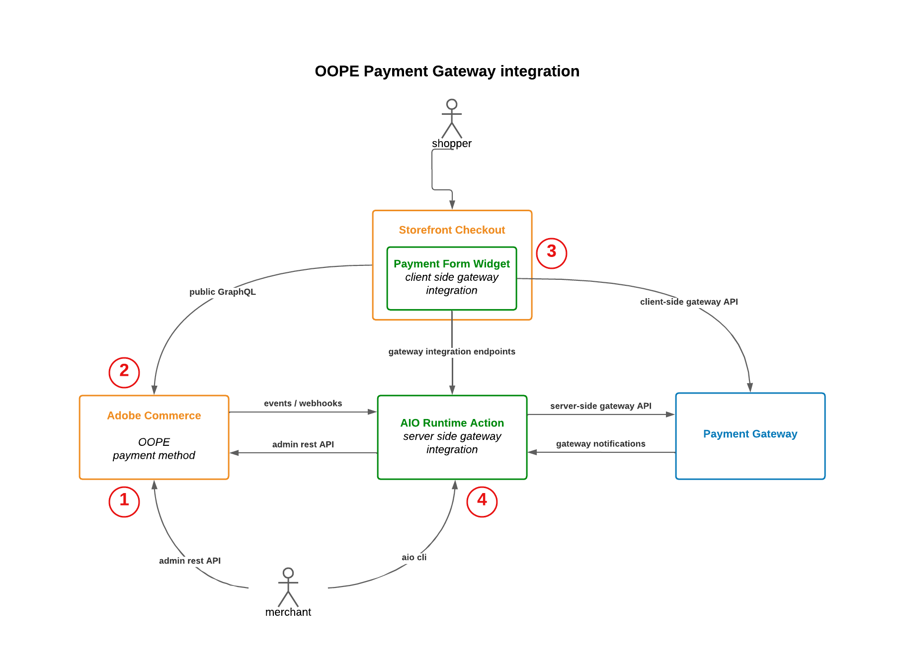
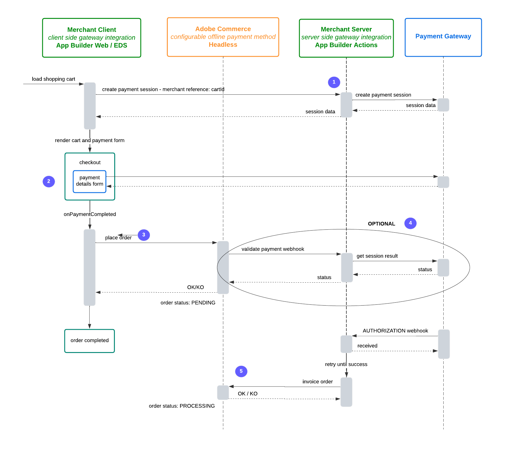
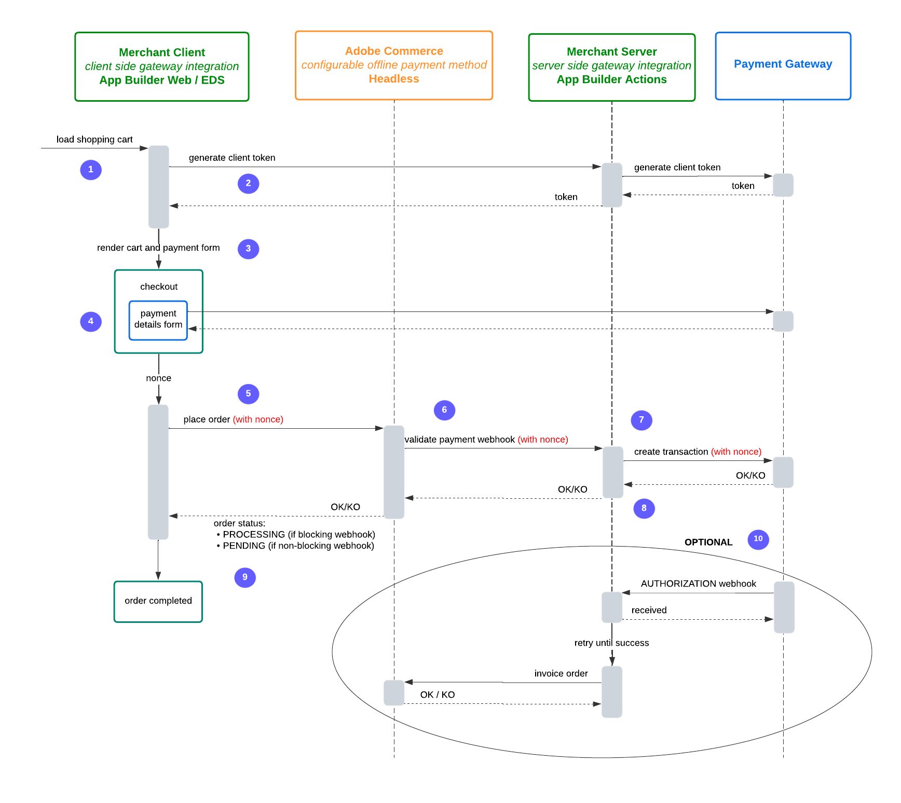

# Payment use cases

This page explores different use cases and scenarios for implementing payment methods using the Adobe Commerce checkout starter kit.

For more general use cases, refer to [use-cases](./use-cases.md).

## Integration strategy

The Adobe Commerce checkout starter kit supports two main integration patterns for payment gateways:

### Key components

The client-side nonce pattern's architecture allows merchants to integrate with virtually any payment gateway.

This strategy consists of the following components:

1. **OOPE Payment Method** - Database-persisted configuration managed with the Admin REST APIs.
1. **Cart GraphQL Extensions** - `configurable_attributes` field provides payment form configuration.
1. **Client-Side Gateway Integration** - Lightweight widget using gateway SDKs in EDS checkout drop-in.
1. **Server-Side Gateway Integration** - App Builder application handling gateway communication.



### Checkout flow

Payment collection during checkout is the core requirement for any payment gateway integration. While refunds and other operations can be handled directly by merchants through their payment provider, checkout payment processing is essential.

The starter kit supports multiple checkout flow patterns. The following flow represents the standard approach used by Adobe Commerce Payment Services and most payment gateways:


For alternative checkout flow patterns, see [Checkout session](#checkout-session-pattern) and [Client-side nonce](#client-side-nonce-pattern).

### Post-checkout patterns

Payment gateways often provide user interfaces where merchants can view and manage customer payments.

Using asynchronous communication patterns common in the [integration starter kit](../integration/index.md), invoices and credit memos and their corresponding captures and refunds can be synchronized as detailed in the following image:

Recommended events: `observer.sales_order_invoice_save_after` and `observer.sales_order_creditmemo_save_after`.


Alternatively, you can use webhooks to make invoice and credit memo creation dependent on successful payment operations.

Recommended webhook events: `plugin.magento.sales.api.invoice_repository.create` and `plugin.magento.sales.api.creditmemo_repository.create`.


Payment gateway captures and refunds synchronized through the Commerce Admin REST API with App Builder runtime actions:


### Checkout session pattern

In a minimal checkout flow, a checkout session is created with the payment gateway before starting the client-side payment process. Once payment is completed, the process with the gateway is effectively completed, and the only thing remaining is to find out the result and update the order:

- A checkout session is established with the payment gateway before starting the client-side payment process.
- Payment is completed during the client-side process.
- The order can be placed immediately after payment completion.
- Payment validation webhooks are optional since the payment is already confirmed.



### Client-side nonce pattern

When using a payment method nonce (a secure, single-use reference to payment information), the payment is not completed with the client-side process. Instead, if payment is accepted, the client side is granted a payment nonce that can subsequently be used to create a payment transaction at the gateway.

- The client-side process generates a payment nonce.
- The actual payment transaction is created server-side using the nonce.
- A payment validation webhook is typically required to complete the payment before order placement.
- Orders may start with **Pending** status until payment is confirmed.



## Get order details from Adobe Commerce using the masked cart ID

The following steps demonstrate the payment flow:

1. The payment flow starts at the frontend. When checkout is completed, the frontend sends the masked cart ID to the payment gateway.

1. The payment gateway then sends a request to the App Builder application with the masked cart ID, as this is the only information it has about the order. This request could be a webhook or an event.

1. The App Builder application uses the Adobe Commerce HTTP Client to retrieve the order details using the masked cart ID. To facilitate this, the starter kit provides the method `getOrderByMaskedCartId` in the Adobe Commerce HTTP Client.


## Validate payment info

To perform a headless checkout and payment, the Commerce instance must ensure that the payment has succeeded and the order can be placed.

### Set payment method additional data

To ingest payment gateway specific information in the payment process, the checkout process must use the [`setPaymentMethodOnCart` mutation](https://developer.adobe.com/commerce/webapi/graphql/schema/cart/mutations/set-payment-method/) in combination with the `payment_method.additional_data` field to persist the information required to validate the payment once the order is placed.

```graphql
setPaymentMethodOnCart(
  input: {
    cart_id: $cartId
    payment_method: {
      code: $code
      additional_data: [
        {
          key: 'sessionId',
          value: '12A34B56-1A23-1234-A123-123456A78901',
        },
        {
          key: 'status',
          value: 'DONE',
        },
      ]
    }
  }
) {
  cart {
    selected_payment_method {
      code
      title
    }
  }
}
```

### Validate the payment with a webhook

With this additional information saved, you can configure an [Adobe Commerce Webhook](../../webhooks/index.md) to validate the payment during order placement. This webhook triggers a synchronous call to your App Builder application, which is responsible for verifying payment details before the order is finalized.

The following example demonstrates how to add a webhook to the [`observer.sales_order_place_before`](../../webhooks/use-cases/order-placement-validation.md) method:

&#8203;<Edition name="paas" /> To register a webhook, [modify the `webhooks.xml` file](../../webhooks/hooks.md) and create a new webhook with the following configuration:

```xml
<?xml version="1.0"?>
<config xmlns:xsi="http://www.w3.org/2001/XMLSchema-instance"
        xsi:noNamespaceSchemaLocation="urn:magento:module:Magento_AdobeCommerceWebhooks:etc/webhooks.xsd">
    <method name="observer.sales_order_place_before" type="before">
        <hooks>
            <batch name="out_of_process_payment_methods">
                <hook name="validate_payment"
                      url="https://<your_app_builder>.adobeioruntime.net/api/v1/web/commerce-checkout-starter-kit/validate-payment"
                      method="POST" timeout="20000" softTimeout="0" priority="100" required="true"
                      fallbackErrorMessage="Error on validation">
                    <fields>
                        <field name="payment_method" source="data.order.payment.method" />
                        <field name="payment_additional_information" source="data.order.payment.additional_information" />
                    </fields>
                    <rules>
                        <rule field="data.order.payment.method" operator="equal" value="<your_payment_method_code>" />
                    </rules>
                </hook>
            </batch>
        </hooks>
    </method>
</config>
```

&#8203;<Edition name="saas" />
For Adobe Commerce as a Cloud Service, you can [create webhooks in the Admin](../../webhooks/create-webhooks.md).

```yaml
Hook Settings

  Webhook Method: observer.sales_order_place_before
  Webhook Type: before
  Batch Name: validate_payment
  Hook Name: oope_payment_methods_sales_order_place_before
  URL: https://<your_app_builder>.runtime.adobe.io/api/v1/web/commerce-checkout-starter-kit/validate-payment
  Active: Yes
  Method: POST

Hook Fields

  Name: payment_method
  Source: data.order.payment.method

  Name: payment_additional_information
  Source: data.order.payment.additional_information

Hook Rules

  Name: data.order.payment.method
  Value: <your_payment_method_code>
  Operator: equal
```

To enhance security, enable webhook signature generation by following the [webhooks signature verification](../../webhooks/signature-verification.md) instructions.

Refer to [`actions/validate-payment.js`](https://github.com/adobe/commerce-checkout-starter-kit/blob/main/actions/validate-payment/index.js) for an example of how to validate the payment according to the payment gateway needs.

## Filter out payment method

In some cases, you may want to filter out a payment method based on the cart details or the customer's information. For example, you may want to disable a payment method based on customer group or product attributes in the cart.

You can use the `plugin.magento.out_of_process_payment_methods.api.payment_method_filter.get_list` webhook to filter out a payment method. This webhook is triggered every time the list of available payment methods is requested, allowing you to filter out the payment methods based on the cart details or customer information.

&#8203;<Edition name="paas" /> The following example demonstrates how to add a webhook to the `plugin.magento.out_of_process_payment_methods.api.payment_method_filter.get_list` method:

<InlineAlert variant="info" slots="text"/>

&#8203;<Edition name="saas" /> SaaS webhooks have slightly different naming conventions. For this example, use the `plugin.out_of_process_payment_methods.api.payment_method_filter.get_list` method.

```xml
<method name="plugin.magento.out_of_process_payment_methods.api.payment_method_filter.get_list" type="after">
    <hooks>
        <batch name="out_of_process_payment_methods">
            <hook name="payment_method_filter" url="https://<your_app_builder>.runtime.adobe.io/api/v1/web/commerce-checkout-starter-kit/filter-payment" method="POST" timeout="20000" softTimeout="0">
                <fields>
                    <field name="payload" />
                </fields>
            </hook>
        </batch>
    </hooks>
</method>
```

Payload example:

```json
{
    "payload": {
        "cart": {
            "entity_id": "1",
            "store_id": 1,
            "converted_at": null,
            "is_active": "1",
            ...
            "items": [
                {
                    "item_id": "4",
                    "quote_id": "1",
                    "product_id": "10",
                    "store_id": 1,
                    "weight": "124.000000",
                    "qty": 2,
                    "price": "600.0000",
                    "base_price": "600.0000",
                    ...
                    "product": {
                        "entity_id": "10",
                        ...
                        "attributes": {
                            "manufacturer": "Two",
                            "color": "Yellow",
                            "country_origin": "France",
                            ...
                        }
                    },
                },
                ...
            ],
        },
        "customer": {
            "entity_id": "1",
            "website_id": "1",
            "email": "test@example.com",
            "group_id": "1",
            ...
        }
    }
}
```

You can find examples of how to filter out payment methods using customer data or product attributes in your App Builder application in [`actions/filter-payment.js`](https://github.com/adobe/commerce-checkout-starter-kit/blob/main/actions/filter-payment/index.js).
